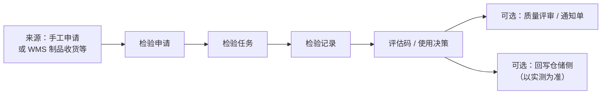

# 生产检验

> 适用基线：测试环境目标 / `dev` 分支 / 2026-07-15。
> 阅读对象：IPQC、生产质量、线边协同；操作见[生产检验-维护与查询参考](生产检验-维护与查询参考.md)。

## 业务目的与适用范围

生产检验覆盖制造过程中的质量确认入口，菜单拆为四套申请—任务—记录：

| 菜单分组 | 典型用途 |
| --- | --- |
| 首件检验 | 开线/换型后首件确认。 |
| 末件检验 | 批次或班次结束确认。 |
| 巡检检验 | 过程巡回抽检。 |
| 其他检验 | 未单独拆分的过程检验场景。 |

本页写四套 ATR 的共同模型与边界；工艺节点检验配置线索见 MES [工艺管理](../../06-MES-生产管理/02-工艺管理/index.md)；工单执行见[计划管理](../../06-MES-生产管理/03-计划管理/index.md) / [终端操作](../../06-MES-生产管理/06-终端操作/index.md)。

## 如何使用本组文档

| 你的目的 | 建议阅读 |
| --- | --- |
| 想理解四套生产检验如何分工 | 本页。 |
| 正在做首件/末件/巡检/其他 | [生产检验-维护与查询参考](生产检验-维护与查询参考.md)。 |
| 想配方案与工序码 | [检验配置](../01-检验配置/index.md)。 |

## 使用前准备

| 需要确认什么 | 为什么重要 |
| --- | --- |
| 对应检验类型的方案 | 首件/末件/巡检等类型码不同。 |
| 工单号、产线、物料、批次/包装 | 追溯与评审明细可能引用。 |
| 触发方式 | **已证实**：WMS 制品收货可自动建检验（类型码与「巡检」枚举名相同的码）。**未证实**：MES 报工 NG 自动建 QMS 单（`GAP-071`）。 |
| 手工申请权限 | 四套菜单均可手工维护申请。 |

【截图占位：首件检验申请与任务列表。】

## 对象与主流程

四套菜单共用同一套申请/任务/记录数据结构，靠检验类型与菜单过滤区分。

| 对象 | 业务含义 |
| --- | --- |
| 申请 | 提出过程检验需求；可带生产相关参考号、方案、数量。 |
| 任务 | 分配执行；含过程步骤与包装。 |
| 记录 | 保存实测与结论；可发布。 |

申请/任务状态口径与来料相同（新增…已完成；待处理…关闭）。判定：接收/拒绝；使用决策：全部合格/全部不合格/报废/隔离。

## 与 MES / WMS 的边界

| 协同方 | 本页负责 | 不在本页展开 |
| --- | --- | --- |
| MES 工单/报工 | 提供可关联的生产上下文；不良为协同线索 | NG→自动建检验单映射（`GAP-071`） |
| MES 工艺 | 方案可配工序码作线索 | 路线图形与节点扩展细节 |
| WMS 制品收货 | 可触发建申请 | 完工入库库存事务 |
| WMS 库存状态调整 | 给出质量结论 | 隔离/报废移动单据 |
| EAM 设备巡检 | — | **不是**本页「巡检检验」 |

## 关键判断

| 判断点 | 应先确认什么 | 影响 |
| --- | --- |
| 用首件还是巡检菜单 | 组织定义的时机 | 选错类型会导致方案与统计错位 |
| 制品收货后出现的检验单 | 类型码与菜单过滤 | 可能出现在「巡检」口径下，需联查类型 |
| 报工 NG 后无检验单 | 是否仅线索、是否需手工申请 | 勿假定自动建单 |
| 不合格出口 | 是否进评审 | 见质量评审 |

## 限制与待确认

- 检验类型枚举另有「过程检验」「性能检验」等，菜单未全部单列。
- 制品收货触发使用的类型码与枚举业务名「巡检」一致；与菜单「巡检检验」关系以环境样例核对。
- 记录发布对制品收货回写的代码路径曾有注释，是否启用需联调。

【示例数据占位：工单 WO 首件申请 → 任务 → 记录不合格 → 转评审。】
