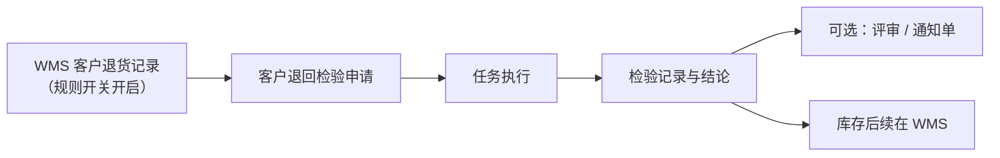

# 客户检验

> 适用基线：测试环境目标 / `dev` 分支 / 2026-07-15。
> 阅读对象：测试、实施、运维（主）；客退质量、仓储退货协同等现场角色（顺带）；操作见[客户检验-维护与查询参考](客户检验-维护与查询参考.md)。

## 业务目的与适用范围

本分组菜单名称为**客户退回检验**（申请/任务/记录），用于客户退货入库后的质量确认，不是「出货 OQC」专页。检验类型枚举虽存在发货检验、客户发货检验等码，但 QMS 菜单未提供对应独立 ATR；出货质量协同应联查销售出库/SCP，勿在本页杜撰出货放行流程。

退货仓储主链见 WMS 销售出库/客户退货相关页；供应链协同见 SCP。

## 如何使用本组文档

| 你的目的 | 建议阅读 |
| --- | --- |
| 想理解客退如何进质量 | 本页。 |
| 正在处理客退检验单 | [客户检验-维护与查询参考](客户检验-维护与查询参考.md)。 |
| 出货/发运问题 | WMS 销售出库；勿默认本页。 |

## 使用前准备

| 需要确认什么 | 为什么重要 |
| --- | --- |
| 客户退货记录及规则开关 | 退货记录创建后，可按「创建后建检验申请」规则触发。 |
| 客户退回检验方案 | 类型为客户退货检验。 |
| 包装、批次、来源销售订单线索 | 追溯；注意部分字段在建单时可能被置空（以服务实现为准）。 |
| 寄售退货/发货调整等旁路 | 亦可能建检验，类型与菜单过滤需联查。 |

!!! example "📷 截图占位"
    客户退回检验申请（客户/物料/数量）。

## 一笔客户退回检验如何完成

也可在 QMS 菜单手工建申请。通用 ATR 状态与判定口径同来料（申请九态、任务四态；接收/拒绝；使用决策四类）。

## 与销售 / SCP / WMS 的边界

| 协同方 | 本页负责 | 不在本页展开 |
| --- | --- | --- |
| WMS 客户退货 | 消费建单触发；质量结论 | 退货收货库存事务、库位 |
| WMS 销售出库 | — | 出货拣配与发运 |
| SCP | 客诉/发货协同线索 | 采购预测与结算 |
| 质量评审 / Q1 | 客退不合格出口 | 索赔金额规则细节 |

## 关键判断

| 判断点 | 应先确认什么 | 影响 |
| --- | --- |
| 退货后无检验单 | 规则开关、是否重复回调号、方案 | 避免重复建单或漏建 |
| 是否做出货检验 | 有无独立菜单/类型使用证据 | 无则不培训为 OQC |
| 结论后库存怎么变 | WMS 退货后续与隔离/报废 | QMS 不直接改余额 |

### 关键字段业务角色

| 字段/配置点 | 在系统中的作用 | 关键行为要点 | 警惕什么 |
| --- | --- | --- | --- |
| 触发：客户退货记录 | 规则开启时可建申请 | 「创建后建检验申请」开关 | 关则无单 |
| 客户/物料/数量 | 客退对象 | 多由退货记录带入 | 部分参考订单字段可能置空 |
| 检验类型=客户退货检验 | 与方案匹配 | 非出货 OQC | 勿当作出货检验页 |
| 评估码 / 使用决策 / ATR 状态 | 同来料口径 | 库存归 WMS | — |

### 选择器范围（骨架）

通例见[通用选择器过滤惯例](../../02-业务模型/12-通用选择器过滤惯例.md)。下表只写本页差异；精确状态集与权限投影见 `FSEM-006` / `GAP-014`。

| 选择字段 | 选择对象 | 可选范围（当前可写） | 范围依赖 | 选不到时通常原因 |
| --- | --- | --- | --- | --- |
| 客户 / 物料 / 数量 | 主数据或上游带入 | 多由客户退货记录带入；手工选时须可用 | 退货记录、规则开关 | 未建退货、开关关、停用、权限外 |
| 检验方案 | 检验配置·方案 | 物料 + **客户退货检验**类型 + 有效期 | 物料、检验类型 | 无方案、类型误配成出货类 |
| 检验类型入口 | 客户退回检验菜单 | 本菜单=客退检验；**非**出货 OQC 专页 | 菜单与权限 | 当作出货检验培训 |
| 寄售退货 / 发货调整旁路 | （触发） | ❓ 与本菜单过滤关系未环境样例（`GAP-016`） | 旁路单据类型 | 有建单无线索或进错菜单 |
| 承接人 | 用户/岗位 | ❓ 组织与数据权限投影未逐页实测 | 角色、岗位 | 无权限、未分配 |

### 详情分组与快速跳转

| 分组 | 应展示什么 | 可联查什么 |
| --- | --- | --- |
| 来源与对象 | 客户、物料、数量、退货记录/参考订单线索。 | WMS 客户退货、销售出库线索。 |
| 方案与类型 | 客户退货检验类型、方案、严格度。 | 检验配置。 |
| 执行与结果 | ATR 状态、评估码、使用决策。 | — |
| 后续处置 | 评审/通知单、库存后续意图。 | 质量评审、WMS。 |
| 系统信息 | 创建、更新与审计。 | — |

!!! example "📷 截图占位"
    客户退回检验申请详情分组与退货联查；状态：待截图。

## 限制与待确认

- `GAP-016`：客退检验现场状态机、旁路建单（寄售退货/发货调整）与回写规则待逐页核验。
- `FSEM-006`：方案/承接人选择器精确状态过滤与 P13 投影矩阵待测。
- 枚举含发货检验等类型，缺菜单 ≠ 已交付出货检验页；培训不得写成 OQC。
- 客户退货建单时部分 `reference*` 字段置空的业务意图待产品确认。

!!! example "📝 示例数据占位"
    客户退货 20 件 → 检验申请 → 拒收 → 转评审。

