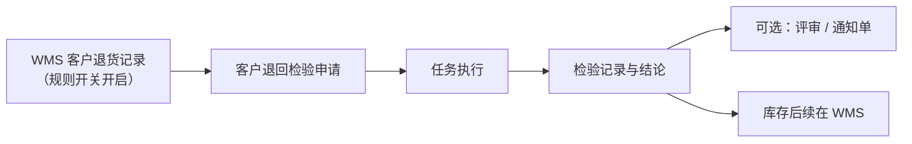

# 客户检验

> 适用基线：测试环境目标 / `dev` 分支 / 2026-07-15。
> 阅读对象：OQC/客退质量、仓储退货协同；操作见[客户检验-维护与查询参考](客户检验-维护与查询参考.md)。

## 业务目的与适用范围

本分组菜单名称为**客户退回检验**（申请/任务/记录），用于客户退货入库后的质量确认，不是「出货 OQC」专页。检验类型枚举虽存在发货检验、客户发货检验等码，但 QMS 菜单未提供对应独立 ATR；出货质量协同应联查销售出库/SCP，勿在本页杜撰出货放行流程。

退货仓储主链见 WMS 销售出库/客户退货相关页；供应链协同见 SCP。

## 如何使用本组文档

| 你的目的 | 建议阅读 |
| --- | --- |
| 想理解客退如何进质量 | 本页。 |
| 正在处理客退检验单 | [客户检验-维护与查询参考](客户检验-维护与查询参考.md)。 |
| 出货/发运问题 | WMS 销售出库；勿默认本页。 |

## 使用前准备

| 需要确认什么 | 为什么重要 |
| --- | --- |
| 客户退货记录及规则开关 | 退货记录创建后，可按「创建后建检验申请」规则触发。 |
| 客户退回检验方案 | 类型为客户退货检验。 |
| 包装、批次、来源销售订单线索 | 追溯；注意部分字段在建单时可能被置空（以服务实现为准）。 |
| 寄售退货/发货调整等旁路 | 亦可能建检验，类型与菜单过滤需联查。 |

【截图占位：客户退回检验申请（客户/物料/数量）。】

## 一笔客户退回检验如何完成

也可在 QMS 菜单手工建申请。通用 ATR 状态与判定口径同来料（申请九态、任务四态；接收/拒绝；使用决策四类）。

## 与销售 / SCP / WMS 的边界

| 协同方 | 本页负责 | 不在本页展开 |
| --- | --- | --- |
| WMS 客户退货 | 消费建单触发；质量结论 | 退货收货库存事务、库位 |
| WMS 销售出库 | — | 出货拣配与发运 |
| SCP | 客诉/发货协同线索 | 采购预测与结算 |
| 质量评审 / Q1 | 客退不合格出口 | 索赔金额规则细节 |

## 关键判断

| 判断点 | 应先确认什么 | 影响 |
| --- | --- |
| 退货后无检验单 | 规则开关、是否重复回调号、方案 | 避免重复建单或漏建 |
| 是否做出货检验 | 有无独立菜单/类型使用证据 | 无则不培训为 OQC |
| 结论后库存怎么变 | WMS 退货后续与隔离/报废 | QMS 不直接改余额 |

## 限制与待确认

- 枚举含发货检验等类型，缺菜单不等于能力不存在，但培训不得写成已交付出货检验页。
- 寄售退货、发货调整建单与本菜单过滤关系待环境样例。
- 客户退货建单时部分参考订单字段被置空的业务意图待产品确认。

【示例数据占位：客户退货 20 件 → 检验申请 → 拒收 → 转评审。】
