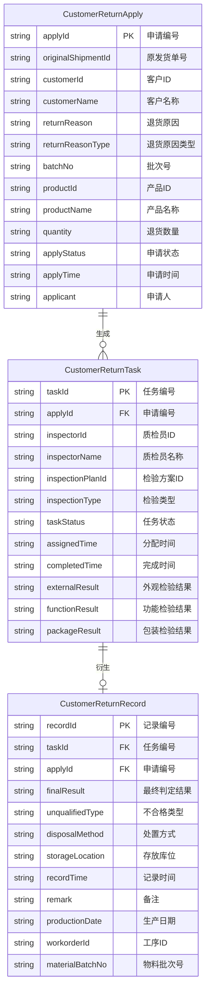
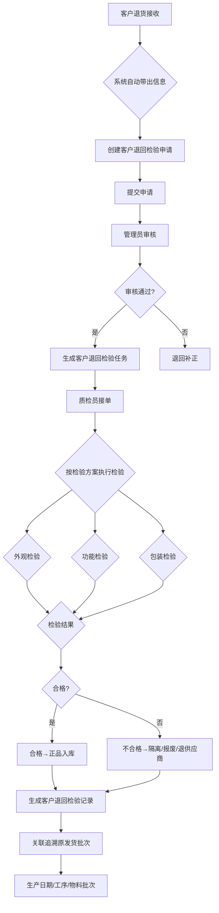

# 客户检验

## 概述

客户检验是 QMS 质量管理系统的核心模块之一，用于对客户退回的产品进行检验评估。当客户因质量问题或其他原因退货时，系统支持从退货接收、检验任务分配到最终判定的全流程管理，确保每笔退货均可追溯至原始发货批次。

客户检验模块包含三个核心子流程：

- **客户退回检验申请** - 记录退货基本信息，系统自动带出原发货单、批次及客户信息
- **客户退回检验任务** - 质检员接单后按检验方案执行检验，区分外观/功能/包装等不合格类型
- **客户退回检验记录** - 记录最终判定结果，合格品可重新入库，不合格品进入隔离/报废/退供应商流程

## 领域模型



### 实体说明

| 实体 | 说明 | 生命周期 |
|------|------|----------|
| CustomerReturnApply | 客户退回检验申请，记录退货信息的起点 | 创建后不可修改，仅作状态流转 |
| CustomerReturnTask | 客户退回检验任务，由申请触发生成 | 可多次退回重检 |
| CustomerReturnRecord | 客户退回检验记录，检验的最终结果 | 一旦判定不可变更 |

## 核心流程

### 流程图



### 流程说明

| 步骤 | 环节 | 说明 |
|------|------|------|
| 1 | 客户退货接收 | 客户将产品退回至仓库，仓库人员确认收货 |
| 2 | 创建申请 | 系统自动带出原发货单号、批次号、客户信息，生成客户退回检验申请 |
| 3 | 任务生成 | 申请审核通过后，根据检验方案自动生成检验任务 |
| 4 | 执行检验 | 质检员按方案执行外观、功能、包装等维度的检验 |
| 5 | 判定处置 | 合格品入正品库；不合格品进入隔离/报废/退供应商流程 |
| 6 | 关联追溯 | 记录关联原发货批次的生产日期、工序、物料批次信息 |

## 字段说明

### 客户退回检验申请 (CustomerReturnApply)

| 字段名 | 中文名 | 类型 | 说明 | 示例 |
|--------|--------|------|------|------|
| applyId | 申请编号 | string | (待截图确认) | CRA-20260520-001 |
| originalShipmentId | 原发货单号 | string | (待截图确认) | SH-20260501-001 |
| customerId | 客户ID | string | (待截图确认) | C-001 |
| customerName | 客户名称 | string | (待截图确认) | 某某汽车 |
| returnReason | 退货原因 | string | (待截图确认) | |
| returnReasonType | 退货原因类型 | string | (待截图确认) | 外观损坏/功能异常/包装破损/其他 |
| batchNo | 批次号 | string | (待截图确认) | B-20260501 |
| productId | 产品ID | string | (待截图确认) | P-001 |
| productName | 产品名称 | string | (待截图确认) | 电机总成 |
| quantity | 退货数量 | string | (待截图确认) | 10 |
| applyStatus | 申请状态 | string | (待截图确认) | 待审核/已通过/已驳回 |
| applyTime | 申请时间 | string | (待截图确认) | 2026-05-20 10:00 |
| applicant | 申请人 | string | (待截图确认) | 张三 |

### 客户退回检验任务 (CustomerReturnTask)

| 字段名 | 中文名 | 类型 | 说明 | 示例 |
|--------|--------|------|------|------|
| taskId | 任务编号 | string | (待截图确认) | CRT-20260520-001 |
| applyId | 申请编号 | string | (待截图确认) | CRA-20260520-001 |
| inspectorId | 质检员ID | string | (待截图确认) | I-001 |
| inspectorName | 质检员名称 | string | (待截图确认) | 李四 |
| inspectionPlanId | 检验方案ID | string | (待截图确认) | IP-001 |
| inspectionType | 检验类型 | string | (待截图确认) | 来料检验/过程检验/出货检验 |
| taskStatus | 任务状态 | string | (待截图确认) | 待接单/进行中/已完成/已取消 |
| assignedTime | 分配时间 | string | (待截图确认) | 2026-05-20 10:30 |
| completedTime | 完成时间 | string | (待截图确认) | 2026-05-20 14:00 |
| externalResult | 外观检验结果 | string | (待截图确认) | 合格/不合格 |
| functionResult | 功能检验结果 | string | (待截图确认) | 合格/不合格 |
| packageResult | 包装检验结果 | string | (待截图确认) | 合格/不合格 |

### 客户退回检验记录 (CustomerReturnRecord)

| 字段名 | 中文名 | 类型 | 说明 | 示例 |
|--------|--------|------|------|------|
| recordId | 记录编号 | string | (待截图确认) | CRR-20260520-001 |
| taskId | 任务编号 | string | (待截图确认) | CRT-20260520-001 |
| applyId | 申请编号 | string | (待截图确认) | CRA-20260520-001 |
| finalResult | 最终判定结果 | string | (待截图确认) | 合格/不合格 |
| unqualifiedType | 不合格类型 | string | (待截图确认) | 外观/功能/包装 |
| disposalMethod | 处置方式 | string | (待截图确认) | 隔离/报废/退供应商 |
| storageLocation | 存放库位 | string | (待截图确认) | QC-Q-001 |
| recordTime | 记录时间 | string | (待截图确认) | 2026-05-20 15:00 |
| remark | 备注 | string | (待截图确认) | |
| productionDate | 生产日期 | string | (待截图确认) | 2026-04-15 |
| workorderId | 工序ID | string | (待截图确认) | WO-001 |
| materialBatchNo | 物料批次号 | string | (待截图确认) | MB-20260415-001 |

## 关联追溯

客户退回检验记录通过以下字段实现对原发货批次的全链路追溯：

| 追溯字段 | 说明 | 用途 |
|----------|------|------|
| productionDate | 生产日期 | 定位产品生产时间节点 |
| workorderId | 工序ID | 追溯生产过程中的加工工序 |
| materialBatchNo | 物料批次号 | 追溯原材料批次，定位供应链问题 |

追溯链路示例：

```
客户退货 → 客户退回检验申请 → 原发货单号 → 批次号
  → 批次关联的生产日期、工序ID、物料批次号
  → 定位问题根源：是生产环节还是物料问题
```