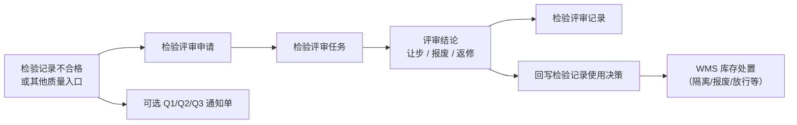

# 质量评审

> 适用基线：测试环境目标 / `dev` 分支 / 2026-07-15。
> 阅读对象：质量评审岗、MRB、仓储协同；操作见[质量评审-维护与查询参考](质量评审-维护与查询参考.md)。

## 业务目的与适用范围

质量评审处理检验不合格后的处置决策，菜单包含：

1. **检验评审**申请 / 任务 / 记录：对检验记录给出让步、报废或返修等结论，并可回写检验记录使用决策。
2. **质量通知**：q1 / q2 / q3 通知单（客诉/供应商索赔/问题跟踪等业务单据，与评审 ATR 并存）。

另：WMS 下有「质量评审 / 待评审物料」入口，属于仓储侧待处置库存视角，**不是**本页检验评审 ATR；联查时需分清。

库存隔离、放行、报废出库等事务仍以 WMS 为准；ANDON/MES 仅在有证据时引用。

## 如何使用本组文档

| 你的目的 | 建议阅读 |
| --- | --- |
| 想理解不合格如何闭环 | 本页。 |
| 正在做检验评审或通知单 | [质量评审-维护与查询参考](质量评审-维护与查询参考.md)。 |
| 查来料/生产/客退原单 | 对应检验分组。 |

## 使用前准备

| 需要确认什么 | 为什么重要 |
| --- | --- |
| 来源检验记录号与结论 | 评审挂接检验事实。 |
| 包装/批次/库位等库存定位（明细） | 处置对象可追溯到库存。 |
| 审批流/评审人 | 任务含流程实例与节点名线索。 |
| 是否需要通知单 | Q1/Q2/Q3 字段面向索赔与责任人，与评审结论分工。 |

!!! example "📷 截图占位"
    检验评审申请（检验记录号、物料、结论）。

## 评审主流程

| 对象 | 业务含义 |
| --- | --- |
| 评审申请 | 提出对某物料/包装/检验记录的评审请求。 |
| 评审任务 | 评审执行；可含结论、评审人、时间、流程节点。 |
| 评审记录 | 固化评审结果。 |
| 明细 | 包装/批次/数量/库存状态/库位/仓库等定位信息。 |
| Q1/Q2/Q3 | 通知与索赔类单据；Q2 可含供应商、采购收货号、索赔金额等。 |

评审结论（培训名）：让步、报废、返修。任务完成可将库存状态映射为检验记录使用决策（合格 / 报废 / 隔离）。

## 与检验执行、WMS、通知单的边界

| 协同方 | 本页负责 | 不在本页展开 |
| --- | --- | --- |
| 来料/生产/客户检验 | 挂接检验记录、更新使用决策 | 抽检录入细节 |
| WMS 库存移动/报废 | 给出处置结论线索 | 具体事务与余额 |
| WMS「质量评审」菜单 | 分清入口 | 待评审物料仓储作业 |
| ANDON | 异常升级线索（若组织使用） | 故障响应 SLA |
| Q1/Q2/Q3 | 通知/索赔事实 | 财务结算细则 |

## 关键判断

| 判断点 | 应先确认什么 | 影响 |
| --- | --- |
| 走评审还是只出通知单 | 组织 MRB 流程 | 避免只建 Q 单无结论 |
| 让步后能否使用 | 使用决策与 WMS 状态 | 让步≠已自动放行 |
| 报废 | 是否已有报废出库 | 防重复或漏处置 |
| 看错菜单 | QMS 检验评审 vs WMS 质量评审 | 对象不同 |

### 关键字段业务角色

| 字段/配置点 | 行为模式 | 在系统中的作用 | 关键行为要点 | 警惕什么 |
| --- | --- | --- | --- | --- |
| 来源检验记录号 | P2 / P5 | 挂接不合格事实 | 须已有检验记录 | 无来源难闭环 |
| 评审结论（让步/报废/返修） | P1 / P9 | 处置决策 | 可回写检验使用决策 | 让步≠WMS 已放行 |
| 明细库位/批次/包装 | P2 / P8 | 定位处置对象 | 追溯到库存粒度 | 定位错导致错处置 |
| Q1/Q2/Q3 通知单 | P1 / P12 | 索赔/客诉单据 | 与评审 ATR 并存、不替代结论 | 只建 Q 单无评审 |
| 评审 ATR 状态 | P9 | 门禁 | 申请→任务→记录 | — |

## 限制与待确认

- Q1/Q2/Q3 与检验评审的强制先后、是否自动互建未闭合。
- 流程引擎字段（流程实例、当前节点）的具体审批图以环境为准。
- 评审结论到 WMS 自动开单的完整链路未在本轮逐项证实。

!!! example "📝 示例数据占位"
    来料不合格记录 → 评审让步 → 使用决策更新 → WMS 隔离转合格。

