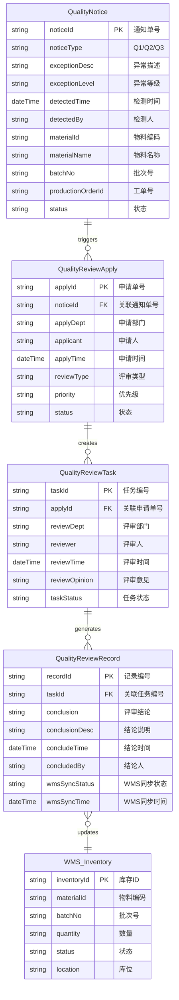
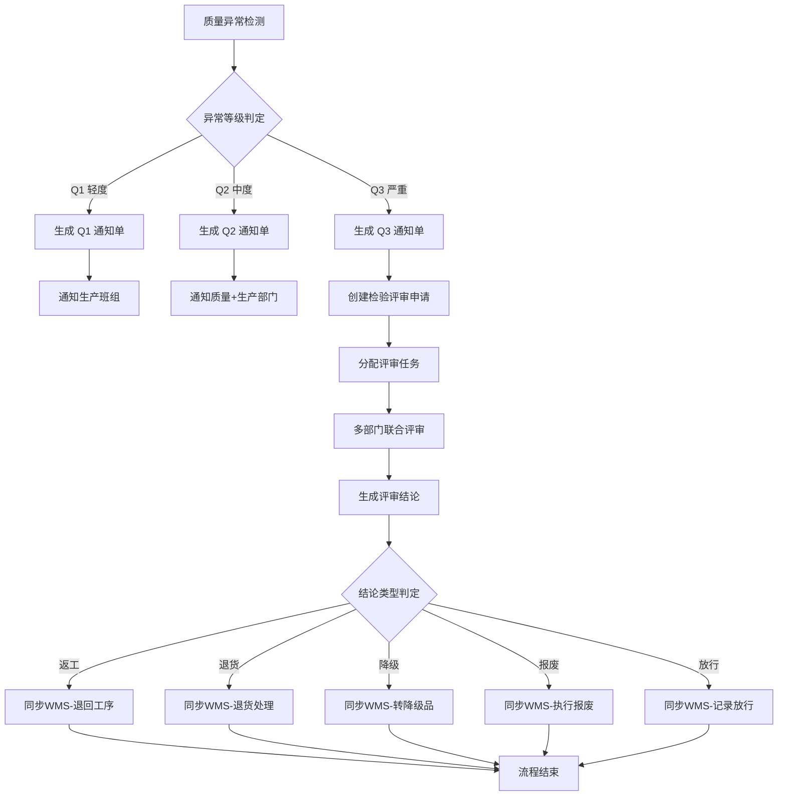

# 05-质量评审

## 概述

质量评审是 MOM 系统中处理质量异常的核心模块，当生产过程中检测到质量异常时，系统自动生成不同级别的质量通知单（Q1/Q2/Q3），并触发多部门联合评审流程，生成评审结论后闭环到 WMS 库存模块进行处理。

### 业务场景

| 通知单类型 | 异常等级 | 描述 | 处理方式 |
|-----------|---------|------|---------|
| Q1 通知单 | 轻度异常 | 一般性质量问题，影响较小 | 通知生产班组，限期整改 |
| Q2 通知单 | 中度异常 | 影响较大，需处理 | 通知质量+生产，联合处理 |
| Q3 通知单 | 严重异常 | 影响严重，需评审 | 触发检验评审，多部门联合评审 |

### 评审结论类型

| 结论类型 | 说明 | WMS 闭环操作 |
|---------|------|------------|
| 返工 | 返工后重新检验 | 退回工序重新加工 |
| 退货 | 退回供应商 | 更新供应商绩效记录 |
| 降级 | 降级使用 | 转至降级品库存 |
| 报废 | 直接报废 | 执行报废处理 |
| 放行 | 特殊放行 | 记录放行原因继续使用 |

---

## 领域模型

### ER 图



---

## 核心流程

### 质量评审流程图



### 流程说明

1. **异常检测与通知单生成**
   - 质量异常发生时，系统根据异常等级自动生成对应的质量通知单
   - Q1 通知单：轻度异常，仅通知生产班组限期整改
   - Q2 通知单：中度异常，通知质量部门和生产部门联合处理
   - Q3 通知单：严重异常，触发检验评审申请流程

2. **检验评审申请**
   - 针对 Q3 严重异常，创建检验评审申请
   - 申请单记录异常详情、申请部门、申请人等信息
   - 系统根据业务规则分配评审任务到相关部门

3. **多部门联合评审**
   - 评审任务分配给质量、生产、技术等部门
   - 各部门评审人填写评审意见
   - 系统汇总形成最终评审结论

4. **评审结论闭环**
   - 评审结论同步到 WMS 库存模块
   - 根据结论类型执行对应的库存处理操作
   - 记录 WMS 同步状态和时间戳

---

## 字段说明

### 质量通知单 (QualityNotice)

| 字段名 | 类型 | 描述 | 说明 |
|-------|------|------|------|
| noticeId | string | 通知单号 | 主键，待截图确认 |
| noticeType | string | 通知单类型 | Q1/Q2/Q3，待截图确认 |
| exceptionDesc | string | 异常描述 | 待截图确认 |
| exceptionLevel | string | 异常等级 | 待截图确认 |
| detectedTime | dateTime | 检测时间 | 待截图确认 |
| detectedBy | string | 检测人 | 待截图确认 |
| materialId | string | 物料编码 | 待截图确认 |
| materialName | string | 物料名称 | 待截图确认 |
| batchNo | string | 批次号 | 待截图确认 |
| productionOrderId | string | 工单号 | 待截图确认 |
| status | string | 状态 | 待截图确认 |

### 检验评审申请 (QualityReviewApply)

| 字段名 | 类型 | 描述 | 说明 |
|-------|------|------|------|
| applyId | string | 申请单号 | 主键，待截图确认 |
| noticeId | string | 关联通知单号 | 外键关联 QualityNotice，待截图确认 |
| applyDept | string | 申请部门 | 待截图确认 |
| applicant | string | 申请人 | 待截图确认 |
| applyTime | dateTime | 申请时间 | 待截图确认 |
| reviewType | string | 评审类型 | 待截图确认 |
| priority | string | 优先级 | 待截图确认 |
| status | string | 状态 | 待截图确认 |

### 检验评审任务 (QualityReviewTask)

| 字段名 | 类型 | 描述 | 说明 |
|-------|------|------|------|
| taskId | string | 任务编号 | 主键，待截图确认 |
| applyId | string | 关联申请单号 | 外键关联 QualityReviewApply，待截图确认 |
| reviewDept | string | 评审部门 | 待截图确认 |
| reviewer | string | 评审人 | 待截图确认 |
| reviewTime | dateTime | 评审时间 | 待截图确认 |
| reviewOpinion | string | 评审意见 | 待截图确认 |
| taskStatus | string | 任务状态 | 待截图确认 |

### 检验评审记录 (QualityReviewRecord)

| 字段名 | 类型 | 描述 | 说明 |
|-------|------|------|------|
| recordId | string | 记录编号 | 主键，待截图确认 |
| taskId | string | 关联任务编号 | 外键关联 QualityReviewTask，待截图确认 |
| conclusion | string | 评审结论 | 返工/退货/降级/报废/放行，待截图确认 |
| conclusionDesc | string | 结论说明 | 待截图确认 |
| concludeTime | dateTime | 结论时间 | 待截图确认 |
| concludedBy | string | 结论人 | 待截图确认 |
| wmsSyncStatus | string | WMS同步状态 | 待截图确认 |
| wmsSyncTime | dateTime | WMS同步时间 | 待截图确认 |

---

## WMS 库存闭环

### 闭环映射表

| 评审结论 | WMS 操作 | 库存状态变更 |
|---------|---------|-------------|
| 返工 | 退回工序 | 在制品 → 生产中 |
| 退货 | 退回供应商 | 来料 → 退货中 |
| 降级 | 转降级品库存 | 合格品 → 降级品 |
| 报废 | 执行库存报废 | 库存 → 已报废 |
| 放行 | 记录放行信息 | 隔离 → 合格品 |

### 同步状态

| 同步状态 | 说明 |
|---------|------|
| pending | 待同步 |
| syncing | 同步中 |
| synced | 已同步 |
| failed | 同步失败 |

---

## 附录

### 菜单路径

```
质量评审
  ├─ Q1通知单
  ├─ Q2通知单
  ├─ Q3通知单
  └─ 检验评审
       ├─ 申请
       ├─ 任务
       └─ 记录
```

### 相关模块接口

#### 依赖模块

| 模块 | 接口方向 | 说明 |
|------|----------|------|
| MES_PLANNING | [计划管理](../../06-MES-生产管理/03-计划管理/index.md) | 获取工单和工序信息，关联异常批次 |
| QMS_IPQC | [生产检验](../03-生产检验/index.md) | 末件检验不合格触发质量评审 |
| DBC_MATERIAL | [物料主数据](../../04-DBC-主数据管理/01-物料管理/01-物料基本信息.md) | 获取物料、批次等基础数据 |

#### 被依赖模块

| 模块 | 接口方向 | 说明 |
|------|----------|------|
| WMS_INVENTORY | [库存管理](../../05-WMS-库房管理/09-库存管理/index.md) | 接收评审结论，执行返工/退货/降级/报废/放行操作 |
| SCP_SUPPLIER | [供应商](../../10-SCP-供应链平台/01-基础数据/index.md) | 退货结论更新供应商绩效记录 |