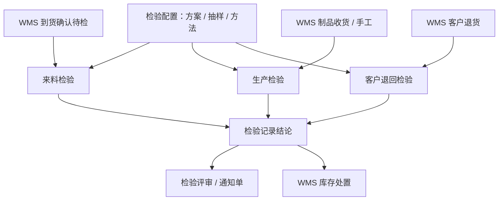

# QMS 质量管理

> 适用基线：测试环境目标 / `dev` 分支 / 2026-07-15。

## 模块职责

QMS 负责把质量要求配置为可执行的检验方案，并沉淀来料、生产过程、客户退回等场景的检验申请—任务—记录，以及不合格后的检验评审与质量通知。库存隔离、放行、退货、报废等**事务写入以 WMS 为准**；生产报工与工单执行细节以 MES 为准。

通用 ATR 概念见[申请、任务与记录模型](../02-业务模型/01-申请任务记录模型.md)。

## 建议学习顺序

1. [检验配置](01-检验配置/index.md) — 先懂方案与抽样。
2. [来料检验](02-来料检验/index.md) — 到货确认触发主链。
3. [生产检验](03-生产检验/index.md) — 首件/末件/巡检/其他。
4. [客户检验](04-客户检验/index.md) — 客户退回检验（非出货 OQC）。
5. [质量评审](05-质量评审/index.md) — 让步/报废/返修与通知单。

操作步骤读各组「维护与查询参考」；技术表名与枚举 code 只在内部证据。

## 业务分组齐套状态

| 分组 | 状态 | 说明 |
| --- | --- | --- |
| [01-检验配置](01-检验配置/index.md) | 已覆盖 | 抽样/方法/模板/方案/动态规则/计数器。 |
| [02-来料检验](02-来料检验/index.md) | 已覆盖 | 到货确认触发；收货建检已停用。 |
| [03-生产检验](03-生产检验/index.md) | 已覆盖 | 四套 ATR；MES 报工 NG→自动建单未证实（`GAP-071`）。 |
| [04-客户检验](04-客户检验/index.md) | 已覆盖 | 客户退回检验；非出货 OQC。 |
| [05-质量评审](05-质量评审/index.md) | 已覆盖 | 检验评审 ATR + Q1/Q2/Q3；区分 WMS 质量评审菜单。 |

## 核心流程（总览）

## 与其它模块边界

| 模块 | QMS 负责 | 不在 QMS 展开 |
| --- | --- | --- |
| WMS | 触发建单、结论回写键、使用决策 | 库存事务、上架、隔离/报废移动 |
| MES | 工序码配置线索、不良协同 | 报工 NG 自动建单（未证实） |
| SCP / 销售 | 客退/索赔上下文 | 出货计划与结算 |
| ANDON | 异常升级线索 | 故障响应主链 |
| EAM | — | 设备/工装巡检（勿与过程巡检混淆） |

## 待确认事项

- 生产检验类型码与制品收货触发的菜单展示关系。
- MES 报工 NG → QMS 映射（`GAP-071`）。
- 评审/通知单编排与自动开 WMS 处置单。
- 各组截图实拍与环境字典细项。
