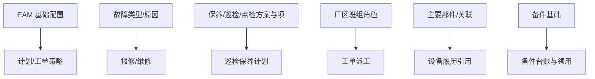

# 基础数据

> 适用基线：测试环境目标 / `dev` 分支 / 2026-07-15。
> 阅读对象：设备工程师、EAM 实施；操作见[基础数据-维护与查询参考](基础数据-维护与查询参考.md)。

## 业务目的与适用范围

基础数据为 EAM 的方案、故障分类、班组角色、部件与备件基础、文档类型等提供配置底座。设备/工装**身份台账**以 DBC 为准（EAM 菜单会嵌入 DBC 台账页）；本页只写 EAM 模块内已证实的配置对象。

旧概述中的虚构「EAM_CONFIG / FACTORY_WORKSHOP」英文字段表废弃，不以之为培训事实。

## 如何使用本组文档

| 你的目的 | 建议阅读 |
| --- | --- |
| 想理解开计划前要配什么 | 本页。 |
| 正在维护方案、故障类型、班组角色 | [基础数据-维护与查询参考](基础数据-维护与查询参考.md)。 |
| 想维护设备身份与现场归属 | DBC [设备台账管理](../../04-DBC-主数据管理/07-设备管理/02-设备台账管理.md)。 |
| 想看计划如何消费方案 | [巡检保养](../05-巡检保养/index.md)。 |

## 使用前准备

| 需要确认什么 | 为什么重要 |
| --- | --- |
| DBC 设备/工装台账已建 | 计划与工单按设备/工装编码挂接。 |
| 车间/产线/工位主数据（DBC） | 组织定位与派工范围。 |
| 哪些故障类型、保养/巡检/点检方案启用 | 报修与计划生成依赖。 |
| 厂区班组角色与维修责任岗位 | 派工、接单与验证人匹配。 |

【截图占位：EAM 基础数据菜单与故障类型列表；脱敏。】

## 对象关系

| 对象 | 业务含义 |
| --- | --- |
| EAM 基础配置 | 模块级键值：标题、编码、配置值。 |
| 故障类型 / 故障原因 | 报修分类；可带标准工时、关联设备线索。 |
| 保养/巡检/点检方案与项、选择集 | 计划引用的检查/保养内容与选项集。 |
| 开拉方案与项（若启用） | 开拉计划底座。 |
| 厂区班组角色 | 派工对象与班组角色绑定。 |
| 主要部件 / 部件关联 | 设备结构部件及关联关系。 |
| 生产商 / 供应商（EAM 菜单） | EAM 侧厂商资料；与 DBC 生产商可能并存，勿当成同一张主数据。 |
| 备件基础、EAM 库区/库位 | 备件主数据与 EAM 库内定位（库存事务边界见[备件管理](../03-备件管理/index.md)）。 |
| 文档类型、扩展属性、故障率参数、生产时长 | 文档分类、扩展字段与指标辅助配置。 |
| 工作日历 | 计划排程与工单生成日历（菜单在 EAM 根下）。 |

## 与 DBC / 其它分组边界

| 协同方 | 本页负责 | 不在本页展开 |
| --- | --- | --- |
| DBC 设备/工装台账 | 引用编码 | 台账新增/导入/状态主维护 |
| DBC 车间产线工位 | 引用 | 工厂建模主维护 |
| 巡检保养 | 提供方案/项 | 计划审批、工单执行 |
| 设备管理 | 提供故障类型等 | 报修维修状态机 |
| 备件管理 | 提供备件基础 | 出入库与 WMS 同步 |

## 关键判断

| 判断点 | 应先确认什么 | 影响 |
| --- | --- | --- |
| 计划选不到方案 | 方案是否启用、编码是否匹配 | 无法建计划或生成空工单 |
| 报修故障类型缺失 | 故障类型/原因是否维护 | 分类统计与标准工时不准 |
| 派不到人 | 班组角色与用户岗位 | 工单停在待派工/待接单 |
| 台账在哪改 | 是否误在 EAM「虚构字段」改身份 | 应回到 DBC 台账页 |

## 限制与待确认

- EAM 与 DBC 两侧生产商是否同步：未证实，维护时以现场实际菜单为准并登记差异。
- 部分基础菜单在菜单数据中可能停用或隐藏，以测试环境可见性为准。

【示例数据占位：新建「月度保养方案」并挂三项检查项，供设备计划引用。】
