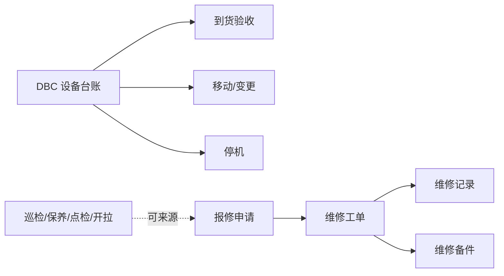
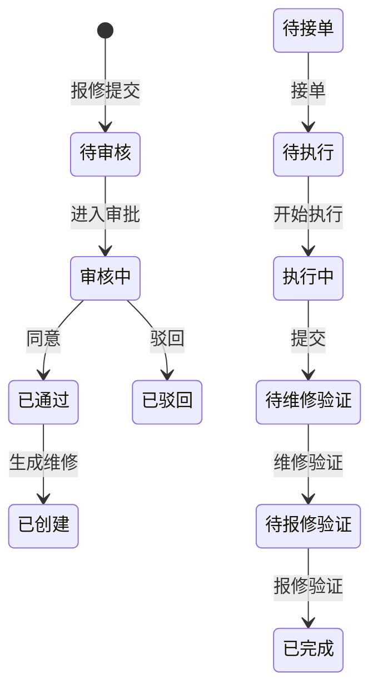

# 设备管理

> 适用基线：测试环境目标 / `dev` 分支 / 2026-07-15。
> 阅读对象：设备工程师、维修班组、生产协同；操作见[设备管理-维护与查询参考](设备管理-维护与查询参考.md)。

## 业务目的与适用范围

设备管理回答：设备如何验收投用、如何移动/变更、何时停机、如何报修与维修闭环。设备**台账身份**在 DBC 维护（EAM 导航下的「设备台账管理」实际打开 DBC 台账页）；本页写 EAM 执行侧已证实能力。

不替代 ANDON 异常呼叫与响应链，也不替代 MES 工位作业。旧虚构 ER 字段废弃。

## 如何使用本组文档

| 你的目的 | 建议阅读 |
| --- | --- |
| 想理解台账 vs 维修边界 | 本页。 |
| 正在验收、移机、报修、派工维修 | [设备管理-维护与查询参考](设备管理-维护与查询参考.md)。 |
| 想改设备编号/车间/责任人 | DBC [设备台账管理](../../04-DBC-主数据管理/07-设备管理/02-设备台账管理.md)。 |
| 巡检异常转报修 | [巡检保养](../05-巡检保养/index.md)。 |
| 现场 PDA 报修/维修 | [终端操作](../06-终端操作/index.md)。 |

## 使用前准备

| 需要确认什么 | 为什么重要 |
| --- | --- |
| DBC 设备台账已存在且编码正确 | 验收/报修/维修均挂设备编码。 |
| 故障类型、班组角色 | 报修分类与派工。 |
| 是否停机、是否影响生产 | 维修工单与停机记录口径。 |
| 备件是否从 EAM 领用并同步 WMS | 见[备件管理](../03-备件管理/index.md)。 |

!!! example "📷 截图占位"
    报修列表与维修工单状态列；脱敏。

## 对象关系

| 对象 | 业务含义 |
| --- | --- |
| 设备台账（DBC） | 身份、型号、现场归属、状态、责任、厂商等主数据。 |
| 到货验收 | 新设备签收/验收，回写或补丁台账侧信息。 |
| 移动记录 / 变更记录 | 位置或关键属性变更履历。 |
| 停机 | 设备停机事实（与 ANDON 停机项目勿直接等同）。 |
| 设备工具备件 | 设备与工具/备件关联。 |
| 报修申请 | 故障描述、紧急度、停机、图片、组织位置、审批与自动策略；可来自保养/巡检/点检/开拉工单。 |
| 维修工单 | 派发、接单、执行、双验证（维修验证/报修验证）、完成/作废/暂停等。 |
| 维修记录 / 明细 | 执行结果沉淀。 |
| 维修备件申请/记录 | 维修过程领用备件。 |

## 报修与维修状态
报修状态：待审核、已撤回、审核中、已通过、已驳回、已创建、已确认、暂存、已作废、已退回。

维修工单状态：待派工、已逾期、已退单、待接单、待执行、执行中、待维修验证、待报修验证、已完成、已作废、暂停。

实际可达路径以服务校验与自动策略为准；上图用于培训理解。

### 关键字段业务角色

完整状态-动作与选择器见[维护与查询参考](设备管理-维护与查询参考.md)。本表只列主线关键项。设备编码「仅可选已存在台账」通例见[通用选择器过滤惯例](../../02-业务模型/12-通用选择器过滤惯例.md)；车间/产线/工位为生产现场层级，**勿套用**仓→区→位通例。

| 字段/配置点 | 在系统中的作用 | 关键行为要点（取值/范围/联动/门禁） | 维护或操作时要警惕什么 |
| --- | --- | --- | --- |
| 设备编码（DBC 台账） | 全链路身份 | 须选已存在台账；EAM 不另建身份 | 错码导致派工/统计错位 |
| 台账可用/现场状态 | 设备是否可被业务引用 | 身份在 DBC；启停规则以台账页为准 | 停用设备仍被报修 |
| 报修状态 | 审批与生成维修门禁 | 见上文报修状态名 | 非预期状态强派工 |
| 维修工单状态 | 派工→执行→双验证 | 见上文维修状态名 | 跳过验证当完成 |
| 紧急度 / 故障类型 | 派工优先级与分类 | 字典取值 | 分类错影响统计与响应 |
| 是否停机 | 停机事实口径 | 与 ANDON 停机项目勿直接等同（关联 ❓） | 双记或漏记停机 |
| 来源工单类型 | 巡检/保养/点检/开拉转入 | 可带来源工单号/类型 | 与 QMS「巡检检验」不同对象 |
| 车间/产线/工位 | 组织定位 | 有效工厂建模 | 定位错影响派工 |
| 自动审核/派工/执行策略 | 缩短人工环节 | 组织默认策略 ❓ | 误开导致未审即派 |

### 选择器范围（骨架）

通例见[通用选择器过滤惯例](../../02-业务模型/12-通用选择器过滤惯例.md)。设备编码「仅可选已存在台账」；车间/产线/工位为生产现场层级，**勿套用**仓→区→位。精确状态集与权限投影见 `FSEM-006` / `GAP-014`。

| 选择字段 | 选择对象 | 可选范围（当前可写） | 范围依赖 | 选不到时通常原因 |
| --- | --- | --- | --- | --- |
| 设备编码 | DBC 设备台账 | 须已存在台账；启停以台账页为准 | DBC 台账状态 | 未建台账、停用、权限外 |
| 故障类型 / 紧急度 | 字典 | 组织启用字典项 | 码表 | 未配字典 |
| 车间 / 产线 / 工位 | 工厂建模 | 有效现场层级（非库位树） | 工厂建模 | 层级未建、跨厂 |
| 派工对象 / 班组角色 | 用户·岗位·班组 | ❓ 自动派工默认与投影未逐页实测 | 角色、策略 | 无人可接、策略未开 |
| 来源工单 | 巡检/保养/点检/开拉 | 可带来源工单号/类型 | 巡检保养 | 来源已关、类型不符 |
| 维修备件 | 备件对象 | 维修领用入口；库存权威在 WMS | 备件管理 | 无可用备件、同步失败 |

## 一次报修如何闭环

## 与 DBC / ANDON / MES 边界

| 协同方 | 本页负责 | 不在本页展开 |
| --- | --- | --- |
| DBC 台账 | 编码引用、验收/移动补丁 | 主数据导入与组织主维护 |
| ANDON | 可被异常协同引用设备编码 | 呼叫/到岗/响应链主链 |
| MES | 提供可用设备编码线索 | 工位作业、开工点检执行细则 |
| 备件/WMS | 维修领用入口 | WMS 库存余额与非计划出入库细则 |

## 关键判断

| 判断点 | 应先确认什么 | 影响 |
| --- | --- | --- |
| 台账改不了型号 | 是否打开的是 DBC 台账页 | 避免在错误模块找字段 |
| 报修过不了 | 状态、审批人、自动审核策略 | 卡在待审核/已驳回 |
| 工单无人接 | 班组角色与派工对象 | 停在待派工/待接单 |
| 与产线异常重复建单 | 是否已有 ANDON 呼叫及是否需并行维修 | 避免双轨无关联 |

## 查询、详情与联查

| 想解决的问题 | 推荐定位方式 | 建议联查 |
| --- | --- | --- |
| 设备为何不能报修 | 台账状态、编码是否存在。 | DBC 设备台账。 |
| 工单卡在哪一状态 | 报修/维修状态、派工对象。 | 班组、审批人。 |
| 备件如何消耗 | 维修备件申请/记录。 | 备件管理、WMS。 |

### 详情分组与快速跳转

| 分组 | 应展示什么 | 可联查什么 |
| --- | --- | --- |
| 设备身份 | 设备编码、现场位置、台账状态。 | DBC 设备台账。 |
| 报修信息 | 故障描述、紧急度、来源工单。 | 巡检保养。 |
| 维修执行 | 工单状态、派工/接单/验证。 | 维修记录、终端操作。 |
| 备件与停机 | 备件消耗、停机事实。 | 备件管理、停机记录。 |
| 系统信息 | 创建、更新与审计。 | — |

!!! example "📷 截图占位"
    报修/维修详情分组与台账/备件联查；状态：待截图。

## 限制与待确认

- `GAP-016`：报修/维修现场状态机、自动派工/执行/验证默认、停机↔ANDON 停机项目自动关联待逐页核验。
- `FSEM-006`：设备/派工对象选择器精确状态过滤与 P13 投影矩阵待测。

!!! example "📝 示例数据占位"
    设备 EQ-001 报修「主轴异响」→ 派工 → 更换备件 → 双验证完成。

