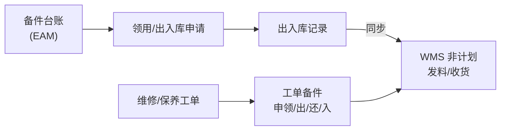

# 备件管理

> 适用基线：测试环境目标 / `dev` 分支 / 2026-07-15。
> 阅读对象：备件管理员、维修班组、仓库协同；操作见[备件管理-维护与查询参考](备件管理-维护与查询参考.md)。

## 业务目的与适用范围

备件管理支撑维修/保养所需物料的台账、申领、出入库、盘点与工单备件执行。EAM 维护备件业务单据与模块内台账视图；**向 WMS 同步非计划出库/入库**已证实存在，库存余额与仓库事务以 WMS 为准。

## 如何使用本组文档

| 你的目的 | 建议阅读 |
| --- | --- |
| 想理解 EAM 备件 vs WMS 库存 | 本页。 |
| 正在申领、出库、入库、盘点 | [备件管理-维护与查询参考](备件管理-维护与查询参考.md)。 |
| 维修领用 | [设备管理](../02-设备管理/index.md)。 |
| WMS 库存查询 | WMS [库存管理](../../05-WMS-库房管理/09-库存管理/index.md)。 |

## 使用前准备

| 需要确认什么 | 为什么重要 |
| --- | --- |
| 备件基础与台账编码 | 申领明细挂物料。 |
| EAM 库区库位与 WMS 映射 | 同步失败常见原因。 |
| 账期/非计划出入库是否开放 | WMS 接口拒收。 |
| 工单备件还是独立领用 | 菜单路径不同。 |

!!! example "📷 截图占位"
    备件出库与 WMS 同步状态；脱敏。

## 对象关系

| 对象 | 业务含义 |
| --- | --- |
| 备件台账 | 物料、库区库位、数量、安全库存、科目等 EAM 视图。 |
| 领用申请 / 出库 / 出库记录 | 申领到出库闭环。 |
| 入库申请 / 入库记录 | 回收入库或采购入 EAM 视角。 |
| 盘点计划/工单/差异/调整 | EAM 备件盘点链。 |
| 备件事务 | 事务查询。 |
| 工单备件申领/出库/归还/入库 | 绑定维修等工单的执行路径；同步 WMS。 |

## 与 WMS 边界

| 本页负责 | 不在本页展开 |
| --- | --- |
| 发起申领/出入口径、同步状态（已同步/失败） | WMS 库存余额、上架、库存事务明细规则 |
| EAM 台账数量展示 | 把 EAM 当作唯一库存真相 |

同步失败时先查 WMS 回执与映射，勿只改 EAM 数量“抹平”。

## 关键判断

| 判断点 | 应先确认什么 | 影响 |
| --- | --- | --- |
| 出库成功但 WMS 无单 | 同步状态是否失败 | 两边账不一致 |
| 台账数量与 WMS 不符 | 是否未同步路径或盘点未回写 | 对账 |
| 维修无料 | 走工单备件还是独立领用 | 选错菜单 |

## 限制与待确认

- 是否所有出入库路径均强制同步 WMS。
- 盘点调整回写 WMS 的完整链路。

!!! example "📝 示例数据占位"
    维修工单领用轴承 → 出库同步 WMS 非计划发料 → 回写单号。

