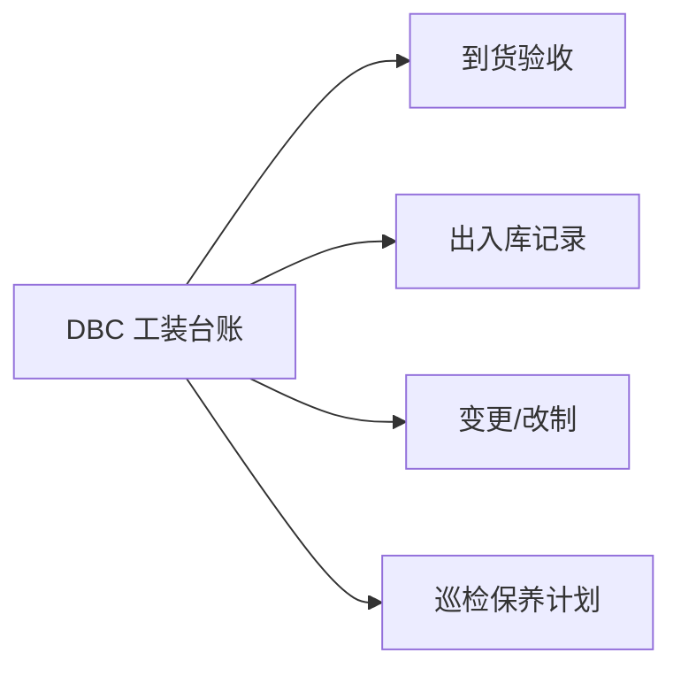

# 工装管理

> 适用基线：测试环境目标 / `dev` 分支 / 2026-07-15。
> 阅读对象：测试、实施、运维（主）；工装管理员、工艺/设备协同（顺带）。操作见[工装管理-维护与查询参考](工装管理-维护与查询参考.md)。

## 业务目的与适用范围

工装台账改不了、巡检计划选不到工装，通常是走错了模块。工装管理覆盖验收、出入库记录、变更与改制等**执行履历**；工装**台账身份**在 DBC（EAM「工装台账管理」打开 DBC 页）。与设备管理同一原则：身份改 DBC，履历记 EAM。

读完本页，应能分清「身份改哪、履历记哪」；巡检/保养/点检/维修对工装与设备共用执行模型，见[巡检保养](../05-巡检保养/index.md)、[终端操作](../06-终端操作/index.md)。工装出入库是否同步 WMS 未证实，勿当库存权威。

## 如何使用本组文档

| 你的目的 | 建议阅读 |
| --- | --- |
| 理解台账 vs 履历、与设备执行模型的关系 | 本页：准备 → 对象关系 → 边界 → 写实示例 → 验证点 |
| 验收、出入库、改制操作细节 | [工装管理-维护与查询参考](工装管理-维护与查询参考.md) |
| 改工装主数据（编号/状态/归属） | DBC [工装台账管理](../../04-DBC-主数据管理/07-设备管理/01-工装台账管理.md) |
| 把工装纳入预防维护 | [巡检保养](../05-巡检保养/index.md)（方案类型选工装） |

## 使用前准备

| 需要确认什么 | 为什么重要 |
| --- | --- |
| DBC 工装台账编码 | 所有履历挂编码。 |
| 是否纳入巡检保养计划 | 方案类型选工装。 |
| MES 是否引用该工装 | 生产可用性。 |

!!! example "📷 截图占位"
    工装出入库记录；脱敏。

## 对象关系

| 对象 | 业务含义 |
| --- | --- |
| 工装台账（DBC） | 身份、客户/现场、采购制造等。 |
| 到货验收 | 签收投用。 |
| 出库/入库记录 | 流转履历。 |
| 变更记录 / 改制 | 属性变更与改制关系。 |

## 与 DBC / MES / 备件边界

工装身份、可用性、库存归属分属不同系统，下表划清各自的责任：

| 协同方 | 本页负责 | 不在本页展开 |
| --- | --- | --- |
| DBC | 编码引用 | 台账主维护 |
| MES | 可用性线索 | 工单绑工装未证实细则 |
| 备件/WMS | — | 工装出入库是否同步 WMS（未证实） |
| 巡检保养 | 工装作为计划对象 | 方案配置 |

!!! example "📝 示例数据占位"
    工装 T-01 验收 → 出库上线 → 纳入周点检。

!!! example "写实示例：给定配置 → 期望行为"
    **给定：** DBC 工装 T-01 已建且可用；点检方案适用类型=工装；完成验收并登记一次出库。
    **期望：**

    1. EAM 菜单打开「工装台账」落地为 DBC 页，可改身份/状态。
    2. 验收/出入库履历挂 T-01；履历不是 WMS 余额（同步 WMS ❓，未证实前勿当库存账）。
    3. 点检计划对象类型选工装时可引用 T-01；台账停用或类型不符则选不到。
    4. 与模具/设备编码体系勿混用，避免记错对象。

### 建议验证点

- EAM 菜单打开工装台账：确认落地 DBC 页且可改归属。
- 完成验收或出入库各一笔，编码可追溯。
- 方案类型=工装时计划可选到目标工装；改为设备类型后选不到。
- 勿用履历数量替代 WMS/备件库存结论。

## 关键判断

| 判断点 | 应先确认什么 | 影响 |
| --- | --- | --- |
| 台账改不了 | 是否在 DBC 页 | 找错模块 |
| 计划选不到工装 | 台账状态/类型 | 无法预防维护 |
| 与模具混淆 | 编码体系 | 记错对象 |

### 关键字段业务角色

| 字段/配置点 | 在系统中的作用 | 关键行为要点 | 警惕什么 |
| --- | --- | --- | --- |
| 工装编码（DBC 台账） | 身份键 | 履历挂编码；身份在 DBC | 找错模块改身份 |
| 台账状态/类型 | 计划能否选到 | 可用状态影响巡检保养选用 | 选不到工装 |
| 出入库/变更履历 | 执行痕迹 | 非库存权威（是否走 WMS ❓） | 当 WMS 余额改 |

### 选择器范围（骨架）

通例见[通用选择器过滤惯例](../../02-业务模型/12-通用选择器过滤惯例.md)。工装编码「仅可选已存在台账」；精确状态集与权限投影见 `FSEM-006` / `GAP-014`。

| 选择字段 | 选择对象 | 可选范围（当前可写） | 范围依赖 | 选不到时通常原因 |
| --- | --- | --- | --- | --- |
| 工装编码 | DBC 工装台账 | 须已存在台账；启停以台账页为准 | DBC 台账状态/类型 | 未建台账、停用、权限外 |
| 验收 / 出入库对象 | 同上台账 | 履历挂编码；**非** WMS 库存权威 | 台账可用态 | 找错模块改身份 |
| 巡检保养计划对象 | 工装台账 | 方案类型选工装时可引用 | 方案类型、台账状态 | 类型不符、停用 |
| MES 工单绑工装 | （协同） | ❓ 寿命扣减与绑定规则未证实（`GAP-016`） | MES 工单 | 勿写成已交付绑定 |

### 详情分组与快速跳转

| 分组 | 应展示什么 | 可联查什么 |
| --- | --- | --- |
| 工装身份 | 工装编码、台账状态/类型、现场归属。 | DBC 工装台账。 |
| 验收与履历 | 到货验收、出入库、变更/改制。 | — |
| 预防维护 | 是否纳入巡检保养计划。 | 巡检保养。 |
| 系统信息 | 创建、更新与审计。 | — |

!!! example "📷 截图占位"
    工装出入库/验收详情分组与台账联查；状态：待截图。

## 限制与待确认

- `GAP-016`：工装寿命扣减、MES 工单绑定、出入库是否同步 WMS 待逐页核验。
- `FSEM-006`：工装台账选择器精确状态过滤与 P13 投影矩阵待测。

