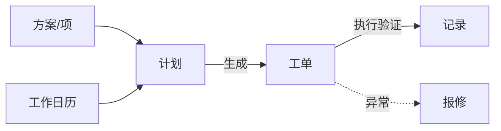
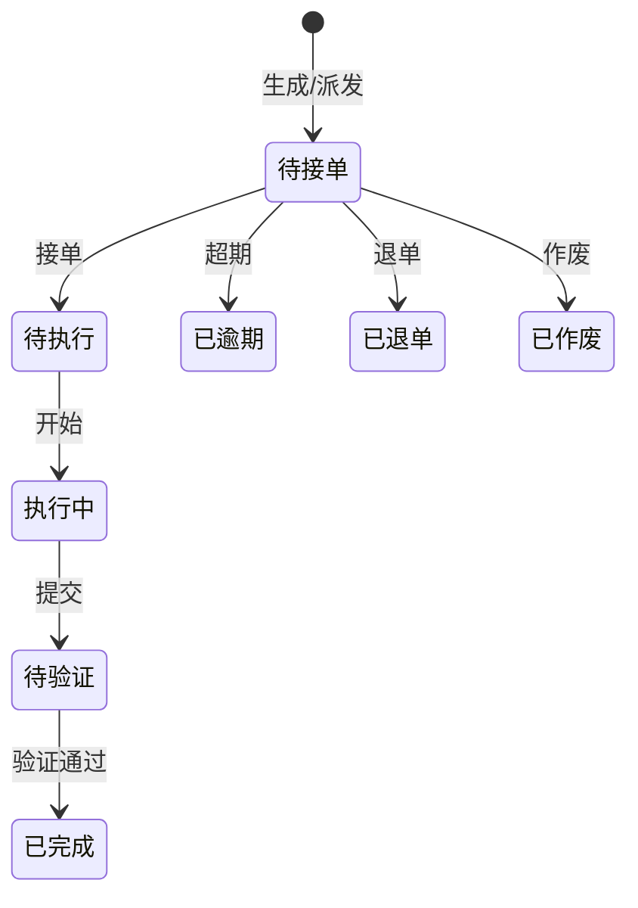
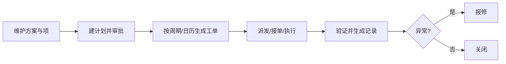

# 巡检保养

> 适用基线：测试环境目标 / `dev` 分支 / 2026-07-15。
> 阅读对象：设备工程师、巡检保养执行人；操作见[巡检保养-维护与查询参考](巡检保养-维护与查询参考.md)。

## 业务目的与适用范围

计划到了日子却不出工单、执行完却没转成报修——多半是排程或转出规则没配对。巡检保养把预防性维护落实为可排程的**计划 → 工单 → 记录**，覆盖保养、巡检、点检，以及可选的开拉；异常可转[报修维修](../02-设备管理/index.md)，方案与检查项在[基础数据](../01-基础数据/index.md)维护。读完本页，你能判断「不出工单」该查计划还是查方案。

本页不写 QMS 过程巡检，也不写 MES 开工点检的线边执行细则（MES 仅有配置入口时，执行仍以 EAM 点检为准）。

## 如何使用本组文档

计划、方案、执行分在三处维护，先按目的挑页能省不少来回：

| 你的目的 | 建议阅读 |
| --- | --- |
| 想理解计划如何变成现场任务 | 本页。 |
| 正在建计划、派工、执行、验证 | [巡检保养-维护与查询参考](巡检保养-维护与查询参考.md)。 |
| 想配方案和检查项 | [基础数据](../01-基础数据/index.md)。 |
| PDA 执行 | [终端操作](../06-终端操作/index.md)。 |

## 使用前准备

| 需要确认什么 | 为什么重要 |
| --- | --- |
| 设备/工装台账与编码 | 计划挂接对象。 |
| 对应方案与检查项已启用 | 工单带出执行内容。 |
| 工作日历与班组角色 | 排程与派工。 |
| 生成周期/cron/提前天数 | 决定何时出工单。 |

!!! example "📷 截图占位"
    巡检计划列表与工单状态；脱敏。

## 对象关系

| 对象 | 业务含义 |
| --- | --- |
| 保养/巡检/点检计划 | 对象设备、方案、周期或 cron、审批与自动策略、组织位置、生成参数。 |
| 保养/巡检/点检工单 | 可派发、接单、执行、验证的工作单元；含计划号、方案、计划/实际时间、班组角色。 |
| 保养/巡检/点检记录 | 执行结果沉淀。 |
| 开拉计划/工单/记录（可选） | 同类执行链，现场未启用可忽略。 |
| 工作日历 | 排程与生成辅助。 |

## 工单状态
通用状态：待派工（历史兼容）、已逾期、已退单、待接单、待执行、执行中、待验证、已完成、已作废。

## 一次计划如何落到记录

## 与 MES / QMS / ANDON 边界

「巡检」这个词在 MES、QMS、EAM 里各指不同对象，边界不清最容易记错业务：

| 协同方 | 本页负责 | 不在本页展开 |
| --- | --- | --- |
| MES 开工点检配置 | 设备点检执行主链 | 线边开工卡点细则 |
| QMS 过程巡检 | — | 制品质量巡检 ATR |
| ANDON | 异常协同线索（来源可含设备巡检） | 呼叫到岗与响应链 |
| 设备报修 | 异常出口 | 维修双验证细节 |

## 关键判断

| 判断点 | 应先确认什么 | 影响 |
| --- | --- | --- |
| 不出工单 | 计划状态、cron/周期、日历、提前天数 | 现场无任务 |
| 执行项为空 | 方案编码与项关联 | 无法判定 |
| 与质量巡检混淆 | 菜单属 EAM 还是 QMS | 记错业务对象 |
| 异常未转维修 | 是否启用转报修及来源类型 | 只留巡检不合格无维修闭环 |

### 关键字段业务角色

| 字段/配置点 | 在系统中的作用 | 关键行为要点 | 警惕什么 |
| --- | --- | --- | --- |
| 计划状态 / 周期 | 是否生成工单 | cron/日历/提前天数 | 无任务 |
| 方案与执行项 | 检什么 | 方案编码关联项 | 项空无法判定 |
| 对象类型（设备/工装） | 台账选择分流 | 与 DBC 台账对应 | 选错对象族 |
| 转报修 | 不合格出口 | 来源类型写入报修 | 与 QMS 巡检检验不同 |
| 工单执行状态 | 现场闭环 | PDA/Web 执行 | 未完成当闭环 |

### 选择器范围（骨架）

通例见[通用选择器过滤惯例](../../02-业务模型/12-通用选择器过滤惯例.md)。对象类型分流设备/工装台账；**勿**与 QMS 过程巡检检验混淆。精确状态集与权限投影见 `FSEM-006` / `GAP-014`。

| 选择字段 | 选择对象 | 可选范围（当前可写） | 范围依赖 | 选不到时通常原因 |
| --- | --- | --- | --- | --- |
| 对象类型 + 编码 | DBC 设备/工装台账 | 按类型分流；须已存在且可用 | 台账状态、方案类型 | 选错族、停用、未建台账 |
| 方案 / 检查项 | 基础数据·方案项 | 已启用方案；工单带出执行项 | 方案启用、对象类型 | 项空、方案未关联 |
| 工作日历 / 班组角色 | 日历·岗位 | 排程与派工依赖 | 日历槽位、角色 | 日历未配、无人可派 |
| 生成周期 / cron | 计划参数 | ❓ 定时生成与槽位精确规则以环境为准（`GAP-016`） | 计划状态、提前天数 | 不出工单 |
| 转报修出口 | 报修申请 | 异常可写来源工单类型/号 | 设备管理报修 | 与 QMS「巡检检验」不同对象 |
| 开拉计划/工单 | （可选） | ❓ 客户现场是否启用未统一 | 菜单与授权 | 无入口当未部署 |

### 详情分组与快速跳转

| 分组 | 应展示什么 | 可联查什么 |
| --- | --- | --- |
| 计划与对象 | 对象类型/编码、方案、周期/cron、日历。 | DBC 台账、基础数据。 |
| 工单执行 | 状态、派工/接单、计划/实际时间。 | 终端操作。 |
| 记录与异常 | 执行结果、转报修线索。 | 设备管理报修。 |
| 系统信息 | 创建、更新与审计。 | — |

!!! example "📷 截图占位"
    巡检/保养计划与工单详情分组；状态：待截图。

## 限制与待确认

- `GAP-016`：定时生成/日历槽位精确规则、开拉启用范围、转报修与现场执行规则待逐页核验。
- `FSEM-006`：对象/方案/派工选择器精确状态过滤与 P13 投影矩阵待测。

!!! example "📝 示例数据占位"
    设备周巡检计划 → 生成工单 → PDA 执行拍照 → 一项不合格转报修。

