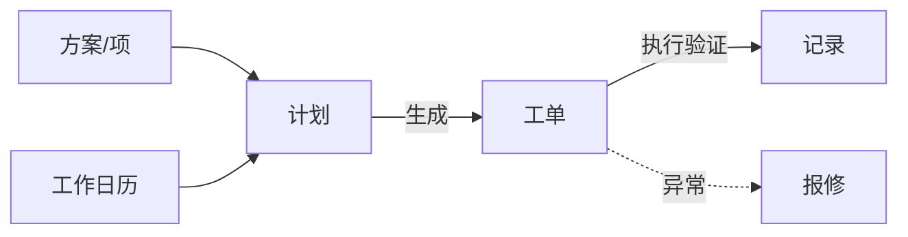
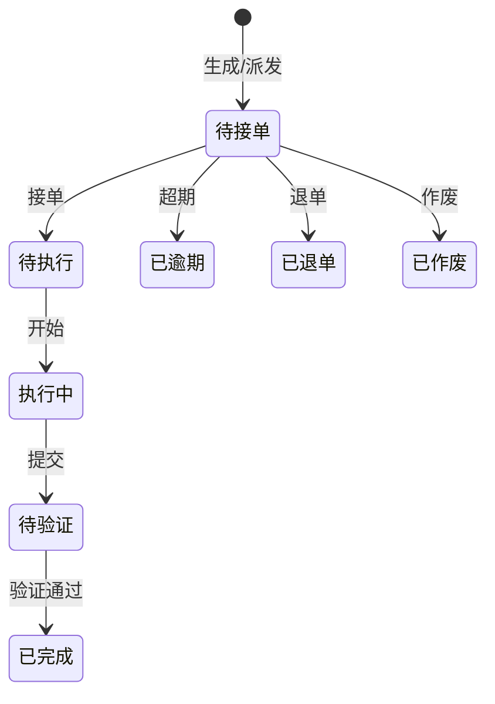
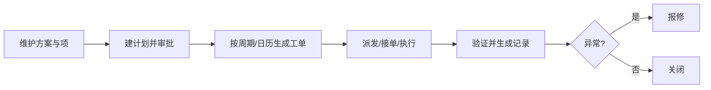

# 巡检保养

> 适用基线：测试环境目标 / `dev` 分支 / 2026-07-15。
> 阅读对象：设备工程师、巡检保养执行人；操作见[巡检保养-维护与查询参考](巡检保养-维护与查询参考.md)。

## 业务目的与适用范围

巡检保养把预防性维护落实为可排程的**计划 → 工单 → 记录**，覆盖保养、巡检、点检，以及可选的开拉。异常可转[报修维修](../02-设备管理/index.md)。方案与检查项在[基础数据](../01-基础数据/index.md)维护。

本页不写 QMS 过程巡检，也不写 MES 开工点检的线边执行细则（MES 仅有配置入口时，执行仍以 EAM 点检为准）。

## 如何使用本组文档

| 你的目的 | 建议阅读 |
| --- | --- |
| 想理解计划如何变成现场任务 | 本页。 |
| 正在建计划、派工、执行、验证 | [巡检保养-维护与查询参考](巡检保养-维护与查询参考.md)。 |
| 想配方案和检查项 | [基础数据](../01-基础数据/index.md)。 |
| PDA 执行 | [终端操作](../06-终端操作/index.md)。 |

## 使用前准备

| 需要确认什么 | 为什么重要 |
| --- | --- |
| 设备/工装台账与编码 | 计划挂接对象。 |
| 对应方案与检查项已启用 | 工单带出执行内容。 |
| 工作日历与班组角色 | 排程与派工。 |
| 生成周期/cron/提前天数 | 决定何时出工单。 |

!!! example "📷 截图占位"
    巡检计划列表与工单状态；脱敏。

## 对象关系

| 对象 | 业务含义 |
| --- | --- |
| 保养/巡检/点检计划 | 对象设备、方案、周期或 cron、审批与自动策略、组织位置、生成参数。 |
| 保养/巡检/点检工单 | 可派发、接单、执行、验证的工作单元；含计划号、方案、计划/实际时间、班组角色。 |
| 保养/巡检/点检记录 | 执行结果沉淀。 |
| 开拉计划/工单/记录（可选） | 同类执行链，现场未启用可忽略。 |
| 工作日历 | 排程与生成辅助。 |

## 工单状态（已证实）

通用培训名：待派工（历史兼容）、已逾期、已退单、待接单、待执行、执行中、待验证、已完成、已作废。

## 一次计划如何落到记录

## 与 MES / QMS / ANDON 边界

| 协同方 | 本页负责 | 不在本页展开 |
| --- | --- | --- |
| MES 开工点检配置 | 设备点检执行主链 | 线边开工卡点细则 |
| QMS 过程巡检 | — | 制品质量巡检 ATR |
| ANDON | 异常协同线索（来源可含设备巡检） | 呼叫到岗与响应链 |
| 设备报修 | 异常出口 | 维修双验证细节 |

## 关键判断

| 判断点 | 应先确认什么 | 影响 |
| --- | --- | --- |
| 不出工单 | 计划状态、cron/周期、日历、提前天数 | 现场无任务 |
| 执行项为空 | 方案编码与项关联 | 无法判定 |
| 与质量巡检混淆 | 菜单属 EAM 还是 QMS | 记错业务对象 |
| 异常未转维修 | 是否启用转报修及来源类型 | 只留巡检不合格无维修闭环 |

### 关键字段业务角色

| 字段/配置点 | 行为模式 | 在系统中的作用 | 关键行为要点 | 警惕什么 |
| --- | --- | --- | --- | --- |
| 计划状态 / 周期 | P9 / P10 | 是否生成工单 | cron/日历/提前天数 | 无任务 |
| 方案与执行项 | P2 / P12 | 检什么 | 方案编码关联项 | 项空无法判定 |
| 对象类型（设备/工装） | P1 | 台账选择分流 | 与 DBC 台账对应 | 选错对象族 |
| 转报修 | P9 / P12 | 不合格出口 | 来源类型写入报修 | 与 QMS 巡检检验不同 |
| 工单执行状态 | P9 | 现场闭环 | PDA/Web 执行 | 未完成当闭环 |

## 限制与待确认

- 定时生成与日历槽位的精确规则以环境为准。
- 开拉是否对当前客户启用未统一。

!!! example "📝 示例数据占位"
    设备周巡检计划 → 生成工单 → PDA 执行拍照 → 一项不合格转报修。

