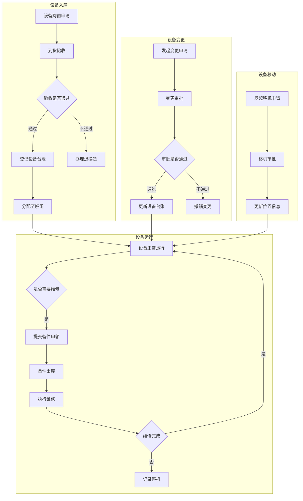
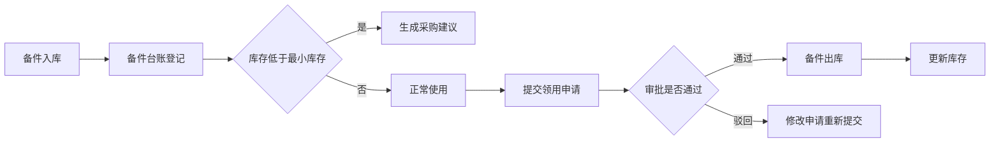
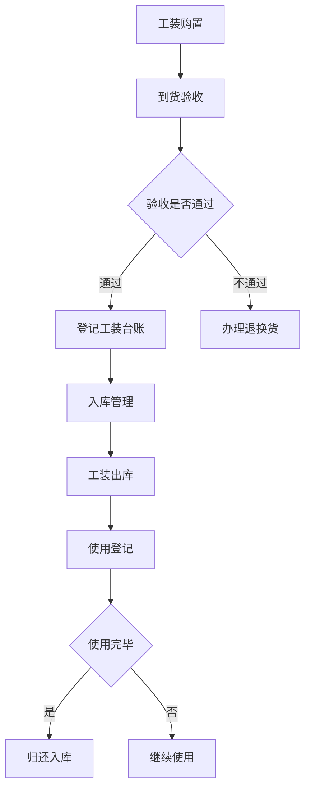
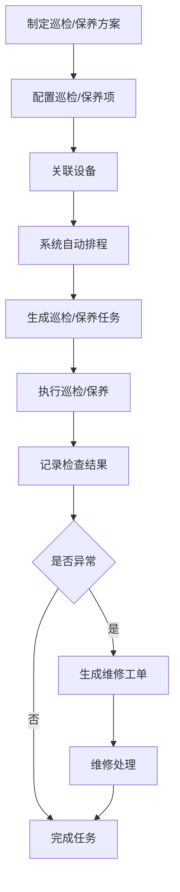

# EAM 设备管理

> 基线状态：已完成 `dev` 后端首轮取证。本页已有的 ER 图、字段和流程中带“待截图确认”的内容不应视为当前事实；以下模块边界优先级更高。

## 已核验的模块职责

当前 EAM 后端覆盖设备、工装、备件及其运行维护业务：设备点检、巡检、保养、维修工单、故障/停机、设备转移、设备/工装签收、附件、维修/保养经验、MTBF/MTTR 统计；同时存在备件申请、入库/出库/退回执行、库位存储、盘点、调整和事务相关接口，并提供 EAM PDA 入口。

| 能力域 | 当前已核验对象 | 文档边界 |
| --- | --- | --- |
| 设备与工装运行 | 设备故障、停机、转移、签收、主件、工装进出/变更、附件。 | DBC/EAM 的台账主数据边界待逐表核验；EAM 记录维护运行事实。 |
| 维护执行 | 点检、巡检、保养、维修、报修、维修工单、计划/工作日历、经验记录。 | 计划生成、工单状态和 PDA 操作待进一步核验。 |
| 备件与库存协同 | 备件申请、入库/出库/退回、库位存储、盘点、调整、事务。 | EAM 负责设备维护业务动作；最终库存事务和余额与 WMS 的关系待核验。 |
| 指标与异常 | MTBF、MTTR、设备故障率、产线设备故障率、生产时长。 | 指标数据口径及与 ANDON/MES 的关联待核验。 |

## 关键边界

1. EAM PDA 是 EAM 的终端操作入口，不独立为业务模块。
2. EAM 出现备件入出库、盘点和事务接口，不自动意味着其独立维护库存余额；需要沿调用链确认是否复用 WMS 库存模型。
3. EAM、MES、ANDON 都可能涉及设备状态或异常；后续必须以“设备资产、采集信号、异常事件、维修工单”四类事实对象划分归属。

## 模块概述

EAM（Enterprise Asset Management）设备管理模块面向离散制造业，提供设备全生命周期管理能力。涵盖设备台账管理、备件管理、工装管理、巡检保养等核心业务，实现设备从购置、运行、维修、保养到报废的闭环管理，降低设备停机时间，提升设备综合效率（OEE）。

## 领域模型

### ER 图

```mermaid
erDiagram
    EAM_CONFIG ||--o{ EQUIPMENT : "基础配置"
    EAM_CONFIG {
        string configId PK "配置ID"
        string configCode "配置编码"
        string configName "配置名称"
        string configType "配置类型"
        string configValue "配置值"
        string status "状态"
        string remark "备注"
    }

    FACTORY_WORKSHOP ||--o{ EQUIPMENT : "厂区班组"
    FACTORY_WORKSHOP {
        string workshopId PK "班组ID"
        string workshopCode "班组编码"
        string workshopName "班组名称"
        string factoryId "工厂ID"
        string areaId "厂区ID"
        string status "状态"
    }

    EQUIPMENT ||--o{ EQUIPMENT_ARRIVAL : "到货验收"
    EQUIPMENT ||--o{ EQUIPMENT_MOVE_RECORD : "移动记录"
    EQUIPMENT ||--o{ EQUIPMENT_CHANGE_RECORD : "变更记录"
    EQUIPMENT ||--o{ EQUIPMENT_STOP : "停机"
    EQUIPMENT ||--o{ EQUIPMENT_SPARE_RELATION : "备件关联"
    EQUIPMENT ||--o{ MAINTENANCE_PLAN : "保养方案"
    EQUIPMENT ||--o{ INSPECTION_PLAN : "巡检方案"
    EQUIPMENT ||--o{ SPOT_CHECK_PLAN : "点检方案"

    EQUIPMENT {
        string equipmentId PK "设备ID"
        string equipmentCode "设备编号"
        string equipmentName "设备名称"
        string equipmentModel "设备型号"
        string spec "规格"
        string manufacturerId "生产商ID"
        string supplierId "供应商ID"
        date purchaseDate "购置日期"
        date startUseDate "启用日期"
        string workshopId "班组ID"
        string status "设备状态"
        string assetCode "资产编号"
        string maintenancePeriod "保养周期"
        string spareParts "备件信息"
        string documents "文档附件"
    }

    EQUIPMENT_ARRIVAL {
        string arrivalId PK "验收ID"
        string arrivalNo "验收单号"
        string equipmentId "设备ID"
        date arrivalDate "到货日期"
        string inspector "验收人"
        string inspectionResult "验收结果"
        string remark "备注"
    }

    EQUIPMENT_MOVE_RECORD {
        string moveId PK "移动记录ID"
        string equipmentId "设备ID"
        string fromWorkshopId "原班组ID"
        string toWorkshopId "目标班组ID"
        date moveDate "移动日期"
        string moveType "移动类型"
        string remark "备注"
    }

    EQUIPMENT_CHANGE_RECORD {
        string changeId PK "变更记录ID"
        string equipmentId "设备ID"
        string changeField "变更字段"
        string oldValue "旧值"
        string newValue "新值"
        date changeDate "变更日期"
        string changer "变更人"
    }

    EQUIPMENT_STOP {
        string stopId PK "停机ID"
        string equipmentId "设备ID"
        date stopDate "停机日期"
        date restartDate "复机日期"
        string stopReason "停机原因"
        string stopType "停机类型"
        string status "状态"
    }

    EQUIPMENT_SPARE_RELATION {
        string relationId PK "关联ID"
        string equipmentId "设备ID"
        string sparePartId "备件ID"
        string sparePartCode "备件编号"
        string sparePartName "备件名称"
        string quantity "数量"
    }

    SPARE_PART ||--o{ SPARE_PART_REQUEST : "备件申领"
    SPARE_PART {
        string sparePartId PK "备件ID"
        string sparePartCode "备件编号"
        string sparePartName "备件名称"
        string sparePartType "备件类型"
        string model "型号"
        string unit "单位"
        string warehouseId "仓库ID"
        decimal price "单价"
        integer stockQty "库存数量"
        integer minStockQty "最小库存"
        string status "状态"
    }

    SPARE_PART_REQUEST {
        string requestId PK "申领ID"
        string requestNo "申领单号"
        string sparePartId "备件ID"
        string equipmentId "设备ID"
        string workshopId "班组ID"
        integer requestQty "申请数量"
        integer approveQty "审批数量"
        string requester "申请人"
        date requestDate "申请日期"
        string status "状态"
    }

    SPARE_PART_RECEIVE {
        string receiveId PK "领用ID"
        string receiveNo "领用单号"
        string requestId "申领ID"
        string sparePartId "备件ID"
        integer receiveQty "领用数量"
        date receiveDate "领用日期"
        string receiver "领用人"
        string status "状态"
    }

    TOOL ||--o{ TOOL_IO_RECORD : "出入库记录"
    TOOL {
        string toolId PK "工装ID"
        string toolCode "工装编号"
        string toolName "工装名称"
        string toolType "工装类型"
        string model "型号"
        string unit "单位"
        string warehouseId "仓库ID"
        string status "状态"
    }

    TOOL_IO_RECORD {
        string recordId PK "记录ID"
        string toolId "工装ID"
        string ioType "出入库类型"
        integer quantity "数量"
        date ioDate "日期"
        string person "经办人"
        string remark "备注"
    }

    TOOL_ARRIVAL {
        string arrivalId PK "验收ID"
        string arrivalNo "验收单号"
        string toolId "工装ID"
        date arrivalDate "到货日期"
        string inspector "验收人"
        string inspectionResult "验收结果"
    }

    TOOL_CHANGE_RECORD {
        string changeId PK "变更记录ID"
        string toolId "工装ID"
        string changeField "变更字段"
        string oldValue "旧值"
        string newValue "新值"
        date changeDate "变更日期"
        string changer "变更人"
    }

    MAINTENANCE_PLAN ||--o{ MAINTENANCE_ITEM : "保养项"
    MAINTENANCE_PLAN {
        string planId PK "方案ID"
        string planCode "方案编码"
        string planName "方案名称"
        string equipmentId "关联设备ID"
        string cycleType "周期类型"
        integer cycleDays "周期天数"
        date nextMaintenanceDate "下次保养日期"
        string status "状态"
    }

    MAINTENANCE_ITEM {
        string itemId PK "保养项ID"
        string planId "方案ID"
        string itemName "保养项名称"
        string itemDesc "保养内容"
        integer seq "顺序"
    }

    INSPECTION_PLAN ||--o{ INSPECTION_ITEM : "巡检项"
    INSPECTION_PLAN {
        string planId PK "方案ID"
        string planCode "方案编码"
        string planName "方案名称"
        string equipmentId "关联设备ID"
        string cycleType "周期类型"
        integer cycleDays "周期天数"
        date nextInspectionDate "下次巡检日期"
        string status "状态"
    }

    INSPECTION_ITEM {
        string itemId PK "巡检项ID"
        string planId "方案ID"
        string itemName "巡检项名称"
        string itemDesc "巡检内容"
        string checkMethod "检查方法"
        string standard "判定标准"
        integer seq "顺序"
    }

    SPOT_CHECK_PLAN ||--o{ SPOT_CHECK_ITEM : "点检项"
    SPOT_CHECK_PLAN {
        string planId PK "方案ID"
        string planCode "方案编码"
        string planName "方案名称"
        string equipmentId "关联设备ID"
        string cycleType "周期类型"
        integer cycleDays "周期天数"
        date nextSpotCheckDate "下次点检日期"
        string status "状态"
    }

    SPOT_CHECK_ITEM {
        string itemId PK "点检项ID"
        string planId "方案ID"
        string itemName "点检项名称"
        string itemDesc "点检内容"
        string checkMethod "检查方法"
        string standard "判定标准"
        integer seq "顺序"
    }

    DOCUMENT_MANAGEMENT ||--o{ DOCUMENT_ATTACHMENT : "文档附件"
    DOCUMENT_MANAGEMENT {
        string docId PK "文档ID"
        string docCode "文档编码"
        string docName "文档名称"
        string docType "文档类型"
        string equipmentId "关联设备ID"
        string relatedPlanType "关联方案类型"
        string relatedPlanId "关联方案ID"
        date uploadDate "上传日期"
        string uploader "上传人"
        string status "状态"
    }

    DOCUMENT_ATTACHMENT {
        string attachmentId PK "附件ID"
        string docId "文档ID"
        string fileName "文件名"
        string filePath "文件路径"
        string fileSize "文件大小"
        date uploadDate "上传日期"
    }
```

## 核心流程

### 设备管理核心流程

### 备件管理核心流程

### 工装管理核心流程

### 巡检保养核心流程

## 字段说明

### 基础数据

#### EAM 基础配置

| 字段名 | 中文名 | 类型 | 说明 |
|--------|--------|------|------|
| configId | 配置ID | string | (待截图确认) |
| configCode | 配置编码 | string | (待截图确认) |
| configName | 配置名称 | string | (待截图确认) |
| configType | 配置类型 | string | (待截图确认) |
| configValue | 配置值 | string | (待截图确认) |
| status | 状态 | string | (待截图确认) |
| remark | 备注 | string | (待截图确认) |

#### 主要部件

| 字段名 | 中文名 | 类型 | 说明 |
|--------|--------|------|------|
| componentId | 部件ID | string | (待截图确认) |
| componentCode | 部件编码 | string | (待截图确认) |
| componentName | 部件名称 | string | (待截图确认) |
| equipmentId | 设备ID | string | (待截图确认) |
| componentType | 部件类型 | string | (待截图确认) |
| replaceCycle | 更换周期 | string | (待截图确认) |
| status | 状态 | string | (待截图确认) |

#### 生产商

| 字段名 | 中文名 | 类型 | 说明 |
|--------|--------|------|------|
| manufacturerId | 生产商ID | string | (待截图确认) |
| manufacturerCode | 生产商编码 | string | (待截图确认) |
| manufacturerName | 生产商名称 | string | (待截图确认) |
| contactPerson | 联系人 | string | (待截图确认) |
| contactPhone | 联系电话 | string | (待截图确认) |
| address | 地址 | string | (待截图确认) |
| status | 状态 | string | (待截图确认) |

#### 供应商

| 字段名 | 中文名 | 类型 | 说明 |
|--------|--------|------|------|
| supplierId | 供应商ID | string | (待截图确认) |
| supplierCode | 供应商编码 | string | (待截图确认) |
| supplierName | 供应商名称 | string | (待截图确认) |
| contactPerson | 联系人 | string | (待截图确认) |
| contactPhone | 联系电话 | string | (待截图确认) |
| address | 地址 | string | (待截图确认) |
| status | 状态 | string | (待截图确认) |

#### 故障类型

| 字段名 | 中文名 | 类型 | 说明 |
|--------|--------|------|------|
| faultTypeId | 故障类型ID | string | (待截图确认) |
| faultTypeCode | 故障类型编码 | string | (待截图确认) |
| faultTypeName | 故障类型名称 | string | (待截图确认) |
| faultLevel | 故障等级 | string | (待截图确认) |
| remark | 备注 | string | (待截图确认) |

#### 厂区班组

| 字段名 | 中文名 | 类型 | 说明 |
|--------|--------|------|------|
| workshopId | 班组ID | string | (待截图确认) |
| workshopCode | 班组编码 | string | (待截图确认) |
| workshopName | 班组名称 | string | (待截图确认) |
| factoryId | 工厂ID | string | (待截图确认) |
| areaId | 厂区ID | string | (待截图确认) |
| status | 状态 | string | (待截图确认) |

### 设备管理

#### 设备台账

| 字段名 | 中文名 | 类型 | 说明 |
|--------|--------|------|------|
| equipmentId | 设备ID | string | (待截图确认) |
| equipmentCode | 设备编号 | string | (待截图确认) |
| equipmentName | 设备名称 | string | (待截图确认) |
| equipmentModel | 设备型号 | string | (待截图确认) |
| spec | 规格 | string | (待截图确认) |
| manufacturerId | 生产商ID | string | (待截图确认) |
| supplierId | 供应商ID | string | (待截图确认) |
| purchaseDate | 购置日期 | date | (待截图确认) |
| startUseDate | 启用日期 | date | (待截图确认) |
| workshopId | 班组ID | string | (待截图确认) |
| status | 设备状态 | string | (待截图确认) |
| assetCode | 资产编号 | string | (待截图确认) |
| maintenancePeriod | 保养周期 | string | (待截图确认) |

#### 到货验收

| 字段名 | 中文名 | 类型 | 说明 |
|--------|--------|------|------|
| arrivalId | 验收ID | string | (待截图确认) |
| arrivalNo | 验收单号 | string | (待截图确认) |
| equipmentId | 设备ID | string | (待截图确认) |
| arrivalDate | 到货日期 | date | (待截图确认) |
| inspector | 验收人 | string | (待截图确认) |
| inspectionResult | 验收结果 | string | (待截图确认) |
| remark | 备注 | string | (待截图确认) |

#### 移动记录

| 字段名 | 中文名 | 类型 | 说明 |
|--------|--------|------|------|
| moveId | 移动记录ID | string | (待截图确认) |
| equipmentId | 设备ID | string | (待截图确认) |
| fromWorkshopId | 原班组ID | string | (待截图确认) |
| toWorkshopId | 目标班组ID | string | (待截图确认) |
| moveDate | 移动日期 | date | (待截图确认) |
| moveType | 移动类型 | string | (待截图确认) |
| remark | 备注 | string | (待截图确认) |

#### 变更记录

| 字段名 | 中文名 | 类型 | 说明 |
|--------|--------|------|------|
| changeId | 变更记录ID | string | (待截图确认) |
| equipmentId | 设备ID | string | (待截图确认) |
| changeField | 变更字段 | string | (待截图确认) |
| oldValue | 旧值 | string | (待截图确认) |
| newValue | 新值 | string | (待截图确认) |
| changeDate | 变更日期 | date | (待截图确认) |
| changer | 变更人 | string | (待截图确认) |

#### 停机记录

| 字段名 | 中文名 | 类型 | 说明 |
|--------|--------|------|------|
| stopId | 停机ID | string | (待截图确认) |
| equipmentId | 设备ID | string | (待截图确认) |
| stopDate | 停机日期 | date | (待截图确认) |
| restartDate | 复机日期 | date | (待截图确认) |
| stopReason | 停机原因 | string | (待截图确认) |
| stopType | 停机类型 | string | (待截图确认) |
| status | 状态 | string | (待截图确认) |

#### 备件关联

| 字段名 | 中文名 | 类型 | 说明 |
|--------|--------|------|------|
| relationId | 关联ID | string | (待截图确认) |
| equipmentId | 设备ID | string | (待截图确认) |
| sparePartId | 备件ID | string | (待截图确认) |
| sparePartCode | 备件编号 | string | (待截图确认) |
| sparePartName | 备件名称 | string | (待截图确认) |
| quantity | 数量 | string | (待截图确认) |

### 备件管理

#### 备件台账

| 字段名 | 中文名 | 类型 | 说明 |
|--------|--------|------|------|
| sparePartId | 备件ID | string | (待截图确认) |
| sparePartCode | 备件编号 | string | (待截图确认) |
| sparePartName | 备件名称 | string | (待截图确认) |
| sparePartType | 备件类型 | string | (待截图确认) |
| model | 型号 | string | (待截图确认) |
| unit | 单位 | string | (待截图确认) |
| warehouseId | 仓库ID | string | (待截图确认) |
| price | 单价 | decimal | (待截图确认) |
| stockQty | 库存数量 | integer | (待截图确认) |
| minStockQty | 最小库存 | integer | (待截图确认) |
| status | 状态 | string | (待截图确认) |

#### 备件申领

| 字段名 | 中文名 | 类型 | 说明 |
|--------|--------|------|------|
| requestId | 申领ID | string | (待截图确认) |
| requestNo | 申领单号 | string | (待截图确认) |
| sparePartId | 备件ID | string | (待截图确认) |
| equipmentId | 设备ID | string | (待截图确认) |
| workshopId | 班组ID | string | (待截图确认) |
| requestQty | 申请数量 | integer | (待截图确认) |
| approveQty | 审批数量 | integer | (待截图确认) |
| requester | 申请人 | string | (待截图确认) |
| requestDate | 申请日期 | date | (待截图确认) |
| status | 状态 | string | (待截图确认) |

#### 领用申请

| 字段名 | 中文名 | 类型 | 说明 |
|--------|--------|------|------|
| receiveId | 领用ID | string | (待截图确认) |
| receiveNo | 领用单号 | string | (待截图确认) |
| requestId | 申领ID | string | (待截图确认) |
| sparePartId | 备件ID | string | (待截图确认) |
| receiveQty | 领用数量 | integer | (待截图确认) |
| receiveDate | 领用日期 | date | (待截图确认) |
| receiver | 领用人 | string | (待截图确认) |
| status | 状态 | string | (待截图确认) |

### 工装管理

#### 工装台账

| 字段名 | 中文名 | 类型 | 说明 |
|--------|--------|------|------|
| toolId | 工装ID | string | (待截图确认) |
| toolCode | 工装编号 | string | (待截图确认) |
| toolName | 工装名称 | string | (待截图确认) |
| toolType | 工装类型 | string | (待截图确认) |
| model | 型号 | string | (待截图确认) |
| unit | 单位 | string | (待截图确认) |
| warehouseId | 仓库ID | string | (待截图确认) |
| status | 状态 | string | (待截图确认) |

#### 出入库记录

| 字段名 | 中文名 | 类型 | 说明 |
|--------|--------|------|------|
| recordId | 记录ID | string | (待截图确认) |
| toolId | 工装ID | string | (待截图确认) |
| ioType | 出入库类型 | string | (待截图确认) |
| quantity | 数量 | integer | (待截图确认) |
| ioDate | 日期 | date | (待截图确认) |
| person | 经办人 | string | (待截图确认) |
| remark | 备注 | string | (待截图确认) |

#### 到货验收

| 字段名 | 中文名 | 类型 | 说明 |
|--------|--------|------|------|
| arrivalId | 验收ID | string | (待截图确认) |
| arrivalNo | 验收单号 | string | (待截图确认) |
| toolId | 工装ID | string | (待截图确认) |
| arrivalDate | 到货日期 | date | (待截图确认) |
| inspector | 验收人 | string | (待截图确认) |
| inspectionResult | 验收结果 | string | (待截图确认) |

#### 变更记录

| 字段名 | 中文名 | 类型 | 说明 |
|--------|--------|------|------|
| changeId | 变更记录ID | string | (待截图确认) |
| toolId | 工装ID | string | (待截图确认) |
| changeField | 变更字段 | string | (待截图确认) |
| oldValue | 旧值 | string | (待截图确认) |
| newValue | 新值 | string | (待截图确认) |
| changeDate | 变更日期 | date | (待截图确认) |
| changer | 变更人 | string | (待截图确认) |

### 巡检保养

#### 保养方案

| 字段名 | 中文名 | 类型 | 说明 |
|--------|--------|------|------|
| planId | 方案ID | string | (待截图确认) |
| planCode | 方案编码 | string | (待截图确认) |
| planName | 方案名称 | string | (待截图确认) |
| equipmentId | 关联设备ID | string | (待截图确认) |
| cycleType | 周期类型 | string | (待截图确认) |
| cycleDays | 周期天数 | integer | (待截图确认) |
| nextMaintenanceDate | 下次保养日期 | date | (待截图确认) |
| status | 状态 | string | (待截图确认) |

#### 保养项

| 字段名 | 中文名 | 类型 | 说明 |
|--------|--------|------|------|
| itemId | 保养项ID | string | (待截图确认) |
| planId | 方案ID | string | (待截图确认) |
| itemName | 保养项名称 | string | (待截图确认) |
| itemDesc | 保养内容 | string | (待截图确认) |
| seq | 顺序 | integer | (待截图确认) |

#### 巡检方案

| 字段名 | 中文名 | 类型 | 说明 |
|--------|--------|------|------|
| planId | 方案ID | string | (待截图确认) |
| planCode | 方案编码 | string | (待截图确认) |
| planName | 方案名称 | string | (待截图确认) |
| equipmentId | 关联设备ID | string | (待截图确认) |
| cycleType | 周期类型 | string | (待截图确认) |
| cycleDays | 周期天数 | integer | (待截图确认) |
| nextInspectionDate | 下次巡检日期 | date | (待截图确认) |
| status | 状态 | string | (待截图确认) |

#### 巡检项

| 字段名 | 中文名 | 类型 | 说明 |
|--------|--------|------|------|
| itemId | 巡检项ID | string | (待截图确认) |
| planId | 方案ID | string | (待截图确认) |
| itemName | 巡检项名称 | string | (待截图确认) |
| itemDesc | 巡检内容 | string | (待截图确认) |
| checkMethod | 检查方法 | string | (待截图确认) |
| standard | 判定标准 | string | (待截图确认) |
| seq | 顺序 | integer | (待截图确认) |

#### 点检方案

| 字段名 | 中文名 | 类型 | 说明 |
|--------|--------|------|------|
| planId | 方案ID | string | (待截图确认) |
| planCode | 方案编码 | string | (待截图确认) |
| planName | 方案名称 | string | (待截图确认) |
| equipmentId | 关联设备ID | string | (待截图确认) |
| cycleType | 周期类型 | string | (待截图确认) |
| cycleDays | 周期天数 | integer | (待截图确认) |
| nextSpotCheckDate | 下次点检日期 | date | (待截图确认) |
| status | 状态 | string | (待截图确认) |

#### 点检项

| 字段名 | 中文名 | 类型 | 说明 |
|--------|--------|------|------|
| itemId | 点检项ID | string | (待截图确认) |
| planId | 方案ID | string | (待截图确认) |
| itemName | 点检项名称 | string | (待截图确认) |
| itemDesc | 点检内容 | string | (待截图确认) |
| checkMethod | 检查方法 | string | (待截图确认) |
| standard | 判定标准 | string | (待截图确认) |
| seq | 顺序 | integer | (待截图确认) |

#### 文档管理

| 字段名 | 中文名 | 类型 | 说明 |
|--------|--------|------|------|
| docId | 文档ID | string | (待截图确认) |
| docCode | 文档编码 | string | (待截图确认) |
| docName | 文档名称 | string | (待截图确认) |
| docType | 文档类型 | string | (待截图确认) |
| equipmentId | 关联设备ID | string | (待截图确认) |
| relatedPlanType | 关联方案类型 | string | (待截图确认) |
| relatedPlanId | 关联方案ID | string | (待截图确认) |
| uploadDate | 上传日期 | date | (待截图确认) |
| uploader | 上传人 | string | (待截图确认) |
| status | 状态 | string | (待截图确认) |

## 接口规范

（待补充）

## 相关模块接口

### 依赖模块

| 模块 | 接口方向 | 说明 |
|------|----------|------|
| DBC_EQUIPMENT | [设备台账](../../04-DBC-主数据管理/07-设备管理/02-设备台账管理.md) | 设备基础信息同步 |
| DBC_MATERIAL | [物料主数据](../../04-DBC-主数据管理/01-物料管理/01-物料基本信息.md) | 备件物料信息获取 |
| DBC_WAREHOUSE | [仓库主数据](../../04-DBC-主数据管理/04-工厂建模/01-仓库管理.md) | 备件/工装仓库基础数据 |
| MES_BASIC | [基础建模](../../06-MES-生产管理/01-基础建模/index.md) | 产线/工位信息关联 |

### 被依赖模块

| 模块 | 接口方向 | 说明 |
|------|----------|------|
| QMS_IPQC | [生产检验](../../07-QMS-质量管理/03-生产检验/index.md) | 检验过程中调用设备信息确认量具校准状态 |
| MES_ROUTING | [工艺管理](../../06-MES-生产管理/02-工艺管理/index.md) | 工艺路线配置关联设备/工位资源 |
| WMS_INVENTORY | [库存管理](../../05-WMS-库房管理/09-库存管理/index.md) | 备件/工装库存变更同步 |
| ANDON_FAULT | [故障记录](../../09-ANDON-异常管理/01-故障记录/index.md) | 设备故障触发 ANDON 异常记录 |

## 与 DBC 联动说明

EAM 模块与 DBC（主数据）模块存在以下联动关系：

1. **备件物料联动**：EAM 备件台账中的备件物料来自 DBC 备件物料主数据
2. **工装管理联动**：EAM 工装台账中的工装物料来自 DBC 工装管理主数据
3. **厂商信息联动**：EAM 基础数据中的生产商、供应商信息来自 DBC 客商主数据
4. **组织架构联动**：EAM 基础数据中的厂区班组来自 DBC 组织架构主数据
