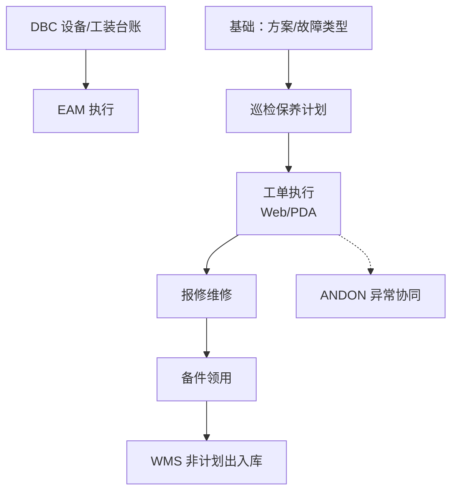

# EAM 设备管理

> 适用基线：测试环境目标 / `dev` 分支 / 2026-07-15。

## 模块职责

EAM 负责设备与工装的**运行维护执行**：验收/移动/变更、停机、报修维修、巡检/保养/点检（及可选开拉）、备件业务与 EAM PDA。设备/工装**身份台账**以 DBC 为准（侧栏「设备台账（DBC）」；EAM 导航常嵌入该台账页）。备件出入库可同步 WMS 非计划发料/收货，**库存余额以 WMS 为准**。

| 要找什么 | 去哪里 |
| --- | --- |
| 设备/工装是谁、归属何处、可否被引用 | [DBC 设备台账](../04-DBC-主数据管理/07-设备管理/index.md) |
| 报修、维修、巡检保养、备件、PDA | 本模块下列分组 |

旧概述中大段虚构 ER 与待截图字段表不再作为培训事实。

## 测试 / 实施从哪读

| 你的目的 | 建议阅读 |
| --- | --- |
| 模块边界、学习顺序、配置依赖（本页） | **本页** |
| 某一分组主线、状态、跨模块边界 | 下表对应**分组 index** |
| 发起/派工/执行/验证、选择器与字段细节 | 各组 `*-维护与查询参考.md` |
| 设计验证场景（配置差异、状态门禁、WMS 同步） | 分组 index + 维护参考；跨模块回查 DBC/WMS/ANDON |

## 配置依赖概览

| 依赖层 | 改什么 / 先备什么 | 对现场行为的影响 |
| --- | --- | --- |
| DBC 设备/工装台账 | 编码、可用状态、现场归属 | 报修/计划选不到对象；EAM 不另建身份主数据 |
| EAM 基础数据 | 故障类型、保养/巡检/点检方案与项、班组角色、工作日历 | 分类、工单内容、派工对象、计划能否出单 |
| 计划参数 | 周期/cron、提前天数、自动策略（以环境为准） | 是否生成工单、何时出现待办 |
| 备件 ↔ WMS | 库区库位映射、账期、非计划出入库通道 | 同步成功/失败；余额以 WMS 为准 |
| 权限 / PDA 菜单 | 角色、终端菜单授权 | 谁看得见入口、谁能接单执行 |
| ANDON / 消息（协同） | 分类与响应链（若并联） | 异常呼叫与维修双轨时的关联口径（见 `GAP-016`） |

实施注意：改方案停用、班组映射或 WMS 映射前，应用「出计划工单 / 报修闭环 / 备件出库同步」三条短链做回归。

## 建议学习顺序

1. [基础数据](01-基础数据/index.md) — 方案、故障类型、班组角色。
2. [设备管理](02-设备管理/index.md) — 台账边界与报修维修。
3. [巡检保养](05-巡检保养/index.md) — 计划→工单→记录。
4. [备件管理](03-备件管理/index.md) — 领用与 WMS 同步。
5. [工装管理](04-工装管理/index.md) — 工装履历。
6. [终端操作](06-终端操作/index.md) — PDA 入口。

## 业务分组齐套状态

| 分组 | 状态 | 说明 |
| --- | --- | --- |
| [01-基础数据](01-基础数据/index.md) | 已覆盖 | 方案/故障/班组等；台账不在本组。 |
| [02-设备管理](02-设备管理/index.md) | 已覆盖 | DBC 台账 + EAM 报修维修。 |
| [03-备件管理](03-备件管理/index.md) | 已覆盖 | EAM 台账 + WMS 同步边界。 |
| [04-工装管理](04-工装管理/index.md) | 已覆盖 | DBC 台账 + EAM 履历。 |
| [05-巡检保养](05-巡检保养/index.md) | 已覆盖 | 计划/工单/记录；异可转报修。 |
| [06-终端操作](06-终端操作/index.md) | 已覆盖 | EAM PDA 入口。 |

## 核心流程（总览）

## 与其它模块边界

| 模块 | EAM 负责 | 不在 EAM 展开 |
| --- | --- | --- |
| DBC | 引用台账编码；验收/移动补丁 | 台账主数据导入与组织主维护 |
| WMS | 备件同步非计划出入库 | 库存余额与仓储作业 |
| MES | 设备编码被生产引用 | 线边报工、开工点检卡点细则 |
| ANDON | 设备异常协同线索 | 呼叫到岗与响应链 |
| QMS | — | 过程质量巡检（勿与设备巡检混淆） |

## 待确认事项

- `GAP-016`：停机↔ANDON 关联、备件/工装与 WMS 同步、开拉/工艺维修启用、定时生成与终端规则等现场核验。
- 台账/方案/派工/终端选择器的精确可选状态与权限投影范围尚未闭合；验收勿按「全状态可见」假定。（辅证：`FSEM-006`）
- 各组截图实拍。
