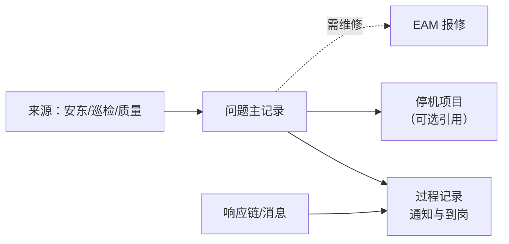

# 故障记录

> 适用基线：测试环境目标 / `dev` 分支 / 2026-07-15。
> 阅读对象：班组长、安灯管理员、设备/质量协同；操作见[故障记录-维护与查询参考](故障记录-维护与查询参考.md)。

## 业务目的与适用范围

故障记录沉淀产线异常的**发生事实**与过程痕迹：谁在何时对哪台设备/模具/工单发起呼叫，问题分类与来源是什么，处理措施与附件是什么。它不替代 EAM 维修工单，也不替代 QMS 检验记录；来源码已预留安东异常、设备巡检、质量检验。

旧稿虚构的英文等级状态机与 REST 示例废弃。

## 如何使用本组文档

| 你的目的 | 建议阅读 |
| --- | --- |
| 想理解异常事实长什么样 | 本页。 |
| 正在登记/关闭呼叫、查过程 | [故障记录-维护与查询参考](故障记录-维护与查询参考.md)。 |
| 想配谁响应、多久升级 | [问题响应](../02-问题响应/index.md)。 |
| 设备侧要开维修 | EAM [设备管理](../../08-EAM-设备管理/02-设备管理/index.md)。 |

## 使用前准备

| 需要确认什么 | 为什么重要 |
| --- | --- |
| 设备/模具/工单编码（若关联） | 追溯与跨模块联查。 |
| 问题分类、来源、类型码表 | 统计与响应链匹配。 |
| 响应链与消息是否已配 | 否则只有记录无通知。 |
| 停机项目是否要用 | OEE/停机分类口径。 |

!!! example "📷 截图占位"
    安东故障/过程记录列表；脱敏。

## 对象关系

| 对象 | 业务含义 |
| --- | --- |
| 问题主记录 | 呼叫事实：用户/岗位、问题与设备时间、设备/模具/零件/工单、分类/来源/类型、描述与措施、重要度/紧急度、分析登记、维修单状态、附件。 |
| 过程记录 | 针对某问题的通知与到岗：通知内容、到岗人/时间/状态/时长。菜单「安东故障记录」前端路径对应该视图。 |
| 停机项目 | 停机原因标准化（设备、班次、类型、计划时长、呼叫岗位）；配置型主数据。 |

## 状态口径

| 字段 | 培训含义 |
| --- | --- |
| 问题状态 | 呼叫中 / 结束 |
| 问题总体状态 | 处理中 / 审结完成 |
| 维修单状态（若填） | 处理中 / 全部完成 |

项目分类示例：安全、效率、成本、交付、质量。
问题分类示例：人员/设备/模具/器具/材料/检测/工艺/环境/质量异常。
问题来源：安东异常、设备巡检、质量检验。

## 一笔异常如何记录

## 与 EAM / MES / QMS 边界

| 协同方 | 本页负责 | 不在本页展开 |
| --- | --- | --- |
| EAM | 记录设备编码与可选转维修线索 | 报修审批与维修工单状态机 |
| MES | 可填工单号等关联 | 报工、停线控制逻辑 |
| QMS | 来源可含质量检验 | 检验 ATR 与评审 |
| 消息平台 | 业务消息键 | 通道投递与重试 |

## 关键判断

| 判断点 | 应先确认什么 | 影响 |
| --- | --- | --- |
| 只有过程没有主单 | 是否未建问题主记录 | 统计与闭环断裂 |
| 通知没人收到 | 响应链岗位与消息配置 | 超时无人到岗 |
| 与维修单两套时间 | 呼叫时长 vs 维修工时 | OEE 与维修 MTTR 勿混用 |
| 来源选错 | 巡检/质量/安东 | 责任部门与报表失真 |

### 关键字段业务角色

| 字段/配置点 | 在系统中的作用 | 关键行为要点 | 警惕什么 |
| --- | --- | --- | --- |
| 问题状态（呼叫中/结束） | 呼叫是否仍开放 | 结束前应有措施/到岗痕迹 | 未结束则 SLA 持续 |
| 问题总体状态 | 审结口径 | 处理中 / 审结完成 | 与呼叫状态勿混 |
| 问题分类 / 来源 / 类型 | 响应链匹配与统计 | 分类须与响应链配置一致 | 分类错→无人通知 |
| 设备/模具/工单 | 跨模块联查键 | 可选但追溯强烈建议填 | 空键难联 EAM/MES |
| 重要度/紧急度 | 优先级 | 字典 | 影响升级节奏认知 |
| 过程到岗状态/时长 | 响应执行痕迹 | 由签到写入 | 无到岗则响应未闭合 |
| 维修单状态（若填） | EAM 线索 | **不**自动等于已开维修工单 | 勿当维修状态机 |

完整表见[维护与查询参考](故障记录-维护与查询参考.md)。

### 选择器范围（骨架）

通例见[通用选择器过滤惯例](../../02-业务模型/12-通用选择器过滤惯例.md)。下表只写本页差异；精确状态集与权限投影见 `FSEM-006` / `GAP-014`。

| 选择字段 | 选择对象 | 可选范围（当前可写） | 范围依赖 | 选不到时通常原因 |
| --- | --- | --- | --- | --- |
| 问题分类 / 来源 / 类型 | 码表 | 须与响应链分类一致；来源含安东/巡检/质量 | 响应链配置、码表 | 分类错→无人通知 |
| 设备 / 模具 / 工单 | DBC·MES 关联键 | 可选但追溯强烈建议填；可用通例见通例页 | 台账/工单状态 ❓ | 空键难联 EAM/MES |
| 重要度 / 紧急度 | 字典 | 组织启用项 | 码表 | 未配字典 |
| 响应岗位（经链） | 问题响应链 | 按分类匹配链上岗位顺序 | 问题响应配置 | 链未配、岗位码无效 |
| 维修单状态 | （线索字段） | **不**自动等于已开 EAM 维修工单 | — | 勿当维修状态机 |
| 巡检/质量来源自动建单 | （触发） | ❓ 自动建单触发点未证实（`GAP-016`） | 来源服务 | 勿空等自动单 |

### 详情分组与快速跳转

| 分组 | 应展示什么 | 可联查什么 |
| --- | --- | --- |
| 呼叫事实 | 分类/来源/类型、描述、重要度/紧急度、设备时间。 | — |
| 关联对象 | 设备/模具/零件/工单编码。 | EAM 台账、MES 工单。 |
| 过程到岗 | 通知内容、到岗人/时间/状态/时长。 | 问题响应链。 |
| 闭环线索 | 措施、审结、维修单状态、附件。 | EAM 报修（若转维修）。 |
| 系统信息 | 创建、更新与审计。 | — |

!!! example "📷 截图占位"
    问题主记录/过程记录详情分组与响应链联查；状态：待截图。

## 限制与待确认

- `GAP-016`：自动升级是否由任务调度驱动、巡检/质量来源自动建单触发点、菜单与主记录页对应关系待环境核验。
- `FSEM-006`：设备/工单/分类选择器精确过滤与 P13 投影矩阵待测。

!!! example "📝 示例数据占位"
    产线呼叫设备异常 → 过程到岗 → 结束呼叫 → 同步开 EAM 报修。

