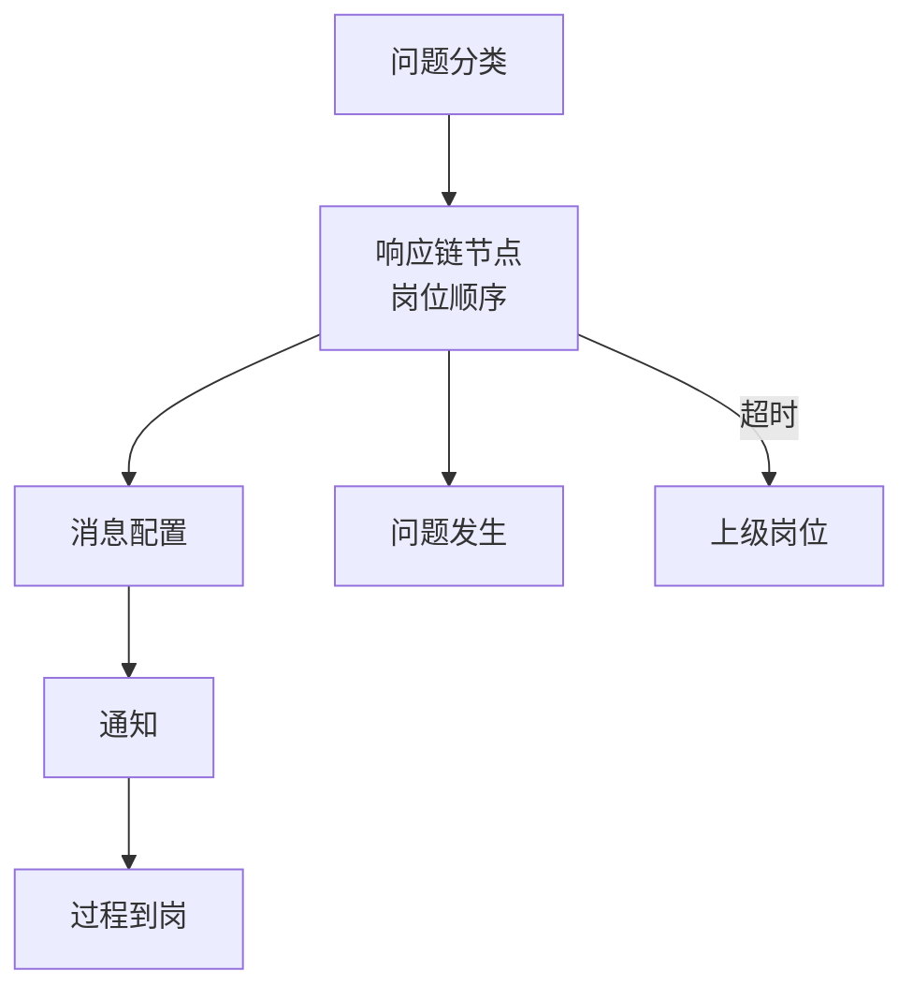

# 问题响应

> 适用基线：测试环境目标 / `dev` 分支 / 2026-07-15。
> 阅读对象：安灯管理员、值班岗位；操作见[问题响应-维护与查询参考](问题响应-维护与查询参考.md)。

## 业务目的与适用范围

问题响应配置「哪类问题由哪个岗位在标准时长内响应，超时通知哪一级，用哪条消息」。执行痕迹落在[故障记录](../01-故障记录/index.md)的过程到岗；本页写配置与闭环协作口径。

不替代系统消息通道治理，也不自动等同于 EAM 派工。

## 如何使用本组文档

| 你的目的 | 建议阅读 |
| --- | --- |
| 想理解响应链怎么配 | 本页。 |
| 正在维护岗位顺序与消息 | [问题响应-维护与查询参考](问题响应-维护与查询参考.md)。 |
| 想看现场到岗 | [故障记录](../01-故障记录/index.md)。 |

## 使用前准备

| 需要确认什么 | 为什么重要 |
| --- | --- |
| 问题分类码与现场一致 | 响应链按分类匹配。 |
| 岗位编码与组织岗位一致 | 通知找不到人。 |
| 消息编号已在消息配置中存在 | 链上 `msgId` 才能用。 |
| 标准时长与间隔 | SLA 与催促节奏。 |

!!! example "📷 截图占位"
    问题响应链配置列表；脱敏。

## 对象关系

| 对象 | 业务含义 |
| --- | --- |
| 响应链配置 | 分类 + 岗位 + 标准时长 + 上级岗位 + 通知间隔 + 消息编号 + 顺序号。 |
| 消息配置 | 消息编号、类型、内容文档。 |
| 消息发送 | 发送记录（投递痕迹）。 |
| 整改 / 整改跟踪（后端有） | 措施计划与跟踪；菜单是否挂出以环境为准。 |
| OEE 确认 / 问题文档（后端有） | 分析与附件类辅助对象。 |

## 响应如何生效

超时升级的**自动调度**是否在当前环境启用，需联调确认；配置字段已支持标准时长、间隔与上级岗位。

## 与故障记录 / EAM / 平台边界

| 协同方 | 本页负责 | 不在本页展开 |
| --- | --- | --- |
| 故障记录 | 提供链与消息键 | 问题描述与附件主录入 |
| EAM | — | 维修派工与备件 |
| 系统消息 | 业务 msg 内容 | 短信/IM 通道与重试 |
| MES OEE | 停机项目/确认线索 | 生产时长主统计 |

## 关键判断

| 判断点 | 应先确认什么 | 影响 |
| --- | --- | --- |
| 无人通知 | 分类是否匹配链、岗位码、msgId | 呼叫空转 |
| 总升级太快/太慢 | 标准时长与间隔 | SLA 失真 |
| 整改找不到入口 | 菜单是否挂出 | 仅口头闭环 |
| 以为配了就会开维修 | 是否另有集成 | 需手工报修 |

### 关键字段业务角色

| 字段/配置点 | 行为模式 | 在系统中的作用 | 关键行为要点 | 警惕什么 |
| --- | --- | --- | --- | --- |
| 问题分类 | P1 / P2 | 匹配哪条响应链 | 须与呼叫分类一致 | 不匹配→空转 |
| 响应岗位顺序 | P2 / P11 | 谁先被通知 | 序号从 1；岗位码须有效 | 岗位错找不到人 |
| 标准时长 / 通知间隔 | P7 / P10 | SLA 与催促节奏 | 时长窗口；自动升级是否部署 ❓ | SLA 失真 |
| 上级岗位 | P2 / P12 | 超时升级对象 | 链上配置 | 无上级则无法升级 |
| 消息编号 | P2 / P12 | 通知内容键 | 须在消息配置存在 | msg 缺失无通知 |
| 整改状态（若启用） | P9 | 措施闭环 | 菜单是否挂出 ❓ | 配置有、入口无 |
| 响应链≠维修工单 | P12 | 边界 | **不**自动创建 EAM 维修 | 以为配链即派工 |

完整选择器见[维护与查询参考](问题响应-维护与查询参考.md)。

## 限制与待确认

- 整改、OEE 确认等对象后端存在，测试环境菜单完整性待核对。
- 自动催促/升级任务是否部署：待确认。

!!! example "📝 示例数据占位"
    设备异常 → 班组长 10 分钟 → 工程师上级 → 消息模板 ANDON-EQ。

