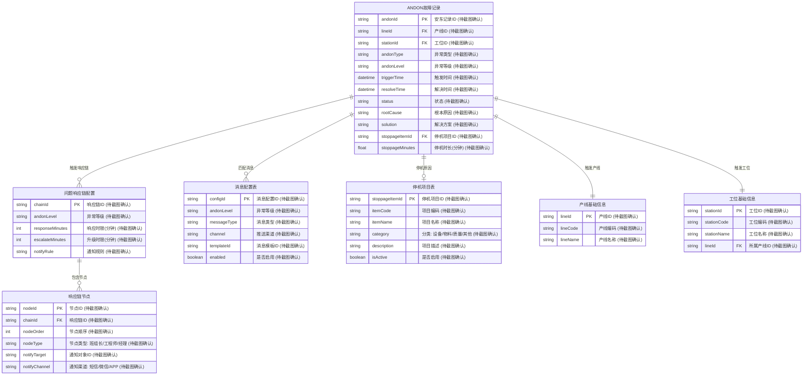
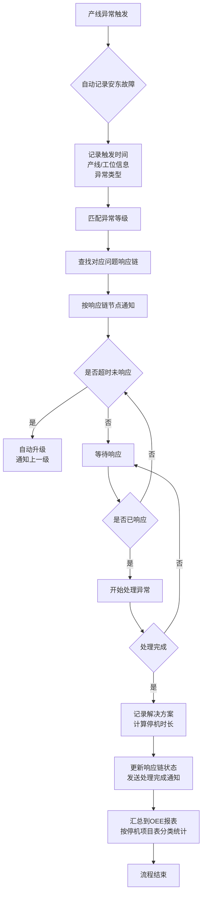
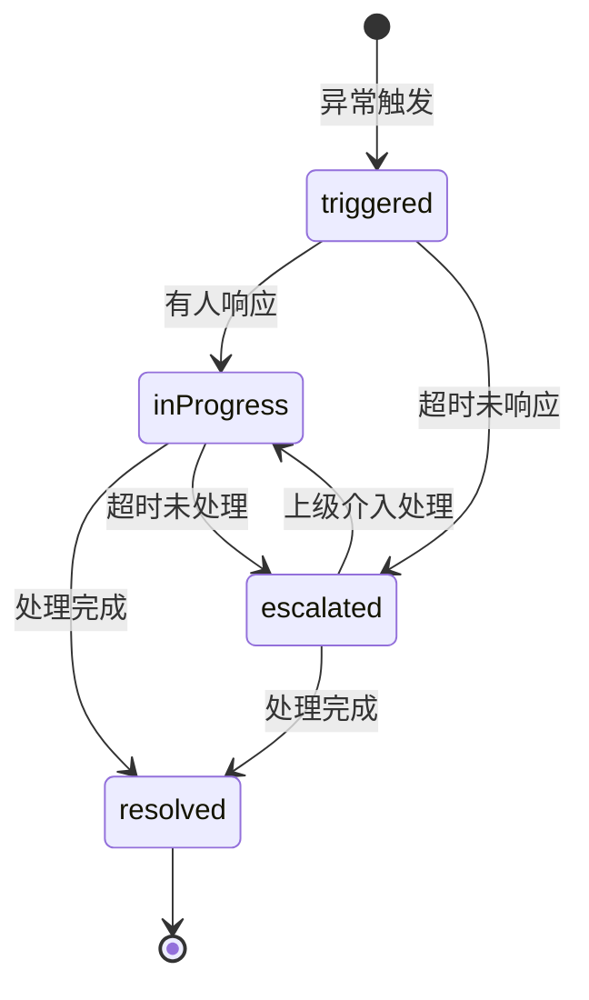

# ANDON 异常管理

## 模块概述

ANDON（安东）系统是制造执行系统（MES）中用于异常快速响应的重要模块。当产线发生设备故障、物料短缺、质量问题等异常时，系统自动记录异常信息并按照预设的响应链逐级通知相关人员，确保异常得到及时处理，减少停机损失。

ANDON 系统包含四大核心功能：

| 功能 | 说明 |
|------|------|
| 安东故障记录 | 产线异常/设备故障的记录，包含异常时间、产线、工位、异常类型等 |
| 问题响应链配置 | 异常等级→通知人→响应时限→升级规则的全链路配置 |
| 消息配置表 | 报警消息的推送规则，支持短信/微信/APP 等多渠道 |
| 停机项目表 | 停机原因的标准化分类，用于 OEE 停机时间统计 |

---

## 领域模型



---

## 核心流程

### 异常触发与响应流程



### 流程说明

| 阶段 | 操作 | 说明 |
|------|------|------|
| 1. 异常触发 | 产线设备故障/物料短缺/质量问题 | 由 MES 系统或产线终端触发 |
| 2. 记录故障 | 系统自动创建 ANDON 故障记录 | 记录触发时间、产线、工位、异常类型 |
| 3. 匹配等级 | 根据异常类型匹配异常等级 | 如：设备故障=严重、物料短缺=中等 |
| 4. 查找响应链 | 根据异常等级查找问题响应链配置 | 配置包含响应时限和升级规则 |
| 5. 通知相关人 | 按响应链节点顺序通知 | 班组长→工程师→经理，逐级升级 |
| 6. 响应处理 | 值班人员确认并处理异常 | 记录处理过程和解决方案 |
| 7. 完成归档 | 记录解决时间、停机时长、停机项目 | 用于 OEE 统计和分析 |

---

## 数据结构

### 安东故障记录 (AndonFaultRecord)

| 字段名 | 类型 | 说明 |
|--------|------|------|
| andonId | string | 安东记录ID (待截图确认) |
| lineId | string | 产线ID (待截图确认) |
| stationId | string | 工位ID (待截图确认) |
| andonType | string | 异常类型: equipmentFault/materialShortage/qualityIssue/other (待截图确认) |
| andonLevel | string | 异常等级: critical/major/minor (待截图确认) |
| triggerTime | datetime | 触发时间 (待截图确认) |
| resolveTime | datetime | 解决时间 (待截图确认) |
| status | string | 状态: triggered/inProgress/resolved/escalated (待截图确认) |
| rootCause | string | 根本原因 (待截图确认) |
| solution | string | 解决方案 (待截图确认) |
| stoppageItemId | string | 停机项目ID (待截图确认) |
| stoppageMinutes | float | 停机时长(分钟) (待截图确认) |
| reporterId | string | 上报人ID (待截图确认) |
| assigneeId | string | 处理人ID (待截图确认) |
| createTime | datetime | 创建时间 (待截图确认) |
| updateTime | datetime | 更新时间 (待截图确认) |

### 问题响应链配置 (AndonResponseChain)

| 字段名 | 类型 | 说明 |
|--------|------|------|
| chainId | string | 响应链ID (待截图确认) |
| chainName | string | 响应链名称 (待截图确认) |
| andonLevel | string | 异常等级: critical/major/minor (待截图确认) |
| responseMinutes | int | 响应时限(分钟) (待截图确认) |
| escalateMinutes | int | 升级时限(分钟) (待截图确认) |
| autoEscalate | boolean | 是否自动升级 (待截图确认) |
| description | string | 描述 (待截图确认) |
| isActive | boolean | 是否启用 (待截图确认) |
| createTime | datetime | 创建时间 (待截图确认) |
| updateTime | datetime | 更新时间 (待截图确认) |

### 响应链节点 (AndonResponseNode)

| 字段名 | 类型 | 说明 |
|--------|------|------|
| nodeId | string | 节点ID (待截图确认) |
| chainId | string | 响应链ID (待截图确认) |
| nodeOrder | int | 节点顺序 (待截图确认) |
| nodeType | string | 节点类型: teamLeader/engineer/manager (待截图确认) |
| notifyTarget | string | 通知对象ID (待截图确认) |
| notifyTargetName | string | 通知对象名称 (待截图确认) |
| notifyChannel | string | 通知渠道: sms/wechat/app/all (待截图确认) |
| nodeDescription | string | 节点描述 (待截图确认) |
| createTime | datetime | 创建时间 (待截图确认) |
| updateTime | datetime | 更新时间 (待截图确认) |

### 消息配置表 (AndonMessageConfig)

| 字段名 | 类型 | 说明 |
|--------|------|------|
| configId | string | 消息配置ID (待截图确认) |
| andonLevel | string | 异常等级: critical/major/minor (待截图确认) |
| messageType | string | 消息类型: faultAlert/escalationNotice/resolutionNotice (待截图确认) |
| channel | string | 推送渠道: sms/wechat/app (待截图确认) |
| templateCode | string | 消息模板编码 (待截图确认) |
| templateContent | string | 消息模板内容 (待截图确认) |
| enabled | boolean | 是否启用 (待截图确认) |
| priority | int | 优先级 (待截图确认) |
| createTime | datetime | 创建时间 (待截图确认) |
| updateTime | datetime | 更新时间 (待截图确认) |

### 停机项目表 (StoppageItem)

| 字段名 | 类型 | 说明 |
|--------|------|------|
| stoppageItemId | string | 停机项目ID (待截图确认) |
| itemCode | string | 项目编码 (待截图确认) |
| itemName | string | 项目名称 (待截图确认) |
| category | string | 分类: equipment/material/quality/other (待截图确认) |
| description | string | 项目描述 (待截图确认) |
| oeeCategory | string | OEE分类: unplannedDowntime/setupTime/idleTime (待截图确认) |
| isActive | boolean | 是否启用 (待截图确认) |
| displayOrder | int | 显示顺序 (待截图确认) |
| createTime | datetime | 创建时间 (待截图确认) |
| updateTime | datetime | 更新时间 (待截图确认) |

---

## 异常等级说明

| 等级 | 代码 | 响应时限 | 说明 | 典型场景 |
|------|------|----------|------|----------|
| 严重 | critical | 10分钟 | 影响整条产线或多个工位 | 设备主故障、批量质量问题 |
| 中等 | major | 30分钟 | 影响单个工位或部分工序 | 物料短缺、单台设备故障 |
| 轻微 | minor | 60分钟 | 不影响生产但需关注 | 工具损坏、轻微异常 |

---

## 接口规范

### 1. 创建安东故障记录

```
POST /api/andon/faults
```

**请求参数**

| 参数名 | 类型 | 必填 | 说明 |
|--------|------|------|------|
| lineId | string | 是 | 产线ID (待截图确认) |
| stationId | string | 是 | 工位ID (待截图确认) |
| andonType | string | 是 | 异常类型 (待截图确认) |
| andonLevel | string | 否 | 异常等级，默认自动匹配 (待截图确认) |
| reporterId | string | 是 | 上报人ID (待截图确认) |
| remark | string | 否 | 备注 (待截图确认) |

**返回参数**

| 参数名 | 类型 | 说明 |
|--------|------|------|
| andonId | string | 安东记录ID (待截图确认) |
| status | string | 状态 (待截图确认) |
| responseChain | object | 匹配的响应链信息 (待截图确认) |

### 2. 更新故障处理状态

```
PUT /api/andon/faults/{andonId}
```

**请求参数**

| 参数名 | 类型 | 必填 | 说明 |
|--------|------|------|------|
| status | string | 是 | 状态: inProgress/resolved (待截图确认) |
| assigneeId | string | 否 | 处理人ID (待截图确认) |
| rootCause | string | 否 | 根本原因 (待截图确认) |
| solution | string | 否 | 解决方案 (待截图确认) |
| stoppageItemId | string | 否 | 停机项目ID (待截图确认) |

### 3. 查询故障记录列表

```
GET /api/andon/faults
```

**查询参数**

| 参数名 | 类型 | 必填 | 说明 |
|--------|------|------|------|
| lineId | string | 否 | 产线ID (待截图确认) |
| andonType | string | 否 | 异常类型 (待截图确认) |
| andonLevel | string | 否 | 异常等级 (待截图确认) |
| status | string | 否 | 状态 (待截图确认) |
| startTime | datetime | 否 | 开始时间 (待截图确认) |
| endTime | datetime | 否 | 结束时间 (待截图确认) |
| page | int | 否 | 页码，默认1 (待截图确认) |
| pageSize | int | 否 | 每页条数，默认20 (待截图确认) |

### 4. 获取问题响应链配置

```
GET /api/andon/response-chains
```

### 5. 创建/更新响应链配置

```
POST /api/andon/response-chains
PUT /api/andon/response-chains/{chainId}
```

### 6. 获取消息配置列表

```
GET /api/andon/message-configs
```

### 7. 创建/更新消息配置

```
POST /api/andon/message-configs
PUT /api/andon/message-configs/{configId}
```

### 8. 获取停机项目列表

```
GET /api/andon/stoppage-items
```

### 9. 创建/更新停机项目

```
POST /api/andon/stoppage-items
PUT /api/andon/stoppage-items/{stoppageItemId}
```

---

## 状态机说明



---

## 相关模块接口

### 依赖模块

| 模块 | 接口方向 | 说明 |
|------|----------|------|
| MES_BASIC | [基础建模](../../06-MES-生产管理/01-基础建模/index.md) | 获取产线/工位基础信息 |
| EAM_ASSET | [设备管理](../../08-EAM-设备管理/02-设备管理/index.md) | 设备故障信息触发异常记录 |
| QMS_IPQC | [生产检验](../../07-QMS-质量管理/03-生产检验/index.md) | 巡检异常自动触发 ANDON 报警 |

### 被依赖模块

| 模块 | 接口方向 | 说明 |
|------|----------|------|
| MES_REPORT | [报表统计](../../06-MES-生产管理/05-报表统计/index.md) | 异常停机数据用于 OEE 统计 |
| EAM_INSPECTION | [巡检保养](../../08-EAM-设备管理/05-巡检保养/index.md) | 异常处理结果反馈设备巡检记录 |

## OEE 停机时间统计

ANDON 系统记录的停机数据通过 `stoppageItemId` 与停机项目表关联，可按以下维度进行 OEE 停机分析：

| 分析维度 | 说明 |
|----------|------|
| 按产线 | 各产线的停机时间分布 |
| 按停机项目 | 各类停机原因的频率和时长 |
| 按时间段 | 停机高峰时段分析 |
| 按班组 | 各班组的响应效率对比 |

停机时间计算公式：

```
停机时长 = resolveTime - triggerTime (分钟)
OEE停机时间 = SUM(stoppageMinutes) WHERE category = 'unplannedDowntime'
```