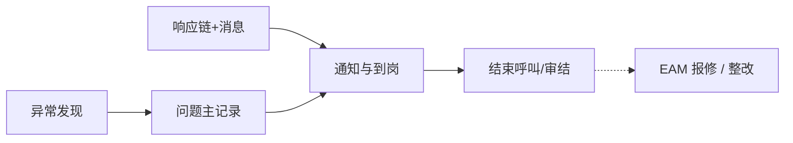

# ANDON 异常管理

> 适用基线：测试环境目标 / `dev` 分支 / 2026-07-15。
> 阅读对象：测试、实施、运维（主）；班组长、安灯管理员、设备与质量协同（顺带）；细节见各分组「维护与查询参考」。

## 模块职责

ANDON 记录产线异常**呼叫与过程到岗**，并配置问题响应链、消息与停机项目。它回答「异常怎么记下来、怎么通知到人」，不回答「维修工单怎么派、怎么双验证」——后者在 [EAM 设备管理](../08-EAM-设备管理/02-设备管理/index.md)。

读完本页，应能分清「故障记录」与「问题响应」各管什么，以及何时转 EAM 报修；勿与 MES 报工或 QMS 检验混用。呼叫结束 ≠ 维修完成；配了响应链 ≠ 自动开维修。

来源可区分安东异常、设备巡检、质量检验。旧概述虚构英文等级状态机与示例 REST 废弃。

## 如何使用本模块

| 你的目的 | 建议怎么做 |
| --- | --- |
| 理解呼叫与到岗主线 | 本页：模块职责 → 核心流程 → 边界；再进故障记录 |
| 查/维护问题主记录与过程 | [故障记录](01-故障记录/index.md)（含写实示例与验证点） |
| 配响应链与消息 | [问题响应](02-问题响应/index.md) |
| 异常要转设备维修 | EAM [设备管理](../08-EAM-设备管理/02-设备管理/index.md)（手工报修；勿指望链配置自动开单） |

## 建议学习顺序

1. [故障记录](01-故障记录/index.md) — 问题主记录与过程到岗。
2. [问题响应](02-问题响应/index.md) — 响应链、消息、整改线索。
3. 异常要转设备维修 → EAM [设备管理](../08-EAM-设备管理/02-设备管理/index.md)。

## 业务分组齐套状态

| 分组 | 状态 | 说明 |
| --- | --- | --- |
| [01-故障记录](01-故障记录/index.md) | 已覆盖 | 主记录/过程/停机项目；菜单与主单关系已标明。 |
| [02-问题响应](02-问题响应/index.md) | 已覆盖 | 响应链与消息；升级调度待联调。 |

## 核心流程（总览）

## 与其它模块边界

| 模块 | ANDON 负责 | 不在 ANDON 展开 |
| --- | --- | --- |
| EAM | 设备编码关联、可转报修线索 | 报修审批、维修状态机与备件 |
| MES | 工单号等关联 | 停线控制与报工 |
| QMS | 来源可含质量检验 | 检验与评审 |
| 消息平台 | 业务消息键 | 通道投递 |

## 待确认事项

- `GAP-016`：超时自动升级任务、整改/OEE 菜单完整性、巡检/质量来源自动建单触发点。
- `FSEM-006`：分类/设备/岗位/消息选择器精确过滤与 P13 投影矩阵待测。
- 截图实拍。
