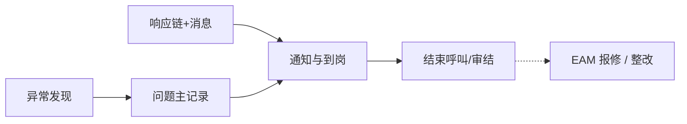

# ANDON 异常管理

> 适用基线：测试环境目标 / `dev` 分支 / 2026-07-15。

## 模块职责

ANDON 记录产线异常呼叫事实与过程到岗，并配置问题响应链与消息、停机项目等。来源可区分安东异常、设备巡检、质量检验。不替代 EAM 维修工单，也不替代 MES 报工或 QMS 检验。

旧概述虚构英文等级状态机与示例 REST 废弃。

## 测试 / 实施从哪读

| 你的目的 | 建议阅读 |
| --- | --- |
| 模块边界与配置依赖 | **本页** |
| 呼叫事实如何登记/关闭 | [故障记录](01-故障记录/index.md) |
| 响应链与消息如何配置 | [问题响应](02-问题响应/index.md) |
| 字段、选择器、日常操作 | 各组 `*-维护与查询参考.md` |
| 验证场景（分类匹配、到岗、超时升级是否部署） | 分组 index + `GAP-016` 文末项 |

## 配置依赖概览

| 依赖层 | 先备 / 改什么 | 行为影响 |
| --- | --- | --- |
| 问题分类 / 来源 / 类型码表 | 与现场口径一致 | 匹配不到响应链 → 无人通知 |
| 响应链 | 岗位顺序、标准时长、间隔、上级岗位、消息编号 | SLA、催促节奏、升级对象 |
| 组织岗位 | 岗位码有效且有人 | 通知找不到人 |
| 消息配置 | `msgId` 存在 | 链上有岗无内容 |
| 设备/模具/工单编码（可选） | DBC/MES 已有对象 | 跨模块联查；空键难追溯 |
| 调度任务（超时升级） | 是否在本环境部署 | 配置了时长≠一定自动升级（待核验） |
| 权限 / 菜单 | 整改、OEE 等入口是否挂出 | 配置有、入口无 |

## 建议学习顺序

1. [故障记录](01-故障记录/index.md) — 问题主记录与过程到岗。
2. [问题响应](02-问题响应/index.md) — 响应链、消息、整改线索。

## 业务分组齐套状态

| 分组 | 状态 | 说明 |
| --- | --- | --- |
| [01-故障记录](01-故障记录/index.md) | 已覆盖 | 主记录/过程/停机项目；菜单与主单关系已标明。 |
| [02-问题响应](02-问题响应/index.md) | 已覆盖 | 响应链与消息；升级调度待联调。 |

## 核心流程（总览）

## 与其它模块边界

| 模块 | ANDON 负责 | 不在 ANDON 展开 |
| --- | --- | --- |
| EAM | 设备编码关联、可转报修线索 | 维修状态机与备件 |
| MES | 工单号等关联 | 停线控制与报工 |
| QMS | 来源可含质量检验 | 检验与评审 |
| 消息平台 | 业务消息键 | 通道投递 |

## 待确认事项

- `GAP-016`：超时自动升级任务、整改/OEE 菜单完整性、巡检/质量来源自动建单触发点。
- 分类/设备/岗位/消息选择器精确过滤的精确可选状态与权限投影范围尚未闭合；验收勿按「全状态可见」假定。（辅证：`FSEM-006`）
- 截图实拍。
