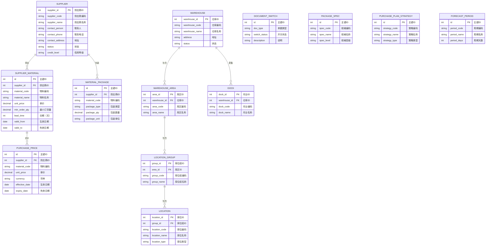

# 基础数据

## 概述

SCP 基础数据是供应链平台的数据底座，涵盖供应商档案、供应商物料、物料包装、采购价格单、仓库库区建模、单据开关、包装规格、采购计划策略等主数据配置，为采购订单、要货预测、发货协同等业务提供基础数据支撑。

## 领域模型



## 功能说明

### 1. 供应商

管理供应商基础档案，支持供应商编码、名称、联系人、信用等级等信息维护。

**功能入口**: 基础数据 → 供应商

| 字段名 | 中文名 | 类型 | 约束 | 影响业务 | 备注 |
|--------|--------|------|------|----------|------|
| supplier_code | 供应商编码 | VARCHAR(50) | 必填 | 采购订单关联（唯一标识） | |
| supplier_name | 供应商名称 | VARCHAR(200) | 必填 | 所有单据显示 | |
| contact_person | 联系人 | VARCHAR(100) | 非必填 | 供应商沟通 | |
| contact_phone | 联系电话 | VARCHAR(50) | 非必填 | 供应商沟通 | |
| contact_address | 地址 | VARCHAR(500) | 非必填 | 送货地址 | |
| status | 状态 | ENUM | 字典项 | 供应商选择列表（禁用不可选） | 生效/禁用 |
| credit_level | 信用等级 | VARCHAR(50) | 非必填 | 采购决策参考 | |

### 2. 供应商物料

维护供应商可供应物料清单及单价、交期等信息。

**功能入口**: 基础数据 → 供应商物料

| 字段名 | 中文名 | 类型 | 约束 | 影响业务 | 备注 |
|--------|--------|------|------|----------|------|
| supplier_id | 供应商ID | INT | 必填 | 关联供应商档案 | |
| material_code | 物料编码 | VARCHAR(50) | 必填 | 采购订单引用 | |
| material_name | 物料名称 | VARCHAR(200) | 必填 | 显示 | |
| unit_price | 单价 | DECIMAL(12,4) | 必填 | 采购订单计价 | 含税单价 |
| min_order_qty | 最小订货量 | DECIMAL(12,4) | 非必填 | 采购数量校验 | |
| lead_time | 交期（天） | INT | 非必填 | 采购计划参考 | |
| valid_from | 生效日期 | DATE | 非必填 | 价格有效性 | |
| valid_to | 失效日期 | DATE | 非必填 | 价格有效性 | |

### 3. 物料包装信息

管理供应商物料的包装方式、包装数量、包装规格等包装信息。

**功能入口**: 基础数据 → 物料包装信息

### 4. 采购价格单

维护采购物料的价格信息，支持价格有效期管理，作为采购订单的计价依据。

**功能入口**: 基础数据 → 采购价格单

### 5. 仓库/库区/库位组/库位管理

管理供应链视角下的仓库层级建模，定义仓库→库区→库位组→库位的四级物理存储结构。

**功能入口**: 基础数据 → 仓库管理 / 库区管理 / 库位组管理 / 库位管理

### 6. 月台管理

管理仓库发货/收货月台信息，用于发货协同中的月台分配。

**功能入口**: 基础数据 → 月台管理

### 7. 单据开关

配置供应链各业务单据的启用/禁用状态，控制业务流程入口。

**功能入口**: 基础数据 → 单据开关

### 8. 包装规格

定义物料包装规格及层级关系，支持多层级包装（如：托盘→箱→件）。

**功能入口**: 基础数据 → 包装规格 / 包装规格层级

### 9. 采购计划策略

配置采购计划的生成策略，影响要货预测和采购订单的自动生成逻辑。

**功能入口**: 基础数据 → 采购计划策略

### 10. 要货预测周期管理

定义要货预测的时间周期（如：周/月/季度），影响要货预测的生成频率和范围。

**功能入口**: 基础数据 → 要货预测周期管理

## 业务规则

1. **供应商编码唯一性**：供应商编码全局唯一，作为系统内供应商的主标识
2. **供应物料价格有效期**：超过有效期的价格记录自动失效，新建采购订单使用最新有效价格
3. **仓库建模层级完整性**：仓库→库区→库位组→库位为强制层级，不可跨层级挂靠
4. **单据开关影响范围**：关闭某单据开关后，所有相关业务入口不可见

## 菜单树结构

```
基础数据
  ├─ 供应商
  ├─ 供应商物料
  ├─ 物料包装信息
  ├─ 采购价格单
  ├─ 仓库管理
  ├─ 库区管理
  ├─ 库位组管理
  ├─ 库位管理
  ├─ 月台管理
  ├─ 单据开关
  ├─ 包装规格
  ├─ 包装规格层级
  ├─ 采购计划策略
  └─ 要货预测周期管理
```

## 相关模块接口

| 模块 | 接口方向 | 说明 |
|------|----------|------|
| DBC_SUPPLIER | [供应商主数据](../../04-DBC-主数据管理/02-供应商管理/01-供应商.md) | 供应商基础信息同步 |
| DBC_MATERIAL | [物料主数据](../../04-DBC-主数据管理/01-物料管理/01-物料基本信息.md) | 物料编码、名称等基础信息 |
| DBC_WAREHOUSE | [仓库主数据](../../04-DBC-主数据管理/04-工厂建模/01-仓库管理.md) | 仓库建模信息 |
| WMS_WAREHOUSE | [仓库管理](../../05-WMS-库房管理/01-基础数据/index.md) | 库区/库位实际使用状态 |

## 版本历史

| 版本 | 日期 | 说明 |
|------|------|------|
| 1.0 | 2026-05-21 | 从单页文档拆分为独立子页面，基于测试环境菜单结构 |
