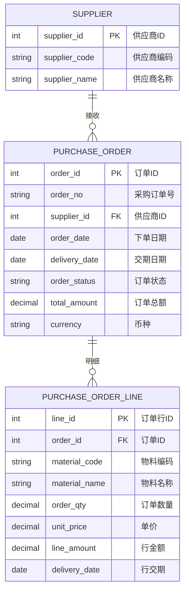
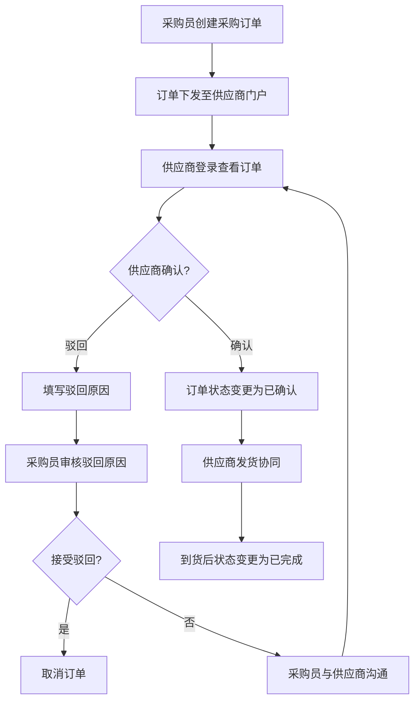

# 采购订单

## 概述

采购订单是 SCP 供应链平台中连接企业与供应商的核心单据。采购方下达采购订单后，供应商通过门户登录查看、确认或驳回订单，确认后的订单作为后续发货协同和采购跟踪的依据。

## 领域模型



## 核心流程



## 功能说明

### 1. 采购订单管理

采购方创建并管理采购订单，供应商通过门户查看和确认。

**功能入口**: 采购订单

| 字段名 | 中文名 | 类型 | 约束 | 影响业务 | 备注 |
|--------|--------|------|------|----------|------|
| order_no | 采购订单号 | VARCHAR(50) | 必填 | 唯一标识 | |
| supplier_id | 供应商ID | INT | 必填 | 关联供应商 | |
| order_date | 下单日期 | DATE | 必填 | 采购统计 | |
| delivery_date | 交期日期 | DATE | 必填 | 到货跟踪 | |
| order_status | 订单状态 | ENUM | 字典项 | 供应商确认流程 | 待确认/已确认/已驳回/已完成 |
| total_amount | 订单总额 | DECIMAL(12,4) | 计算 | 对账依据 | |
| currency | 币种 | VARCHAR(10) | 默认CNY | 结算 | |

### 2. 订单行明细

每个采购订单包含多个订单行，每个行指定物料、数量、单价和交期。

| 字段名 | 中文名 | 类型 | 约束 | 影响业务 | 备注 |
|--------|--------|------|------|----------|------|
| line_id | 行号 | INT | 必填 | 订单行标识 | |
| material_code | 物料编码 | VARCHAR(50) | 必填 | 发货依据 | |
| material_name | 物料名称 | VARCHAR(200) | 必填 | 显示 | |
| order_qty | 订单数量 | DECIMAL(12,4) | 必填 | 发货数量上限 | |
| unit_price | 单价 | DECIMAL(12,4) | 必填 | 计价依据 | |
| line_amount | 行金额 | DECIMAL(12,4) | 计算 | 订单总额汇总 | qty × unit_price |
| delivery_date | 行交期 | DATE | 必填 | 供应商发货节点 | |

## 业务规则

1. **订单确认时效**：供应商收到采购订单后需在 24 小时内确认，超时自动催提醒
2. **订单变更管控**：已确认的采购订单如需变更，需采购方发起变更申请，供应商重新确认
3. **数量容差**：发货数量允许在订单数量的 ±X% 以内浮动（可在采购计划策略中配置）
4. **订单关闭**：订单全部到货后自动变更为"已完成"；长期未完成订单超交期自动预警

## 菜单树结构

```
采购订单
```

## 相关模块接口

| 模块 | 接口方向 | 说明 |
|------|----------|------|
| SCP_SUPPLIER | [基础数据](../01-基础数据/index.md) | 获取供应商信息 |
| SCP_SUPPLIER_MATERIAL | [基础数据](../01-基础数据/index.md) | 获取供应商物料及价格 |
| SCP_DELIVERY | [发货协同](../05-发货协同/index.md) | 确认后触发发货流程 |
| SCP_INVOICE | [发票结算](../07-发票结算/index.md) | 到货后作为开票依据 |
| ERP_PURCHASE | [ERP采购](../../01-总体框架/architecture.md) | 订单状态同步至ERP |

## 版本历史

| 版本 | 日期 | 说明 |
|------|------|------|
| 1.0 | 2026-05-21 | 从单页文档拆分为独立子页面 |
