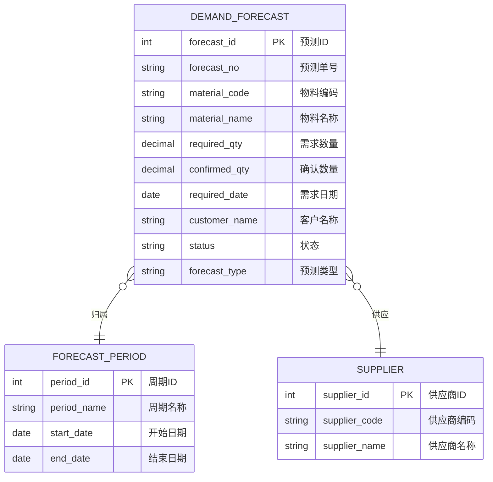
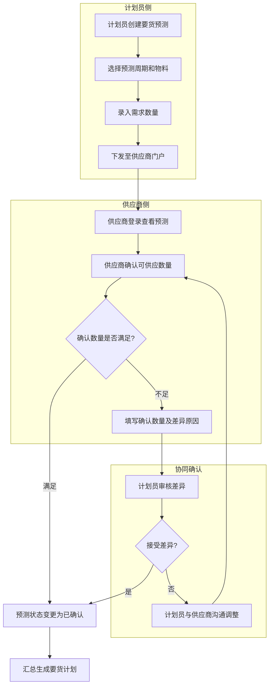

# 要货预测

## 概述

要货预测是 SCP 供应链平台中连接计划员与供应商的协同预测模块。计划员创建中长期要货预测，供应商通过门户查看并确认可供应数量，经过双方对齐后汇总生成要货计划，作为后续采购订单的依据。

## 领域模型



## 核心流程



## 功能说明

### 1. 要货预测-计划员

计划员创建和管理要货预测，下发至供应商确认。

**功能入口**: 要货预测-计划员

| 字段名 | 中文名 | 类型 | 约束 | 影响业务 | 备注 |
|--------|--------|------|------|----------|------|
| forecast_no | 预测单号 | VARCHAR(50) | 必填 | 唯一标识 | |
| material_code | 物料编码 | VARCHAR(50) | 必填 | 关联物料 | |
| material_name | 物料名称 | VARCHAR(200) | 必填 | 显示 | |
| required_qty | 需求数量 | DECIMAL(12,4) | 必填 | 供应商确认依据 | |
| confirmed_qty | 确认数量 | DECIMAL(12,4) | 非必填 | 供应商回复 | |
| required_date | 需求日期 | DATE | 必填 | 计划排程 | |
| customer_name | 客户名称 | VARCHAR(200) | 非必填 | 客户长期计划来源 | |
| status | 状态 | ENUM | 字典项 | 计划汇总 | 待确认/已确认/已驳回 |

### 2. 要货预测-供应商

供应商通过门户查看要货预测，确认可供应数量或反馈差异。

**功能入口**: 要货预测-供应商

| 字段名 | 中文名 | 类型 | 约束 | 影响业务 | 备注 |
|--------|--------|------|------|----------|------|
| forecast_no | 预测单号 | VARCHAR(50) | 显示 | 唯一标识 | |
| material_code | 物料编码 | VARCHAR(50) | 显示 | 关联物料 | |
| required_qty | 需求数量 | DECIMAL(12,4) | 显示 | 需方数量 | |
| confirmed_qty | 确认数量 | DECIMAL(12,4) | 输入 | 供应商承诺数量 | |
| diff_reason | 差异原因 | VARCHAR(500) | 非必填 | 确认数量不足时填写 | |
| confirm_time | 确认时间 | DATETIME | 系统自动 | 审计追踪 | |
| supplier_status | 供应商状态 | ENUM | 字典项 | 供应商侧流转 | 待确认/已确认/已驳回 |

## 业务规则

1. **预测周期管理**：要货预测按预设周期（周/月/季度）生成，由要货预测周期管理配置
2. **确认时效**：供应商需在预测下发后规定时间内确认，超时系统自动催提醒
3. **差异处理**：确认数量低于需求数量超过阈值（如 20%），需计划员手动审核
4. **预测锁定**：已确认的预测数据汇总至要货计划后，原预测不可再修改

## 菜单树结构

```
要货预测-计划员
要货预测-供应商
```

## 相关模块接口

| 模块 | 接口方向 | 说明 |
|------|----------|------|
| DBC_MATERIAL | [物料主数据](../../04-DBC-主数据管理/01-物料管理/01-物料基本信息.md) | 获取物料编码、名称 |
| SCP_FORECAST_PERIOD | [基础数据](../01-基础数据/index.md) | 获取预测周期配置 |
| SCP_DEMAND_PLAN | [要货计划](../04-要货计划/index.md) | 已确认预测汇总至要货计划 |
| ERP_FORECAST | [ERP预测](../../01-总体框架/architecture.md) | 预测数据同步至ERP |

## 版本历史

| 版本 | 日期 | 说明 |
|------|------|------|
| 1.0 | 2026-05-21 | 从单页文档拆分为独立子页面 |
