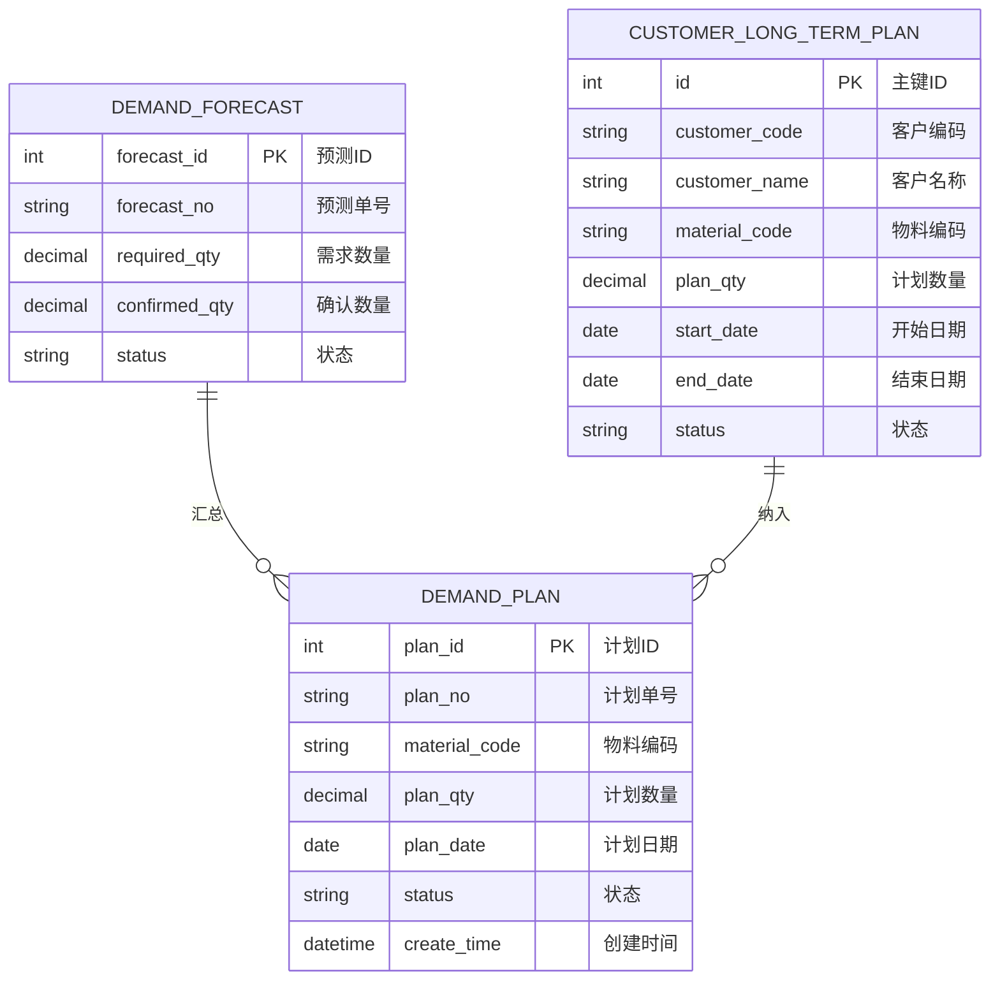
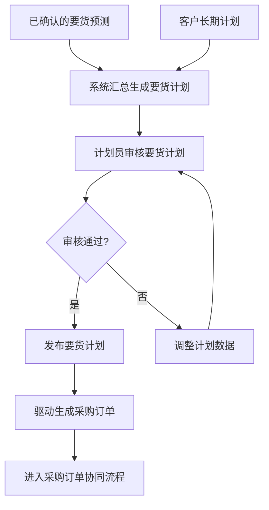

# 要货计划

## 概述

要货计划是对已确认的要货预测进行汇总，形成正式的供应计划。计划员审核后驱动采购订单的生成，同时支持客户长期计划的管理，实现从"需求预测→供应计划→采购执行"的完整闭环。

## 领域模型



## 核心流程



## 功能说明

### 1. 要货计划

汇总要货预测数据，生成正式供应计划。

**功能入口**: 要货计划

| 字段名 | 中文名 | 类型 | 约束 | 影响业务 | 备注 |
|--------|--------|------|------|----------|------|
| plan_no | 计划单号 | VARCHAR(50) | 必填 | 唯一标识 | |
| material_code | 物料编码 | VARCHAR(50) | 必填 | 关联物料 | |
| plan_qty | 计划数量 | DECIMAL(12,4) | 必填 | 采购订单数量依据 | |
| plan_date | 计划日期 | DATE | 必填 | 采购执行时间 | |
| status | 状态 | ENUM | 字典项 | 采购订单生成 | 待审核/已发布/已转单 |
| creator | 创建人 | VARCHAR(50) | 系统自动 | 审计 | |
| create_time | 创建时间 | DATETIME | 系统自动 | 审计 | |

### 2. 客户长期计划

管理客户侧的长期需求计划，作为要货预测和要货计划的补充输入来源。

**功能入口**: 客户长期计划

| 字段名 | 中文名 | 类型 | 约束 | 影响业务 | 备注 |
|--------|--------|------|------|----------|------|
| customer_code | 客户编码 | VARCHAR(50) | 必填 | 关联客户 | |
| customer_name | 客户名称 | VARCHAR(200) | 必填 | 显示 | |
| material_code | 物料编码 | VARCHAR(50) | 必填 | 关联物料 | |
| plan_qty | 计划数量 | DECIMAL(12,4) | 必填 | 需求来源 | |
| start_date | 开始日期 | DATE | 必填 | 计划范围 | |
| end_date | 结束日期 | DATE | 必填 | 计划范围 | |
| status | 状态 | ENUM | 字典项 | 需求确认 | 待确认/已纳入/已失效 |

## 业务规则

1. **汇总规则**：同一物料、同一周期的多个已确认预测，按数量汇总生成一条要货计划
2. **计划排程**：要货计划按物料交期自动推算采购订单建议下单日期
3. **转单控制**：已发布的要货计划不可直接修改，需先撤销发布
4. **客户长期计划优先级**：客户长期计划与要货预测冲突时，以客户长期计划为准

## 菜单树结构

```
要货计划
客户长期计划
```

## 相关模块接口

| 模块 | 接口方向 | 说明 |
|------|----------|------|
| SCP_DEMAND_FORECAST | 要货预测 | 已确认预测汇总输入 |
| SCP_PURCHASE_ORDER | 采购订单 | 已发布计划转采购订单 |
| DBC_MATERIAL | 物料主数据 | 获取物料信息 |
| DBC_CUSTOMER | 客户主数据 | 获取客户信息 |

## 版本历史

| 版本 | 日期 | 说明 |
|------|------|------|
| 1.0 | 2026-05-21 | 从单页文档拆分为独立子页面 |
