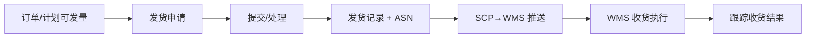

# 发货协同

> 适用基线：测试环境目标 / `dev` 分支 / 2026-07-15。
> 阅读对象：供应商发货员、采购跟单；操作见[发货协同-维护与查询参考](发货协同-维护与查询参考.md)。

## 业务目的与适用范围

发货协同覆盖供应商发货申请与发货记录（含 ASN 号、到仓/月台、承运与车牌、计划到货时间等）。申请提交并形成记录后，通过 **SCP↔WMS** 接口推送发货主/明细（及批次属性等），供仓库安排收货；记录可带「是否已生成采购收货申请」标志与申请号。

旧稿「提交即生成 ASN 并保证 WMS 自动完成」需以接口成功为准，失败应查接口信息，不能假定库存已变。

## 如何使用本组文档

| 你的目的 | 建议阅读 |
| --- | --- |
| 想理解 ASN 如何进仓库 | 本页。 |
| 正在做发货申请/记录 | [发货协同-维护与查询参考](发货协同-维护与查询参考.md)。 |
| 想看仓库如何收 | WMS [采购收货](../../05-WMS-库房管理/03-采购收货/index.md)。 |
| 想看订单/计划数量约束 | [采购订单](../02-采购订单/index.md)、[要货计划](../04-要货计划/index.md)。 |

## 使用前准备

| 需要确认什么 | 为什么重要 |
| --- | --- |
| 已发布/可发的订单或计划 | 申请挂 poNumber / ppNumber。 |
| 物料包装、批次属性 | 扫码与收货核对。 |
| 到仓、月台、时间窗、承运信息 | 到货安排。 |
| 接口通道可用 | 推送失败则 WMS 无 ASN。 |

【截图占位：发货申请新增（PO、明细数量、到仓）。】

## 一笔发货如何完成

发货完成时会回写采购计划已发数量等（服务内已有同步线索）；撤销发货存在重新推送 WMS 的路径。

## 主对象

| 对象 | 业务含义 |
| --- | --- |
| 发货申请头/行 | 申请号、关联计划/订单、到仓月台、时间窗、承运、明细数量与包装。 |
| 发货记录头/行 | ASN、执行时间、申请号回挂、是否已建收货申请等。 |
| 发货检验明细 | 协同侧检验线索（与 QMS 权威边界待确认）。 |
| 供应商包装 | 发货包装辅助。 |

申请状态复用通用请求状态枚举（NEW、REVIEWING、AGREED、…、COMPLETED 等）。

## 与 WMS / QMS / 销售发货边界

| 协同方 | 本页负责 | 不在本页展开 |
| --- | --- | --- |
| WMS 采购收货 | 推送 ASN/发货记录；可触发收货申请标志 | 库内任务、库存事务、PDA 收货 |
| WMS 成品发货 | — | 客户发货申请/任务/记录（另一菜单域） |
| QMS 来料检验 | 可选检验明细线索 | IQC 申请任务记录权威 |
| 采购跟踪 | 发货后跟踪未收/已收 | 退货/短缺细则 |

## 关键判断

| 判断点 | 应先确认 | 影响 |
| --- | --- | --- |
| 数量超发 | 订单/计划未交量 | 申请校验失败 |
| WMS 无单 | 接口状态是否成功 | 仓库无法收 |
| 重复建收货申请 | purchasereceiptRequestFlag | 避免重复申请 |

## 限制与待确认

- 发货申请与记录是否必须一对一、部分发货多次：以环境配置与测试为准。
- 发货检验明细与 QMS 来料检验是否自动建单：**未证实**。
- 定时任务由发货记录创建 WMS 收货申请（WMS Job 线索）的启用条件：待联调。
