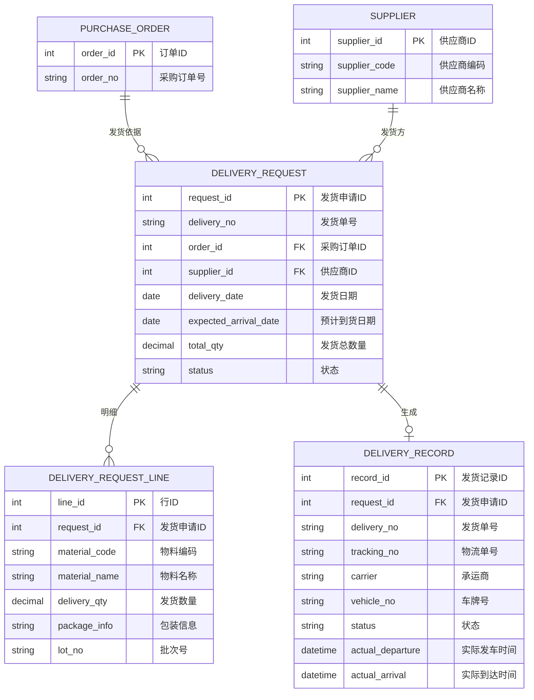
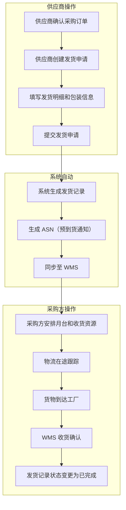

# 发货协同

## 概述

发货协同是供应商与采购方的物流协同模块。供应商在确认采购订单后，通过发货申请提交发货信息（ASN），采购方据此安排月台和收货准备。发货记录实时同步至 WMS，实现来料全过程可视化跟踪。

## 领域模型



## 核心流程



## 功能说明

### 1. 供应商发货申请

供应商创建发货申请，填写发货明细，提交后同步至采购方。

**功能入口**: 供应商发货申请

| 字段名 | 中文名 | 类型 | 约束 | 影响业务 | 备注 |
|--------|--------|------|------|----------|------|
| delivery_no | 发货单号 | VARCHAR(50) | 必填 | 唯一标识 | |
| order_no | 采购订单号 | VARCHAR(50) | 必填 | 关联订单 | |
| supplier_id | 供应商ID | INT | 必填 | 发货方 | |
| delivery_date | 发货日期 | DATE | 必填 | 到货跟踪 | |
| expected_arrival_date | 预计到货日期 | DATE | 非必填 | 采购方备货 | |
| total_qty | 发货总数量 | DECIMAL(12,4) | 必填 | 到货核对 | |
| status | 状态 | ENUM | 字典项 | 采购收货 | 待发货/已发货/部分到货/已完成 |

### 2. 发货申请明细

每笔发货申请包含多个物料行，记录每种物料的发货数量和包装信息。

| 字段名 | 中文名 | 类型 | 约束 | 影响业务 | 备注 |
|--------|--------|------|------|----------|------|
| material_code | 物料编码 | VARCHAR(50) | 必填 | 收货核对 | |
| material_name | 物料名称 | VARCHAR(200) | 必填 | 显示 | |
| delivery_qty | 发货数量 | DECIMAL(12,4) | 必填 | 实际发货量 | 不可超过订单未发货数量 |
| package_info | 包装信息 | VARCHAR(200) | 非必填 | 收货准备 | 如：托盘数/箱数 |
| lot_no | 批次号 | VARCHAR(50) | 非必填 | 批次追溯 | |

### 3. 供应商发货记录

发货申请的物流执行记录，追踪货物从供应商到工厂的全过程。

**功能入口**: 供应商发货记录

| 字段名 | 中文名 | 类型 | 约束 | 影响业务 | 备注 |
|--------|--------|------|------|----------|------|
| delivery_no | 发货单号 | VARCHAR(50) | 必填 | 关联发货申请 | |
| tracking_no | 物流单号 | VARCHAR(100) | 非必填 | 在途跟踪 | |
| carrier | 承运商 | VARCHAR(100) | 非必填 | 物流管理 | |
| vehicle_no | 车牌号 | VARCHAR(50) | 非必填 | 入厂核查 | |
| actual_departure | 实际发车时间 | DATETIME | 非必填 | 在途跟踪 | |
| actual_arrival | 实际到达时间 | DATETIME | 非必填 | 收货准备 | |
| status | 状态 | ENUM | 字典项 | WMS收货 | 待发货/在途/已到货/已完成 |

## 业务规则

1. **发货数量校验**：发货申请数量不能超过订单未交货数量，系统自动校验
2. **ASN同步规则**：发货申请提交后立即生成 ASN 并同步至 WMS
3. **状态联动**：WMS 完成收货后，发货记录状态自动变更为"已完成"
4. **变更限制**：已发货的发货申请不可修改物料行，仅可补充物流信息

## 搜索条件说明

### 供应商发货记录搜索

| 搜索字段 | 中文名 | 搜索类型 | 说明 |
|----------|--------|----------|------|
| supplier | 供应商 | 下拉选择 | 支持模糊搜索供应商名称 |
| delivery_no | 发货单号 | 文本输入 | 支持精确和模糊搜索 |
| order_no | 采购订单号 | 文本输入 | 支持精确搜索 |
| status | 状态 | 下拉选择 | 待发货/在途/已到货/已完成 |
| date_range | 发货日期范围 | 日期区间 | 支持自定义起止日期 |

## 菜单树结构

```
供应商发货申请
供应商发货记录
```

## 相关模块接口

| 模块 | 接口方向 | 说明 |
|------|----------|------|
| SCP_PURCHASE_ORDER | 采购订单 | 获取已确认订单作为发货依据 |
| SCP_SUPPLIER | 基础数据 | 获取供应商信息 |
| WMS_RECEIVING | 采购收货 | ASN同步，收货结果回传 |
| TMS_TRACKING | 运输管理 | 物流在途状态查询 |

## 版本历史

| 版本 | 日期 | 说明 |
|------|------|------|
| 1.0 | 2026-05-21 | 从单页文档拆分为独立子页面 |
