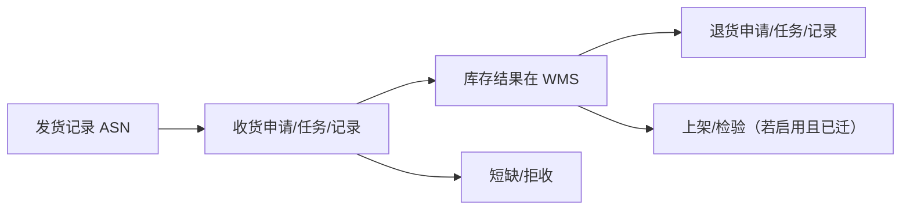

# 采购跟踪

> 适用基线：测试环境目标 / `dev` 分支 / 2026-07-15。
> 阅读对象：采购跟单、供应商查询；操作见[采购跟踪-维护与查询参考](采购跟踪-维护与查询参考.md)。

## 业务目的与适用范围

采购跟踪面向「发货之后到入库/退货」的进度可视：SCP 侧存在采购收货申请/任务/记录、退货对应对象、短缺明细，以及上架、检验等迁移页面。**库存变动与库内执行以 WMS 为准**；SCP 收货服务中仍有依赖 WMS 基础设施未迁完的 TODO（如部分退货/检验/上架创建），培训勿承诺 SCP 页可独立完成全部仓内闭环。

未收货视角可由发货记录「未取/已取」统计与订单/计划未收数量共同观察，而非单独虚构表。

## 如何使用本组文档

| 你的目的 | 建议阅读 |
| --- | --- |
| 想理解跟踪与仓内收货关系 | 本页。 |
| 正在查收货/退货/短缺 | [采购跟踪-维护与查询参考](采购跟踪-维护与查询参考.md)。 |
| 仓库现场收货 | WMS [采购收货](../../05-WMS-库房管理/03-采购收货/index.md)、[采购退货](../../05-WMS-库房管理/04-采购退货/index.md)。 |
| 发货来源 | [发货协同](../05-发货协同/index.md)。 |

## 使用前准备

| 需要确认什么 | 为什么重要 |
| --- | --- |
| ASN / 采购订单号 | 联查主键。 |
| 当前查 SCP 还是 WMS | 避免改错系统。 |
| 短缺与拒收是否启用 | 差异处理入口。 |

【截图占位：采购收货记录列表（PO、ASN、数量）。】

## 跟踪主线

## 主对象

| 对象 | 业务含义 |
| --- | --- |
| 采购收货申请/任务/记录 | 到货处理链；任务状态含 PENDING/PROCESSING/COMPLETED/CLOSED/REFUSAL。 |
| 短缺明细 | 收货差异/短缺记录。 |
| 采购退货申请/任务/记录 | 退货协同与结果。 |
| 上架/检验页（scp-ui 存在） | 迁移中能力；完整规则以 WMS/QMS 为准。 |

## 与 WMS / QMS 边界

| 协同方 | 本页负责 | 不在本页展开 |
| --- | --- | --- |
| WMS | 供应商侧跟踪与部分镜像对象 | 库存事务、余额、PDA 执行权威 |
| QMS | 检验页迁移线索 | 来料检验结论与回写权威 |
| 发票结算 | 收货结果作为开票数量来源线索 | 对账金额规则 |

## 限制与待确认

- SCP 与 WMS 收货记录是否同一库表/同步镜像：**未证实**。
- 若干 createInspect / createPutaway / createPurchasereturn 在 SCP 标注未实现：功能以 WMS 为准。
- 「未收货记录」是否独立菜单或仅统计视图：以 scp-ui 实际菜单为准。
