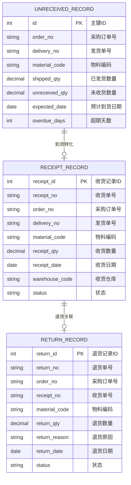
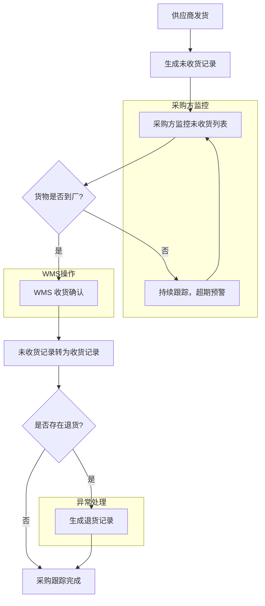

# 采购跟踪

## 概述

采购跟踪是 SCP 供应链平台的到货状态监控模块，覆盖未收货记录、已收货记录和退货记录三大维度。采购方通过此模块实时掌握每笔采购订单的到货进度，供应商侧也可查看自身的发货到货状态。

## 领域模型



## 核心流程



## 功能说明

### 1. 采购未收货记录

展示所有已发货但尚未完成收货的采购订单，支持超期预警和催货跟进。

**功能入口**: 采购未收货记录

| 字段名 | 中文名 | 类型 | 约束 | 影响业务 | 备注 |
|--------|--------|------|------|----------|------|
| order_no | 采购订单号 | VARCHAR(50) | 必填 | 关联采购订单 | |
| delivery_no | 发货单号 | VARCHAR(50) | 非必填 | 关联发货记录 | |
| material_code | 物料编码 | VARCHAR(50) | 必填 | 物料标识 | |
| material_name | 物料名称 | VARCHAR(200) | 显示 | | |
| shipped_qty | 已发货数量 | DECIMAL(12,4) | 显示 | 发货数量 | |
| unreceived_qty | 未收货数量 | DECIMAL(12,4) | 计算 | 跟踪重点 | shipped_qty - received_qty |
| expected_date | 预计到货日期 | DATE | 必填 | 超期判断依据 | |
| overdue_days | 超期天数 | INT | 计算 | 催货优先级 | 当前日期 - expected_date |
| supplier_name | 供应商名称 | VARCHAR(200) | 显示 | 催货联系 | |

### 2. 采购收货记录

展示所有已完成 WMS 收货的采购入库记录，为发票结算提供数据基础。

**功能入口**: 采购收货记录

| 字段名 | 中文名 | 类型 | 约束 | 影响业务 | 备注 |
|--------|--------|------|------|----------|------|
| receipt_no | 收货单号 | VARCHAR(50) | PK | WMS 收货单号 | |
| order_no | 采购订单号 | VARCHAR(50) | FK | 关联采购订单 | |
| delivery_no | 发货单号 | VARCHAR(50) | 非必填 | 关联发货记录 | |
| material_code | 物料编码 | VARCHAR(50) | 必填 | 物料标识 | |
| material_name | 物料名称 | VARCHAR(200) | 显示 | | |
| receipt_qty | 收货数量 | DECIMAL(12,4) | 必填 | 发票结算依据 | |
| receipt_date | 收货日期 | DATE | 必填 | 对账周期判定 | |
| warehouse_code | 收货仓库 | VARCHAR(50) | 显示 | 库存归属 | |
| status | 状态 | ENUM | 字典项 | 对账可开票状态 | |

### 3. 采购退货记录

展示所有采购退货记录，记录退货原因和数量，支持供应商绩效评估。

**功能入口**: 采购退货记录

| 字段名 | 中文名 | 类型 | 约束 | 影响业务 | 备注 |
|--------|--------|------|------|----------|------|
| return_no | 退货单号 | VARCHAR(50) | PK | WMS 退货单号 | |
| order_no | 采购订单号 | VARCHAR(50) | FK | 关联采购订单 | |
| receipt_no | 收货单号 | VARCHAR(50) | FK | 关联原收货记录 | |
| material_code | 物料编码 | VARCHAR(50) | 必填 | 物料标识 | |
| material_name | 物料名称 | VARCHAR(200) | 显示 | | |
| return_qty | 退货数量 | DECIMAL(12,4) | 必填 | 发票扣减依据 | |
| return_reason | 退货原因 | VARCHAR(500) | 必填 | 供应商绩效 | 质量/数量/包装等 |
| return_date | 退货日期 | DATE | 必填 | 对账周期判定 | |
| status | 状态 | ENUM | 字典项 | 退货完成状态 | |

## 业务规则

1. **超期预警**：预计到货日期 + 缓冲天数（可配置）后仍未收货，系统自动标记为超期并警告
2. **收货数据来源**：采购收货记录和退货记录从 WMS 回传，SCP 侧为只读展示
3. **未收货清零**：全部收货完成后，未收货记录自动移除
4. **退货扣减**：退货数量从可开票收货数量中扣减

## 搜索条件说明

### 采购未收货记录搜索

| 搜索字段 | 中文名 | 搜索类型 | 说明 |
|----------|--------|----------|------|
| supplier | 供应商 | 下拉选择 | 支持模糊搜索 |
| order_no | 采购订单号 | 文本输入 | 支持精确搜索 |
| material | 物料 | 下拉选择 | |
| overdue | 是否超期 | 下拉选择 | 全部/是/否 |
| date_range | 预计到货日期 | 日期区间 | |

### 采购收货记录搜索

| 搜索字段 | 中文名 | 搜索类型 | 说明 |
|----------|--------|----------|------|
| supplier | 供应商 | 下拉选择 | |
| order_no | 采购订单号 | 文本输入 | |
| receipt_no | 收货单号 | 文本输入 | |
| date_range | 收货日期 | 日期区间 | |

## 菜单树结构

```
采购未收货记录
采购收货记录
采购退货记录
```

## 相关模块接口

| 模块 | 接口方向 | 说明 |
|------|----------|------|
| WMS_RECEIVING | [采购收货](../../05-WMS-库房管理/03-采购收货/index.md) | 收货结果回传至SCP |
| WMS_RETURN | [采购退货](../../05-WMS-库房管理/04-采购退货/index.md) | 退货结果回传至SCP |
| SCP_PURCHASE_ORDER | [采购订单](../02-采购订单/index.md) | 订单状态关联 |
| SCP_INVOICE | [发票结算](../07-发票结算/index.md) | 收货记录作为开票依据 |

## 版本历史

| 版本 | 日期 | 说明 |
|------|------|------|
| 1.0 | 2026-05-21 | 从单页文档拆分为独立子页面 |
