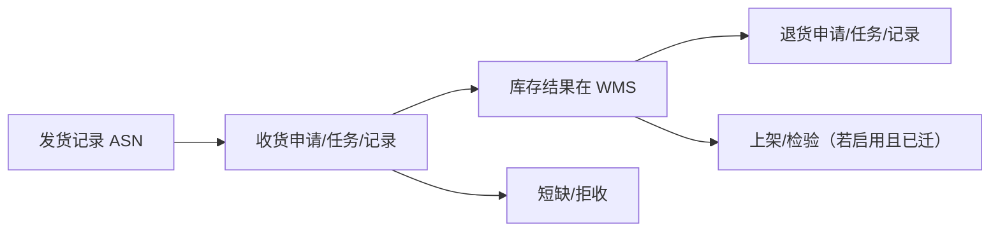

# 采购跟踪

> 适用基线：测试环境目标 / `dev` 分支 / 2026-07-15。
> 阅读对象：测试、实施、运维（主）；采购跟单、供应商查询（顺带）。操作细节见[采购跟踪-维护与查询参考](采购跟踪-维护与查询参考.md)。

## 业务目的与适用范围

想在 SCP 里把收货、退货、检验一次性做完——这个期待本页要先纠正。采购跟踪处在协同链后段：承接[发货协同](../05-发货协同/index.md)之后，面向「发货到入库/退货」的进度可视，并为[发票结算](../07-发票结算/index.md)提供可对账收货线索。SCP 侧存在采购收货申请/任务/记录、退货对应对象、短缺明细，以及上架、检验等迁移页面，但**库存变动与库内执行以 WMS 为准**；SCP 收货服务中仍有依赖 WMS 基础设施未迁完的 TODO（如部分退货/检验/上架创建）。

读完本页，应能判断：

1. 跟踪问题该在 SCP 联查，还是切到 WMS 执行；
2. 「有 ASN 无收货」是推送/链路问题，还是仓内未作业；
3. 本页是**协同跟踪视图**，不是仓库库存权威，也不是开票金额规则页。

未收货视角可由发货记录「未取/已取」统计与订单/计划未收数量共同观察，而非单独虚构表。

## 如何使用本组文档

跟踪链横跨 SCP 与 WMS 两套系统，先确认要查的环节在哪一边：

| 你的目的 | 建议阅读 |
| --- | --- |
| 理解跟踪与仓内收货关系、何时改系统 | 本页：准备 → 跟踪主线 → 边界 → 建议验证点 |
| 按 ASN/PO 查收货/退货/短缺 | [采购跟踪-维护与查询参考](采购跟踪-维护与查询参考.md) |
| 仓库现场收货/退货执行 | WMS [采购收货](../../05-WMS-库房管理/03-采购收货/index.md)、[采购退货](../../05-WMS-库房管理/04-采购退货/index.md) |
| 发货来源与推送 | [发货协同](../05-发货协同/index.md) |
| 开票数量来源 | [发票结算](../07-发票结算/index.md) |

## 使用前准备

| 需要确认什么 | 为什么重要 |
| --- | --- |
| ASN / 采购订单号 | 联查主键。 |
| 当前查 SCP 还是 WMS | 避免改错系统。 |
| 短缺与拒收是否启用 | 差异处理入口。 |

!!! example "📷 截图占位"
    采购收货记录列表（PO、ASN、数量）。

## 跟踪主线

发货形成 ASN 并推送成功后，跟踪侧按 ASN/PO 联查收货申请→任务→记录；库存与 PDA 执行在 WMS。短缺/拒收处理差异；退货、上架、检验若 SCP 入口不可用或报依赖 WMS，改走权威系统。

!!! example "写实示例：给定 → 期望"
    **给定：** 发货记录 ASN-9001 关联 PO-2001，接口推送成功；仓库已在 WMS 实收物料 A 共 58。
    **期望：**

    1. SCP 跟踪可用 ASN-9001 / PO-2001 联查到收货申请或记录（按环境链路；同实例 ❓ `GAP-017`）。
    2. 订单/计划已收累计增加（回写时序以环境为准）；库存余额变化在 **WMS** 可查，不以 SCP 页当余额权威。
    3. 若 SCP 有 ASN、仓库说「无单」——先回[发货协同](../05-发货协同/index.md)查推送，再查仓内权限；勿在 SCP 点「完成」代替 WMS 收货。
    4. 退货样例：SCP 创建入口若不可用，以 WMS 采购退货闭环，SCP 仅作跟踪时不报错误导。

## 主对象

| 对象 | 业务含义 |
| --- | --- |
| 采购收货申请/任务/记录 | 到货处理链；任务状态含待处理、处理中、完成、关闭、拒收等。 |
| 短缺明细 | 收货差异/短缺记录。 |
| 采购退货申请/任务/记录 | 退货协同与结果。 |
| 上架/检验页（SCP 侧存在） | 迁移中能力；完整规则以 WMS/QMS 为准。 |

### 关键字段业务角色

| 字段/配置点 | 在系统中的作用 | 关键行为要点 | 警惕什么 |
| --- | --- | --- | --- |
| ASN / PO | 联查主键 | 与发货记录对齐 | 改错系统 |
| 收货任务状态 | 跟踪进度 | 待处理…拒收等任务态 | 当 WMS 执行权威 |
| 短缺/拒收 | 差异 | 是否启用以环境为准 | 漏处理差异 |
| 库存结果 | 只读联查意图 | **权威在 WMS** | SCP 页独立闭环 |

### 选择器范围（骨架）

通例见[通用选择器过滤惯例](../../02-业务模型/12-通用选择器过滤惯例.md)。本页以**联查/跟踪**为主，执行权威在 WMS；SCP↔WMS 收货是否同实例 ❓（`GAP-017`）。

| 选择字段 | 选择对象 | 可选范围（当前可写） | 范围依赖 | 选不到时通常原因 |
| --- | --- | --- | --- | --- |
| ASN / 发货记录 | 已形成 ASN 的发货记录 | 发货协同已成功形成记录；推送失败则难联查 | 发货协同 | 无 ASN、接口失败 |
| 采购订单号 | 采购订单 | 存在即可联查；状态过滤 ❓（`GAP-017`） | — | 单号错、跨供应商 |
| 收货申请 / 任务 / 记录 | 到货处理链 | 跟踪链对象；库内执行以 WMS 为准；同实例/镜像 ❓（`GAP-017`） | ASN、PO | 改错系统、链路未迁完 |
| 退货来源 | 收货结果 | 宜有可退收货事实；SCP 侧创建退货未全实现 | 收货记录、WMS | 在 SCP 空等创建入口 |
| 短缺 / 拒收对象 | 收货差异 | 是否启用以环境为准 ❓（`GAP-017`） | 收货结果 | 未启用、无差异行 |

## 与 WMS / QMS 边界

本页只负责「供应商侧/跟单侧能看到什么进度」；执行与库存权威始终在 WMS。

| 协同方 | 本页负责 | 不在本页展开 |
| --- | --- | --- |
| 发货协同 | 按 ASN 联查上游发货结果 | ASN 创建与推送修复 |
| WMS | 供应商侧跟踪与部分镜像对象 | 库存事务、余额、PDA 执行权威 |
| QMS | 检验页迁移线索 | 来料检验结论与回写权威 |
| 采购订单 / 要货计划 | 观察已收等累计回写线索 | 订单/计划状态机 |
| 发票结算 | 收货结果作为开票数量来源线索 | 对账金额规则 |

## 建议验证点

- 用 ASN 能从发货记录联查到收货申请或记录（按环境链路）。
- 收货完成后订单/计划已收数量增加；库存余额变化在 WMS 可查。
- 「SCP 有 ASN、仓库无单」：先查发货推送，再查仓内，最后才查 SCP 跟踪菜单权限。
- 退货样例在权威系统可闭环；SCP 仅作跟踪时不报错误导。
- 短缺/拒收启用时有差异行可查；未启用不以「找不到短缺菜单」当缺陷（启用 ❓ `GAP-017`）。

## 限制与待确认

- SCP 与 WMS 收货记录是否同一实例/同步镜像：**未证实**（`GAP-017`）。
- SCP 侧创建检验/上架/退货等能力未全实现：功能以 WMS（及 QMS 检验权威）为准。
- 「未收货记录」是否独立菜单或仅统计视图：以当前 SCP 菜单为准（`GAP-017`）。
