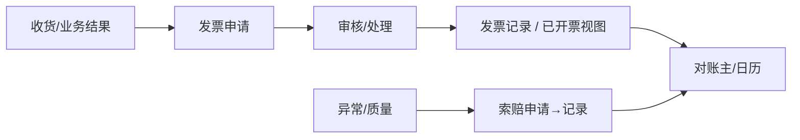

# 发票结算

> 适用基线：测试环境目标 / `dev` 分支 / 2026-07-15。
> 阅读对象：测试、实施、运维（主）；采购结算、供应商财务协同（顺带）。操作细节见[发票结算-维护与查询参考](发票结算-维护与查询参考.md)。

## 业务目的与适用范围

供应商申请开票却提交不了、或索赔金额对不上账——多半和日历窗口或状态没走对有关。发票结算处在协同链末端：承接[采购跟踪](../06-采购跟踪/index.md)的收货结果（及订单行线索），覆盖供应商发票申请/记录、已开票视图（排程/离散）、采购索赔申请/记录、供应商对账主数据与对账日历、开票日历等。申请状态含 NEW、REVIEWING、AGREED、REFUSED、CLOSED、HANDLING、PARTIAL、COMPLETED、ABORT（发票申请枚举）。对账与财务系统回写细节**待确认**，文档只写 SCP 内已证实对象与状态。

读完本页，应能判断：

1. 一笔开票/索赔卡在流程状态，还是卡在日历窗口；
2. 可开票数量来自收货事实，不是口头「发过货」；
3. 本页负责 **SCP 内开票/索赔/对账协同**，付款与总账不在此闭环（ERP 付款自动回写未证实）。

## 如何使用本组文档

开票、索赔、对账三条线各自独立又相互引用，先按目的挑一条看：

| 你的目的 | 建议阅读 |
| --- | --- |
| 理解开票/索赔与收货、日历的关系 | 本页：准备 → 主线 → 边界 → 建议验证点 |
| 做发票/索赔/对账操作或查状态字段 | [发票结算-维护与查询参考](发票结算-维护与查询参考.md) |
| 核对可开票收货数量来源 | [采购跟踪](../06-采购跟踪/index.md) |
| 配开票/对账日历或供应商用户 | [基础数据](../01-基础数据/index.md) 与本组日历页 |

## 使用前准备

| 需要确认什么 | 为什么重要 |
| --- | --- |
| 可开票收货/发货结果 | 发票明细来源。 |
| 开票日历与对账日历 | 周期窗口。 |
| 索赔与发票申请的关联字段 | 扣款/冲抵线索。 |
| 供应商用户权限 | 门户提交范围。 |

!!! example "📷 截图占位"
    供应商发票申请列表（状态、金额）。

## 一笔结算如何协同

有可对账收货事实 → 供应商建发票申请（受开票日历窗口约束）→ 审核/处理至记录或已开票视图；质量/数量异常可走索赔申请→记录，并可关联发票申请作扣款线索。对账主与日历管周期；**勿把「对账确认」写成已自动推送 ERP 付款**（`GAP-017`）。

!!! example "写实示例：给定 → 期望"
    **给定：** PO-2001 物料 A 已收 58；开票日历本窗口开放；供应商提交发票申请含该行数量 58、金额按有效采购价；另有索赔申请关联同行数量 2（短缺）。
    **期望：**

    1. 窗口内可提交；窗口外提交受限或以环境规则提示——先查日历再查权限。
    2. 申请可推进至记录/已开票视图（按状态机）；驳回/中止后勿用同一业务键重复硬提。
    3. 索赔可关联 PO 行与（可选）发票申请号；轧差规则待联调，文档不固化自动轧差金额（`GAP-017`）。
    4. 已开票（排程/离散）视图只读核对外部已开票数据，勿当 SCP 内可编辑主数据。

## 主对象

| 对象 | 业务含义 |
| --- | --- |
| 发票申请头/行 | 供应商开票请求与明细；可含自动提交/同意/执行等策略字段。 |
| 发票记录头/行 | 已处理发票结果。 |
| 已开票（排程/离散/删除视图） | QAD/外部已开票数据视图。 |
| 索赔申请/记录 | 索赔原因、PO 行、金额/数量等。 |
| 供应商对账主 / 对账日历 / 开票日历 | 对账周期与开票日程。 |

### 关键字段业务角色

| 字段/配置点 | 在系统中的作用 | 关键行为要点 | 警惕什么 |
| --- | --- | --- | --- |
| 发票申请状态 | 审核/处理门禁 | 新建…中止等通用请求态 | 非法提交 |
| 开票/对账日历 | 周期窗口 | 日历槽位 | 窗口外开票 |
| 索赔金额/数量 | 扣款线索 | 关联 PO 行 | 轧差规则 ❓（`GAP-017`） |
| 自动提交/同意策略 | 减人工 | 头策略字段 | 误开 |
| ERP 付款回写 | — | **未证实**自动付款（`GAP-017`） | 写成已闭环 |

### 选择器范围（骨架）

通例见[通用选择器过滤惯例](../../02-业务模型/12-通用选择器过滤惯例.md)。下表只写本页差异；可开票来源精确集、轧差与 ERP 付款见 `GAP-017`；门户投影见 `GAP-014` 线索。

| 选择字段 | 选择对象 | 可选范围（当前可写） | 范围依赖 | 选不到时通常原因 |
| --- | --- | --- | --- | --- |
| 供应商 | 协同供应商 | 可用；门户可见范围 ❓（`GAP-017`） | 供应商用户绑定 | 未绑定、停用 |
| 可开票明细来源 | 收货/业务结果行 | 宜有可对账收货事实；精确可选集与已开过滤 ❓（`GAP-017`） | 采购跟踪/收货结果 | 未收、已开完、窗口外 |
| 开票 / 对账日历槽 | 日历日程 | 有效周期窗口内 | 日历配置 | 未配日历、窗口外 |
| 索赔关联订单/行 | 采购订单行 | 存在可关联 PO 行 | 订单、供应商 | 行不存在、供应商不符 |
| 关联发票申请（索赔） | 发票申请 | 可关联进行中/已开票线索；轧差规则 ❓（`GAP-017`） | 发票申请状态 | 无申请、状态不符 |
| ERP 付款对象 | 财务付款单 | **未证实**自动推送/回写（`GAP-017`） | 对账确认 | 勿当已闭环能力 |

## 与财务 / WMS / QMS 边界

本页是链末端的 **SCP 结算协同**；财务付款、仓内库存、检验结论各归其它系统。

| 协同方 | 本页负责 | 不在本页展开 |
| --- | --- | --- |
| 采购跟踪 / 发货 | 消费可开票收货/业务结果线索 | ASN 推送与仓内收货执行 |
| 财务/ERP | 申请与已开票视图、接口线索 | 付款、总账、税务申报 |
| WMS | 收货数量来源（经跟踪） | 库存 |
| QMS | 质量问题可转索赔线索 | 检验结论权威 |
| 基础数据 | 供应商用户、日历入口线索 | 主数据治理全文 |
| 系统审批 | 申请状态机 | 通用流程引擎：SCP 侧曾禁用相关审批接口，勿写成全站审批中心必开 |

## 建议验证点

- 基于已收货业务可建发票申请并走到记录；无收货事实时选不到或不可提交（精确过滤 ❓ `GAP-017`）。
- 开票日历窗口内可提交；窗口外受限——先查日历再查权限。
- 索赔申请可关联 PO 并形成记录；与发票申请关联字段可查，但不固化自动轧差金额。
- 已开票视图可按供应商过滤（若启用），只读核对。
- 不把「对账确认 → 自动推送 ERP 付款」写成已证实动作。

## 限制与待确认

- 对账确认后是否自动推送 ERP 付款单：**未证实**（`GAP-017`）。
- 发票与索赔金额轧差规则：待结算联调（`GAP-017`）。
- 可开票来源选择器精确过滤与门户权限投影：待测（`GAP-017` / `FSEM-006`）。
- 索赔菜单挂接以当前 SCP 菜单为准。
