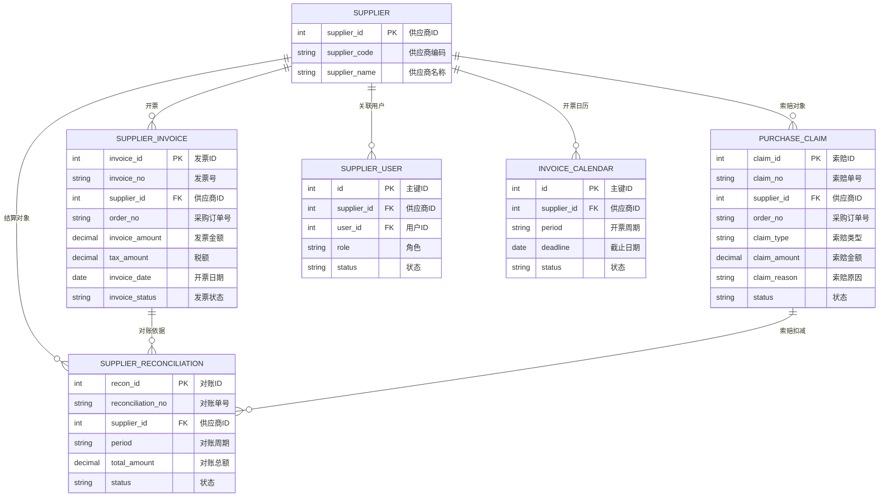
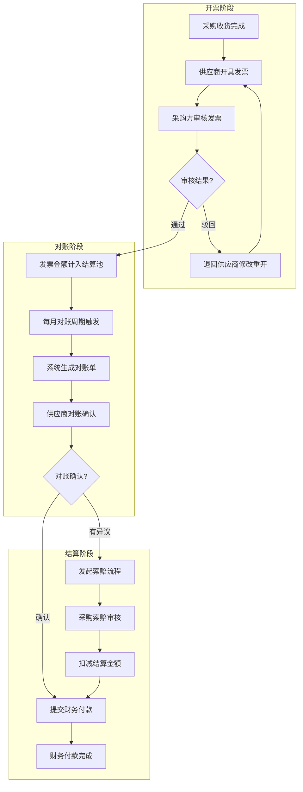

# 发票结算

## 概述

发票结算是 SCP 供应链平台的财务协同模块，连接供应商开票、采购方审核、供应商对账到最终付款的全流程。覆盖供应商发票、采购索赔、供应商对账、供应商用户关联、开票日历等子功能。

## 领域模型



## 核心流程



## 功能说明

### 1. 供应商发票

供应商通过门户开具发票，采购方审核确认。

**功能入口**: 供应商发票

| 字段名 | 中文名 | 类型 | 约束 | 影响业务 | 备注 |
|--------|--------|------|------|----------|------|
| invoice_no | 发票号 | VARCHAR(50) | 必填 | 唯一标识 | |
| supplier_id | 供应商ID | INT | 必填 | 开票方 | |
| order_no | 采购订单号 | VARCHAR(50) | 必填 | 关联订单 | |
| invoice_amount | 发票金额 | DECIMAL(12,4) | 必填 | 对账依据 | |
| tax_amount | 税额 | DECIMAL(12,4) | 非必填 | 税务核算 | |
| invoice_date | 开票日期 | DATE | 必填 | 对账周期 | |
| invoice_status | 发票状态 | ENUM | 字典项 | 付款审批 | 待审核/已通过/已驳回 |

### 2. 采购索赔

采购方对供应商发起索赔申请，记录索赔原因和金额。

**功能入口**: 采购索赔

| 字段名 | 中文名 | 类型 | 约束 | 影响业务 | 备注 |
|--------|--------|------|------|----------|------|
| claim_no | 索赔单号 | VARCHAR(50) | 必填 | 唯一标识 | |
| supplier_id | 供应商ID | INT | 必填 | 索赔对象 | |
| order_no | 采购订单号 | VARCHAR(50) | 必填 | 关联订单 | |
| claim_type | 索赔类型 | ENUM | 字典项 | 分类统计 | 质量/延迟/数量短缺等 |
| claim_amount | 索赔金额 | DECIMAL(12,4) | 必填 | 对账扣减 | |
| claim_reason | 索赔原因 | VARCHAR(500) | 必填 | 供应商反馈 | |
| status | 状态 | ENUM | 字典项 | 对账处理 | 待审核/已确认/已扣减 |

### 3. 供应商对账管理

按周期生成对账单，供应商确认后进入付款流程。

**功能入口**: 供应商对账管理

| 字段名 | 中文名 | 类型 | 约束 | 影响业务 | 备注 |
|--------|--------|------|------|----------|------|
| reconciliation_no | 对账单号 | VARCHAR(50) | 必填 | 唯一标识 | |
| supplier_id | 供应商ID | INT | 必填 | 结算对象 | |
| period | 对账周期 | VARCHAR(20) | 必填 | 月份/期间 | 格式：YYYY-MM |
| total_amount | 对账总额 | DECIMAL(12,4) | 计算 | 付款依据 | 发票金额 - 索赔金额 |
| status | 状态 | ENUM | 字典项 | 财务付款 | 待确认/已确认/已付款 |

### 4. 供应商用户关联管理

管理供应商门户登录账号与供应商实体的绑定关系。

**功能入口**: 供应商用户关联管理

| 字段名 | 中文名 | 类型 | 约束 | 影响业务 | 备注 |
|--------|--------|------|------|----------|------|
| supplier_id | 供应商ID | INT | 必填 | 关联供应商 | |
| user_id | 用户ID | INT | 必填 | 门户登录账号 | |
| role | 角色 | ENUM | 字典项 | 权限控制 | 管理员/操作员/只读 |
| status | 状态 | ENUM | 字典项 | 登录控制 | 生效/禁用 |

### 5. 开票日历管理

定义各供应商的开票周期和截止日期，用于对账节奏管理。

**功能入口**: 开票日历管理

| 字段名 | 中文名 | 类型 | 约束 | 影响业务 | 备注 |
|--------|--------|------|------|----------|------|
| supplier_id | 供应商ID | INT | 必填 | 关联供应商 | |
| period | 开票周期 | VARCHAR(20) | 必填 | 对账归属 | YYYY-MM |
| deadline | 截止日期 | DATE | 必填 | 开票时效 | |
| status | 状态 | ENUM | 字典项 | 对账触发 | 未开始/进行中/已截止 |

## 业务规则

1. **发票金额校验**：发票金额与订单实际收货金额的差异不能超过 ±5%
2. **对账周期**：默认月结，每月 25 日生成当月对账数据
3. **开票日历联动**：超过开票截止日期的供应商，当月对账单不生成
4. **索赔优先级**：索赔在发票审核通过前发起，审核通过后不可新增索赔单
5. **对账锁定**：对账确认后，对应周期的发票和索赔单全部锁定不可修改

## 搜索条件说明

### 供应商发票搜索

| 搜索字段 | 中文名 | 搜索类型 | 说明 |
|----------|--------|----------|------|
| supplier | 供应商 | 下拉选择 | |
| invoice_no | 发票号 | 文本输入 | |
| order_no | 采购订单号 | 文本输入 | |
| invoice_status | 发票状态 | 下拉选择 | 待审核/已通过/已驳回 |
| date_range | 开票日期范围 | 日期区间 | |

### 供应商对账搜索

| 搜索字段 | 中文名 | 搜索类型 | 说明 |
|----------|--------|----------|------|
| supplier | 供应商 | 下拉选择 | |
| period | 对账周期 | 下拉选择 | 按年月筛选 |
| status | 状态 | 下拉选择 | 待确认/已确认/已付款 |

## 菜单树结构

```
供应商发票（含子菜单）
采购索赔（含子菜单）
供应商对账管理
供应商用户关联管理
开票日历管理
```

## 相关模块接口

| 模块 | 接口方向 | 说明 |
|------|----------|------|
| SCP_PURCHASE_ORDER | [采购订单](../02-采购订单/index.md) | 获取订单及收货数据作为开票依据 |
| SCP_SUPPLIER | [基础数据](../01-基础数据/index.md) | 获取供应商信息 |
| WMS_RECEIVING | [采购收货](../../05-WMS-库房管理/03-采购收货/index.md) | 收货数量作为开票数量基准 |
| WMS_RETURN | [采购退货](../../05-WMS-库房管理/04-采购退货/index.md) | 退货数量从开票数量中扣减 |
| ERP_FINANCE | [ERP财务](../../01-总体框架/architecture.md) | 对账确认后同步至ERP应付模块 |

## 版本历史

| 版本 | 日期 | 说明 |
|------|------|------|
| 1.0 | 2026-05-21 | 从单页文档拆分为独立子页面 |
