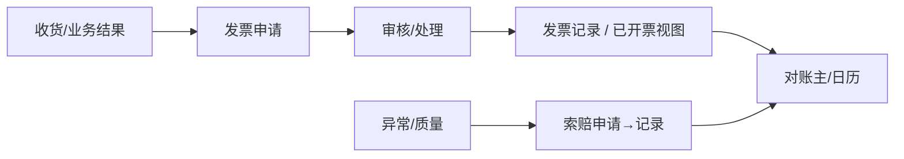

# 发票结算

> 适用基线：测试环境目标 / `dev` 分支 / 2026-07-15。
> 阅读对象：采购结算、供应商财务协同；操作见[发票结算-维护与查询参考](发票结算-维护与查询参考.md)。

## 业务目的与适用范围

发票结算覆盖供应商发票申请/记录、已开票视图（排程/离散）、采购索赔申请/记录、供应商对账主数据与对账日历、开票日历等。申请状态含 NEW、REVIEWING、AGREED、REFUSED、CLOSED、HANDLING、PARTIAL、COMPLETED、ABORT（发票申请枚举）。对账与财务系统回写细节**待确认**，文档只写 SCP 内已证实对象与状态。

## 如何使用本组文档

| 你的目的 | 建议阅读 |
| --- | --- |
| 想理解开票与索赔关系 | 本页。 |
| 正在做发票/索赔/对账 | [发票结算-维护与查询参考](发票结算-维护与查询参考.md)。 |
| 想来源收货数量 | [采购跟踪](../06-采购跟踪/index.md)。 |
| 想配开票日历 | [基础数据](../01-基础数据/index.md) 与本组日历页。 |

## 使用前准备

| 需要确认什么 | 为什么重要 |
| --- | --- |
| 可开票收货/发货结果 | 发票明细来源。 |
| 开票日历与对账日历 | 周期窗口。 |
| 索赔与发票申请的关联字段 | 扣款/冲抵线索。 |
| 供应商用户权限 | 门户提交范围。 |

【截图占位：供应商发票申请列表（状态、金额）。】

## 主线

## 主对象

| 对象 | 业务含义 |
| --- | --- |
| 发票申请头/行 | 供应商开票请求与明细；可含自动提交/同意/执行等策略字段。 |
| 发票记录头/行 | 已处理发票结果。 |
| 已开票（排程/离散/删除视图） | QAD/外部已开票数据视图。 |
| 索赔申请/记录 | 索赔原因、PO 行、金额/数量等。 |
| 供应商对账主 / 对账日历 / 开票日历 | 对账周期与开票日程。 |

## 与财务 / WMS / QMS 边界

| 协同方 | 本页负责 | 不在本页展开 |
| --- | --- | --- |
| 财务/ERP | 申请与已开票视图、接口线索 | 付款、总账、税务申报 |
| WMS | 收货数量来源 | 库存 |
| QMS | 质量问题可转索赔线索 | 检验结论权威 |
| 系统审批 | 申请状态机 | 通用 BPM：SCP 侧曾禁用 `/admin-api/bpm/**`，勿写成全站审批中心必开 |

## 限制与待确认

- 对账确认后是否自动推送 ERP 付款单：**未证实**。
- 发票与索赔金额轧差规则：待结算联调。
- 索赔菜单曾从其它根迁到 SCP 根：以当前 scp-ui 菜单为准。
