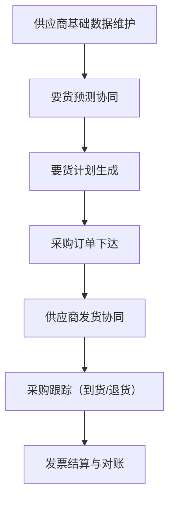

# SCP 供应链平台

## 模块概述

供应链平台（Supply Chain Platform，SCP）是面向供应商的协同门户，连接企业与供应商，实现采购订单下达、发货协同、来料跟踪、对账结算的数字化。

**核心价值**：
- 供应商通过门户查看要货预测、确认采购订单
- 供应商在线提交发货申请和发货记录
- 采购方实时跟踪来料状态
- 自动生成供应商对账数据

## 业务分组

| 分组 | 说明 |
|------|------|
| [01-基础数据](01-基础数据/index.md) | 供应商档案、供应商物料、物料包装、采购价格单、仓库库区、单据开关、包装规格、采购计划策略、要货预测周期 |
| [02-采购订单](02-采购订单/index.md) | 采购订单下达与确认（供应商视角） |
| [03-要货预测](03-要货预测/index.md) | 计划员/供应商两侧的要货预测协同确认 |
| [04-要货计划](04-要货计划/index.md) | 汇总要货预测，生成要货计划，管理客户长期计划 |
| [05-发货协同](05-发货协同/index.md) | 供应商发货申请、发货记录、ASN |
| [06-采购跟踪](06-采购跟踪/index.md) | 未收货记录、收货记录、退货记录 |
| [07-发票结算](07-发票结算/index.md) | 供应商发票、采购索赔、供应商对账、供应商用户关联、开票日历 |

## 首页数据看板

| 指标 | 数值 | 说明 |
|------|------|------|
| 开放订单数 | 112单 | 未完成的采购订单 |
| 全部订单数 | 112单 | 所有采购订单 |
| 开放计划数 | 81单 | 未确认的要货计划 |
| 全部计划数 | 107单 | 所有要货计划 |
| 未收货订单数 | 56单 | 已发货未入库的订单 |
| 已收货订单数 | 0单 | 已完成入库的订单 |

## 核心流程

### 端到端协同流程

## 接口规范

### SCP → WMS 接口

| 接口 | 方向 | 说明 |
|------|------|------|
| 采购收货查询 | SCP→WMS | 查询采购订单在 WMS 的收货状态 |
| 发货通知同步 | SCP→WMS | 供应商发货后同步到 WMS 生成到货通知 |

### SCP → ERP 接口

| 接口 | 方向 | 说明 |
|------|------|------|
| 采购订单同步 | SCP→ERP | 采购订单状态变更同步到 ERP |
| 对账数据推送 | SCP→ERP | 供应商对账确认后推送到 ERP 生成付款单 |

### WMS → SCP 接口

| 接口 | 方向 | 说明 |
|------|------|------|
| 收货结果回传 | WMS→SCP | 采购收货后回传收货数量和收货日期 |
| 退货结果回传 | WMS→SCP | 采购退货后回传退货数量和退货日期 |

## 版本历史

| 版本 | 日期 | 说明 |
|------|------|------|
| V1.1 | 2026-05-21 | 拆分为多页面结构，完善各子页面内容 |
| V1.0 | 2026-05-20 | 初版完成，基于测试环境菜单结构提取 |
