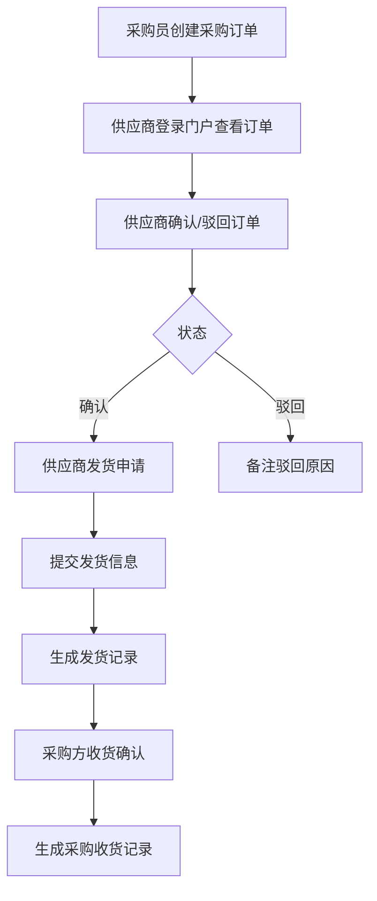
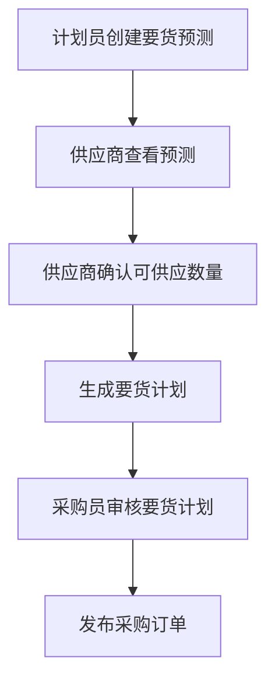
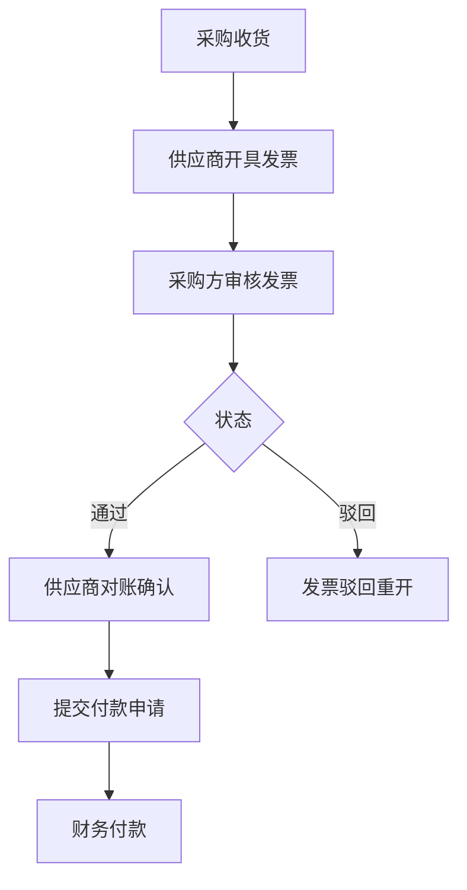
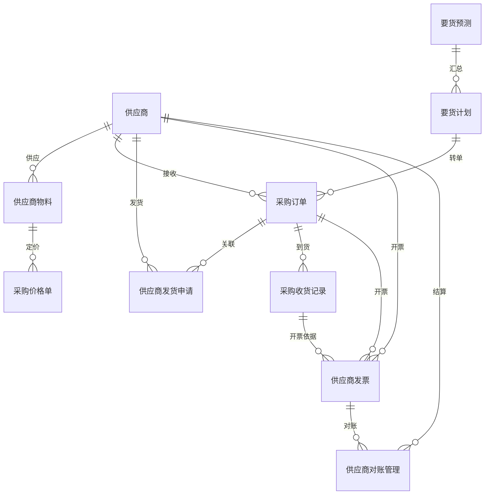

# SCP 供应链平台

## 模块概述

供应链平台（Supply Chain Platform，SCP）是面向供应商的协同门户，连接企业与供应商，实现采购订单下达、发货协同、来料跟踪、对账结算的数字化。

**核心价值**：
- 供应商通过门户查看要货预测、确认采购订单
- 供应商在线提交发货申请和发货记录
- 采购方实时跟踪来料状态
- 自动生成供应商对账数据

## 业务分组

| 分组 | 说明 |
|------|------|
| 基础数据 | 供应商档案、供应商物料、物料包装、采购价格单、仓库库区、单据开关、包装规格 |
| 采购订单 | 采购订单下达与确认（供应商视角） |
| 要货预测 | 计划员/供应商两侧的要货预测确认 |
| 要货计划 | 汇总要货预测，生成要货计划 |
| 发货协同 | 供应商发货申请、发货记录、ASN |
| 采购跟踪 | 未收货记录、收货记录、退货记录 |
| 发票结算 | 供应商发票、采购索赔、供应商对账、开票日历 |

## 完整菜单树（实测）

```
闻荫供应商系统
  ├─ 系统管理
  ├─ 基础设施
  ├─ 报表管理
  └─ 报表

首页（Dashboard：开放订单数/全部订单数/开放计划数/全部计划数/未收货订单数/已收货订单数）

基础数据
  ├─ 供应商
  ├─ 供应商物料
  ├─ 物料包装信息
  ├─ 采购价格单
  ├─ 仓库管理
  ├─ 库区管理
  ├─ 库位组管理
  ├─ 库位管理
  ├─ 月台管理
  ├─ 单据开关
  ├─ 包装规格
  ├─ 包装规格层级
  ├─ 采购计划策略
  └─ 要货预测周期管理

采购订单
要货预测-计划员
要货预测-供应商
要货计划
供应商发货申请
供应商发货记录
采购未收货记录
客户长期计划
采购收货记录
采购退货记录
供应商发票（含子菜单）
采购索赔（含子菜单）
供应商对账管理
供应商用户关联管理
开票日历管理
```

## 首页数据看板

| 指标 | 数值 | 说明 |
|------|------|------|
| 开放订单数 | 112单 | 未完成的采购订单 |
| 全部订单数 | 112单 | 所有采购订单 |
| 开放计划数 | 81单 | 未确认的要货计划 |
| 全部计划数 | 107单 | 所有要货计划 |
| 未收货订单数 | 56单 | 已发货未入库的订单 |
| 已收货订单数 | 0单 | 已完成入库的订单 |

## 核心流程

### 采购订单协同流程



### 要货预测协同流程



### 结算对账流程



## 字段说明

### 供应商

| 字段名 | 中文名 | 类型 | 约束 | 影响业务 | 备注 |
|--------|--------|------|------|----------|------|
| supplierCode | 供应商编码 | VARCHAR(50) | 必填 | 采购订单关联（唯一标识） | |
| supplierName | 供应商名称 | VARCHAR(200) | 必填 | 所有单据显示 | |
| contactPerson | 联系人 | VARCHAR(100) | 非必填 | 供应商沟通 | |
| contactPhone | 联系电话 | VARCHAR(50) | 非必填 | 供应商沟通 | |
| contactAddress | 地址 | VARCHAR(500) | 非必填 | 送货地址 | |
| status | 状态 | ENUM | 字典项 | 供应商选择列表（禁用不可选） | 生效/禁用 |
| creditLevel | 信用等级 | VARCHAR(50) | 非必填 | 采购决策参考 | |

### 供应商物料

| 字段名 | 中文名 | 类型 | 约束 | 影响业务 | 备注 |
|--------|--------|------|------|----------|------|
| supplierId | 供应商ID | INT | 必填 | 关联供应商档案 | |
| materialCode | 物料编码 | VARCHAR(50) | 必填 | 采购订单引用 | |
| materialName | 物料名称 | VARCHAR(200) | 必填 | 显示 | |
| unitPrice | 单价 | DECIMAL(12,4) | 必填 | 采购订单计价 | 含税单价 |
| minOrderQty | 最小订货量 | DECIMAL(12,4) | 非必填 | 采购数量校验 | |
| leadTime | 交期（天） | INT | 非必填 | 采购计划参考 | |
| validFrom | 生效日期 | DATE | 非必填 | 价格有效性 | |
| validTo | 失效日期 | DATE | 非必填 | 价格有效性 | |

### 采购订单

| 字段名 | 中文名 | 类型 | 约束 | 影响业务 | 备注 |
|--------|--------|------|------|----------|------|
| orderNo | 采购订单号 | VARCHAR(50) | 必填 | 唯一标识 | |
| supplierId | 供应商ID | INT | 必填 | 关联供应商 | |
| orderDate | 下单日期 | DATE | 必填 | 采购统计 | |
| deliveryDate | 交期日期 | DATE | 必填 | 到货跟踪 | |
| orderStatus | 订单状态 | ENUM | 字典项 | 供应商确认流程 | 待确认/已确认/已驳回/已完成 |
| totalAmount | 订单总额 | DECIMAL(12,4) | 计算 | 对账依据 | |
| currency | 币种 | VARCHAR(10) | 默认CNY | 结算 | |

### 要货预测

| 字段名 | 中文名 | 类型 | 约束 | 影响业务 | 备注 |
|--------|--------|------|------|----------|------|
| forecastNo | 预测单号 | VARCHAR(50) | 必填 | 唯一标识 | |
| materialCode | 物料编码 | VARCHAR(50) | 必填 | 关联物料 | |
| materialName | 物料名称 | VARCHAR(200) | 必填 | 显示 | |
| requiredQty | 需求数量 | DECIMAL(12,4) | 必填 | 供应商确认依据 | |
| confirmedQty | 确认数量 | DECIMAL(12,4) | 非必填 | 供应商回复 | |
| requiredDate | 需求日期 | DATE | 必填 | 计划排程 | |
| customerName | 客户名称 | VARCHAR(200) | 非必填 | 客户长期计划来源 | |
| status | 状态 | ENUM | 字典项 | 计划汇总 | 待确认/已确认/已驳回 |

### 供应商发货申请

| 字段名 | 中文名 | 类型 | 约束 | 影响业务 | 备注 |
|--------|--------|------|------|----------|------|
| deliveryNo | 发货单号 | VARCHAR(50) | 必填 | 唯一标识 | |
| orderNo | 采购订单号 | VARCHAR(50) | 必填 | 关联订单 | |
| supplierId | 供应商ID | INT | 必填 | 发货方 | |
| deliveryDate | 发货日期 | DATE | 必填 | 到货跟踪 | |
| expectedArrivalDate | 预计到货日期 | DATE | 非必填 | 采购方备货 | |
| totalQty | 发货总数量 | DECIMAL(12,4) | 必填 | 到货核对 | |
| status | 状态 | ENUM | 字典项 | 采购收货 | 待发货/已发货/部分到货/已完成 |

### 供应商发票

| 字段名 | 中文名 | 类型 | 约束 | 影响业务 | 备注 |
|--------|--------|------|------|----------|------|
| invoiceNo | 发票号 | VARCHAR(50) | 必填 | 唯一标识 | |
| supplierId | 供应商ID | INT | 必填 | 开票方 | |
| orderNo | 采购订单号 | VARCHAR(50) | 必填 | 关联订单 | |
| invoiceAmount | 发票金额 | DECIMAL(12,4) | 必填 | 对账依据 | |
| taxAmount | 税额 | DECIMAL(12,4) | 非必填 | 税务核算 | |
| invoiceDate | 开票日期 | DATE | 必填 | 对账周期 | |
| invoiceStatus | 发票状态 | ENUM | 字典项 | 付款审批 | 待审核/已通过/已驳回 |

### 供应商对账管理

| 字段名 | 中文名 | 类型 | 约束 | 影响业务 | 备注 |
|--------|--------|------|------|----------|------|
| reconciliationNo | 对账单号 | VARCHAR(50) | 必填 | 唯一标识 | |
| supplierId | 供应商ID | INT | 必填 | 结算对象 | |
| period | 对账周期 | VARCHAR(20) | 必填 | 月份/期间 | 格式：YYYY-MM |
| totalAmount | 对账总额 | DECIMAL(12,4) | 计算 | 付款依据 | |
| status | 状态 | ENUM | 字典项 | 财务付款 | 待确认/已确认/已付款 |

## 关联关系



## 接口规范

### SCP → WMS 接口

| 接口 | 方向 | 说明 |
|------|------|------|
| 采购收货查询 | SCP→WMS | 查询采购订单在 WMS 的收货状态 |
| 发货通知同步 | SCP→WMS | 供应商发货后同步到 WMS 生成到货通知 |

### SCP → ERP 接口

| 接口 | 方向 | 说明 |
|------|------|------|
| 采购订单同步 | SCP→ERP | 采购订单状态变更同步到 ERP |
| 对账数据推送 | SCP→ERP | 供应商对账确认后推送到 ERP 生成付款单 |

### WMS → SCP 接口

| 接口 | 方向 | 说明 |
|------|------|------|
| 收货结果回传 | WMS→SCP | 采购收货后回传收货数量和收货日期 |
| 退货结果回传 | WMS→SCP | 采购退货后回传退货数量和退货日期 |

## 业务规则

1. **订单确认时效**：供应商收到采购订单后需在 24 小时内确认，超时自动催提醒
2. **发货数量校验**：发货申请数量不能超过订单未交货数量
3. **发票金额校验**：发票金额与订单实际收货金额的差异不能超过 ±5%
4. **对账周期**：默认月结，每月 25 日生成当月对账数据

## 版本历史

| 版本 | 日期 | 说明 |
|------|------|------|
| V1.0 | 2026-05-20 | 初版完成，基于测试环境菜单结构提取 |