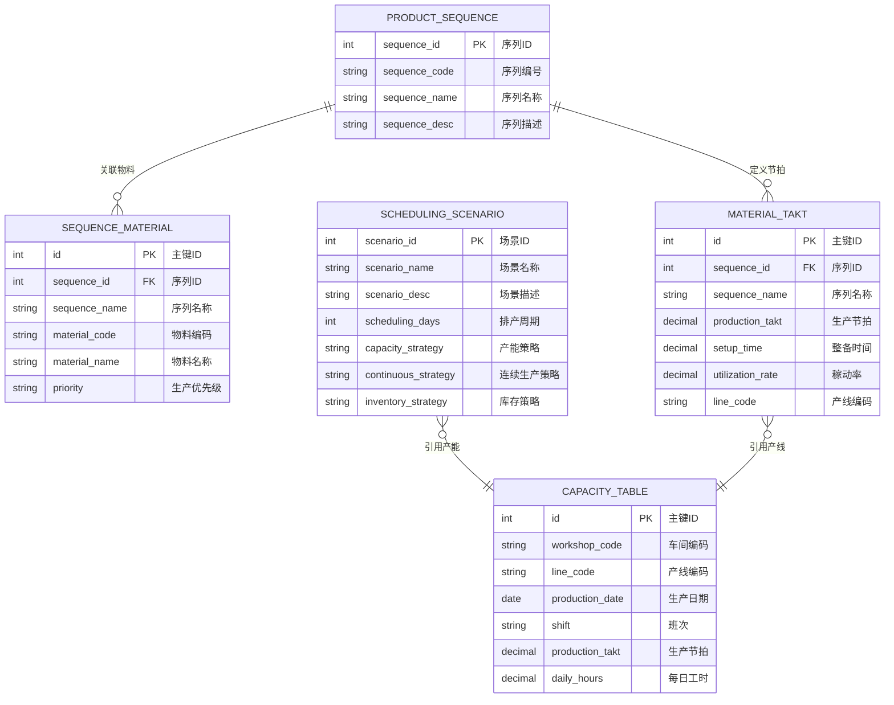

# 基础数据

## 概述

PS 基础数据是排程引擎的数据底座，定义排程所需的产能约束、产品序列、物料节拍、排程场景等核心主数据。这些基础数据直接影响排程算法的运行结果，是理解排程逻辑的入口。

## 领域模型



## 功能说明

### 1. 产能表

定义每条产线每日的可用产能（生产节拍 × 每日工时），是排程引擎的核心约束输入。

**功能入口**: 基础数据管理 → 产能表

| 字段名 | 中文名 | 类型 | 约束 | 影响业务 | 备注 |
|--------|--------|------|------|----------|------|
| workshop_code | 车间编码 | VARCHAR(50) | 必填 | 产能范围 | |
| line_code | 产线编码 | VARCHAR(50) | 必填 | 排程单位 | |
| production_date | 生产日期 | DATE | 必填 | 产能时间维度 | |
| shift | 班次 | VARCHAR(50) | 非必填 | 产能细分 | |
| production_takt | 生产节拍 | DECIMAL(10,4) | 必填 | 排程速度依据 | 分钟 |
| daily_hours | 每日工时 | DECIMAL(10,4) | 必填 | 产能计算 | 小时 |

### 2. 产品序列表

定义产品序列（Product Sequence），将工艺路线相近的产品归为一组，作为排程的对象单元。

**功能入口**: 基础数据管理 → 产品序列表

| 字段名 | 中文名 | 类型 | 约束 | 影响业务 | 备注 |
|--------|--------|------|------|----------|------|
| sequence_code | 序列编号 | VARCHAR(50) | 必填 | 唯一标识 | |
| sequence_name | 序列名称 | VARCHAR(200) | 必填 | 排程显示 | |
| sequence_desc | 序列描述 | VARCHAR(500) | 非必填 | 业务说明 | |

### 3. 产品序列物料对应表

定义每个产品序列包含哪些物料，以及各物料的生产优先级，是排程算法中的物料维基础数据。

**功能入口**: 基础数据管理 → 产品序列物料对应表

| 字段名 | 中文名 | 类型 | 约束 | 影响业务 | 备注 |
|--------|--------|------|------|----------|------|
| sequence_code | 序列编号 | VARCHAR(50) | 必填 | 关联产品序列 | |
| sequence_name | 序列名称 | VARCHAR(200) | 必填 | 显示 | |
| material_code | 物料编码 | VARCHAR(50) | 必填 | 物料关联 | |
| material_name | 物料名称 | VARCHAR(200) | 必填 | 显示 | |
| priority | 生产优先级 | ENUM | 字典项 | 排程优先级 | 高/中/低 |

### 4. 物料节拍

定义每种物料（按产品序列分组）在特定产线上的生产节拍、整备时间和稼动率，是排程产能计算的关键参数。

**功能入口**: 基础数据管理 → 物料节拍

| 字段名 | 中文名 | 类型 | 约束 | 影响业务 | 备注 |
|--------|--------|------|------|----------|------|
| sequence_code | 序列编号 | VARCHAR(50) | 必填 | 关联产品序列 | |
| sequence_name | 序列名称 | VARCHAR(200) | 必填 | 显示 | |
| production_takt | 生产节拍 | DECIMAL(10,4) | 必填 | 排程速度 | 分钟 |
| setup_time | 整备时间 | DECIMAL(10,4) | 非必填 | 切换时间 | 分钟 |
| utilization_rate | 稼动率 | DECIMAL(5,2) | 计算 | 设备效率 | % |
| line_code | 产线编码 | VARCHAR(50) | 必填 | 产能归属 | |

### 5. 排程场景

定义排程运行时的策略参数组合，包括排产周期、产能策略、连续生产策略和库存策略。不同的场景可以产出不同的排程结果，供计划员对比择优。

**功能入口**: 基础数据管理 → 排程场景

| 字段名 | 中文名 | 类型 | 约束 | 影响业务 | 备注 |
|--------|--------|------|------|----------|------|
| scenario_name | 场景名称 | VARCHAR(100) | 必填 | 场景标识 | |
| scenario_desc | 场景描述 | VARCHAR(500) | 非必填 | 业务说明 | |
| scheduling_days | 排产周期 | INT | 必填 | 排程时间跨度 | 天 |
| capacity_strategy | 产能策略 | ENUM | 字典项 | 排程优化目标 | 冲产能/平衡/保守 |
| continuous_strategy | 连续生产策略 | ENUM | 字典项 | 生产连续性控制 | |
| inventory_strategy | 库存策略 | ENUM | 字典项 | 库存上下限控制 | |

## 业务规则

1. **产能表唯一性**：同一产线 + 同一日期 + 同一班次的产能记录唯一，不可重复录入
2. **节拍联动**：物料节拍 × 产线节拍 → 实际生产速度，修改任一方都会影响排程结果
3. **场景隔离**：不同排程场景独立运行，互不影响
4. **优先级约束**：生产优先级高的物料在排程中优先分配产能

## 菜单树结构

```
基础数据管理
  ├─ 产能表
  ├─ 产品序列表
  ├─ 产品序列物料对应表
  ├─ 物料节拍
  └─ 排程场景
```

## 相关模块接口

| 模块 | 接口方向 | 说明 |
|------|----------|------|
| DBC_MATERIAL | 物料主数据 | 获取物料编码、名称 |
| DBC_ROUTING | 工艺路线 | 获取工艺路线信息确定产品序列归属 |
| DBC_WORKSHOP | 车间主数据 | 获取车间/产线信息 |
| MES_PRODUCTION | 生产管理 | 产线实际产能反馈至产能表 |

## 版本历史

| 版本 | 日期 | 说明 |
|------|------|------|
| 1.0 | 2026-05-21 | 从单页文档拆分为独立子页面 |
