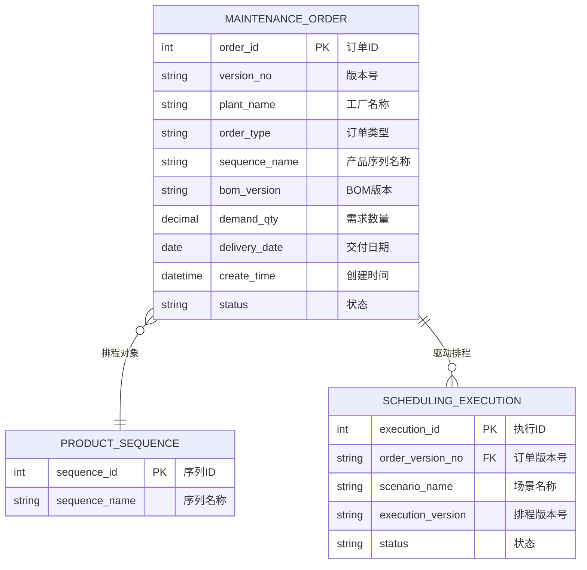
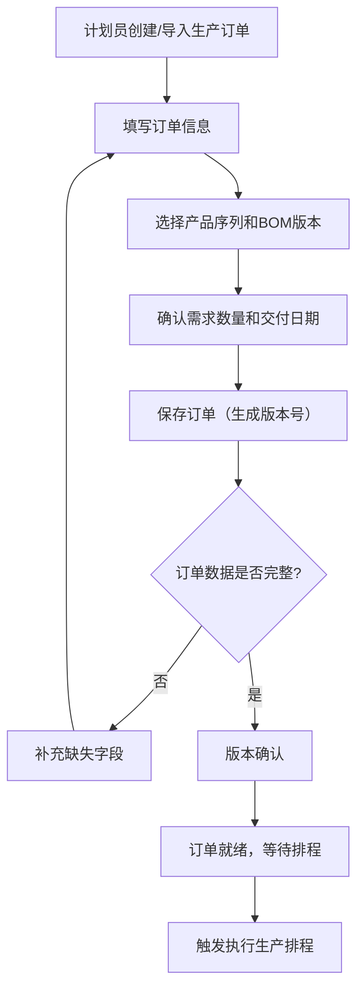

# 维护订单

## 概述

维护订单是 PS 排程管理中生产订单的录入与管理页面，是排程引擎的数据输入源。计划员在此维护生产订单信息（工厂、产品序列、BOM 版本、需求数量、交付日期等），数据完整且版本确认后即可触发排程执行。

## 领域模型



## 核心流程



## 功能说明

### 维护订单

计划员维护生产订单，录入排程所需的生产需求数据。

**功能入口**: 维护订单

| 字段名 | 中文名 | 类型 | 约束 | 影响业务 | 备注 |
|--------|--------|------|------|----------|------|
| version_no | 版本号 | VARCHAR(50) | 必填 | 排程关联标识 | |
| plant_name | 工厂名称 | VARCHAR(100) | 必填 | 排程范围 | |
| order_type | 订单类型 | ENUM | 字典项 | 生产类型区分 | 普通订单等 |
| sequence_name | 产品序列名称 | VARCHAR(200) | 必填 | 排程对象 | |
| bom_version | BOM版本 | VARCHAR(50) | 必填 | 物料清单版本 | |
| demand_qty | 需求数量 | DECIMAL(12,2) | 必填 | 排程数量依据 | |
| delivery_date | 交付日期 | DATE | 必填 | 排程约束 | |
| create_time | 创建时间 | DATETIME | 自动 | 记录审计 | |

## 业务规则

1. **版本确认前提**：所有必填字段完整且通过数据校验后，订单版本才可确认
2. **版本锁定**：已确认并用于排程的订单版本不可修改，如需变更需创建新版本
3. **[产品序列](../01-基础数据/index.md)关联**：订单必须指定[产品序列](../01-基础数据/index.md)，系统根据[产品序列](../01-基础数据/index.md)匹配[工艺路线](../../04-DBC-主数据管理/08-工艺建模/02-工艺路线.md)和产能
4. **交付日期约束**：交付日期是排程的硬约束，排程结果中的完成时间不得晚于交付日期
5. **BOM 版本一致性**：同一[产品序列](../01-基础数据/index.md)的订单应使用同一 BOM 版本，否则排程可能产生不一致结果

## 菜单树结构

```
维护订单
```

## 相关模块接口

| 模块 | 接口方向 | 说明 |
|------|----------|------|
| PS_PRODUCT_SEQUENCE | [基础数据](../01-基础数据/index.md) | 获取产品序列信息 |
| PS_SCENARIO | [基础数据](../01-基础数据/index.md) | 排程场景关联 |
| DBC_PLANT | [工厂建模](../../04-DBC-主数据管理/04-工厂建模/06-车间管理.md) | 获取工厂信息 |
| DBC_BOM | [BOM主数据](../../04-DBC-主数据管理/01-物料管理/02-BOM.md) | 获取BOM版本信息 |
| MES_PRODUCTION_ORDER | [MES生产订单](../../06-MES-生产管理/03-计划管理/index.md) | 可与MES生产订单关联 |
| PS_SCHEDULING | [执行生产排程](../03-执行生产排程/index.md) | 排程执行输入 |

## 版本历史

| 版本 | 日期 | 说明 |
|------|------|------|
| 1.0 | 2026-05-21 | 从单页文档拆分为独立子页面 |
