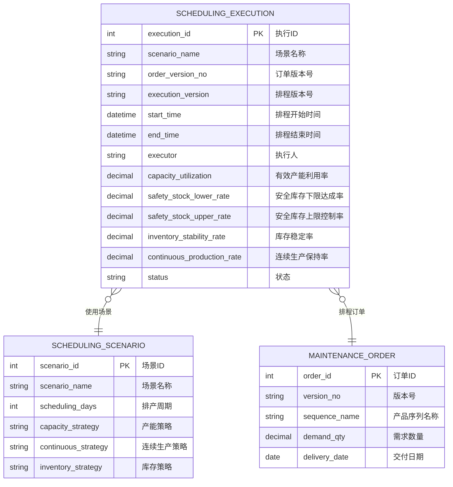
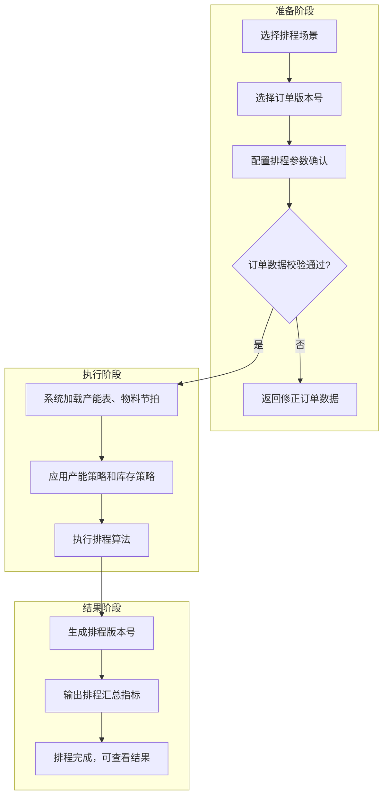

# 执行生产排程

## 概述

执行生产排程是 PS 排程引擎的核心运行页面。计划员选择排程场景和订单版本后，系统基于产能表、物料节拍、产品序列等基础数据，应用场景定义的策略参数，自动运行排程算法并生成排程结果。

## 领域模型



## 核心流程



## 功能说明

### 执行生产排程

选择场景和订单版本，触发排程引擎运行，查看排程汇总指标。

**功能入口**: 执行生产排程

| 字段名 | 中文名 | 类型 | 约束 | 影响业务 | 备注 |
|--------|--------|------|------|----------|------|
| scenario_name | 场景名称 | VARCHAR(100) | 必填 | 排程策略载体 | |
| order_version_no | 订单版本号 | VARCHAR(50) | 必填 | 排程对象 | |
| execution_version | 排程版本号 | VARCHAR(50) | 系统生成 | 排程结果标识 | |
| start_time | 排程开始时间 | DATETIME | 计算 | 排程性能指标 | |
| end_time | 排程结束时间 | DATETIME | 计算 | 排程性能指标 | |
| executor | 执行人 | VARCHAR(50) | 自动 | 审计 | |
| capacity_utilization | 有效产能利用率 | DECIMAL(5,2) | 计算 | 产能评估 | % |
| safety_stock_lower_rate | 安全库存下限达成率 | DECIMAL(5,2) | 计算 | 库存安全评估 | % |
| safety_stock_upper_rate | 安全库存上限控制率 | DECIMAL(5,2) | 计算 | 库存上限管控 | % |
| inventory_stability_rate | 库存稳定率 | DECIMAL(5,2) | 计算 | 库存波动评估 | % |
| continuous_production_rate | 连续生产保持率 | DECIMAL(5,2) | 计算 | 生产连续性评估 | % |

### 排程汇总指标说明

| 指标 | 说明 | 计算公式 |
|------|------|----------|
| 有效产能利用率 | 实际使用产能占总可用产能的比例 | 实际生产工时 / 可用总工时 × 100% |
| 安全库存下限达成率 | 排程结果中库存不低于安全库存下限的比例 | 满足下限的物料数 / 物料总数 × 100% |
| 安全库存上限控制率 | 排程结果中库存不超出安全库存上限的比例 | 未超出上限的物料数 / 物料总数 × 100% |
| 库存稳定率 | 排程周期内库存水平波动的稳定程度 | 基于库存标准差计算 |
| 连续生产保持率 | 同一产线/序列连续排产的保持程度 | 连续生产天数 / 排产总天数 × 100% |

## 业务规则

1. **排程执行前提**：维护订单数据完整且版本已确认后才能执行排程
2. **场景唯一性**：同一订单版本 + 同一场景只能有一个执行中的排程
3. **版本管理**：每次排程生成新版本号，保留历史版本供对比
4. **产能约束**：排程结果受产能表节拍和产线实际产能约束，不超产能排产
5. **策略优先级**：产能策略 > 库存策略 > 连续生产策略，冲突时按优先级取舍
6. **排程耗时**：排程执行完成后记录起止时间，用于评估排程算法性能

## 菜单树结构

```
执行生产排程
```

## 相关模块接口

| 模块 | 接口方向 | 说明 |
|------|----------|------|
| PS_CAPACITY | [基础数据](../01-基础数据/index.md) | 获取产能表 |
| PS_MATERIAL_TAKT | [基础数据](../01-基础数据/index.md) | 获取物料节拍 |
| PS_SCENARIO | [基础数据](../01-基础数据/index.md) | 获取场景策略参数 |
| PS_MAINTENANCE_ORDER | [维护订单](../02-维护订单/index.md) | 获取排程订单数据 |
| PS_RESULT_COMPARE | [排程结果对比](../04-排程结果对比/index.md) | 输出排程结果供对比 |
| PS_RESULT_QUERY | [查询排程结果](../05-查询排程结果/index.md) | 输出排程明细供查询 |
| PS_PROD_PLAN_QUERY | [生产计划查询](../06-生产计划查询/index.md) | 输出甘特图数据 |

## 版本历史

| 版本 | 日期 | 说明 |
|------|------|------|
| 1.0 | 2026-05-21 | 从单页文档拆分为独立子页面 |
