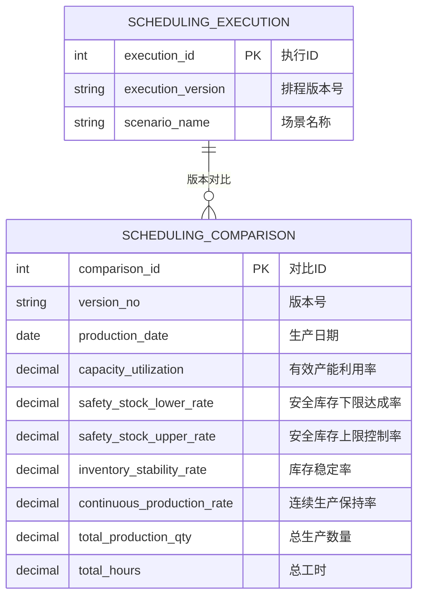
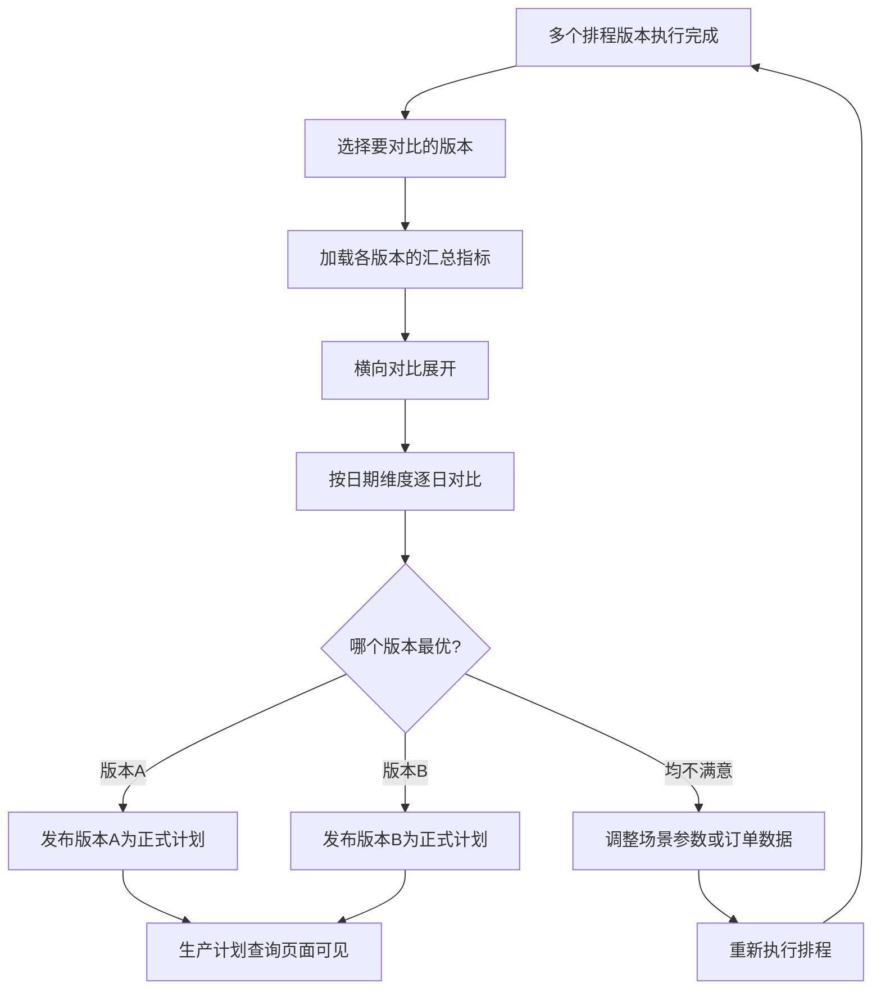

# 排程结果对比

## 概述

排程结果对比是 PS 排程管理的分析与决策页面。由于不同排程场景（冲产能/平衡/保守）会产出不同的排程结果，计划员需要通过横向对比各维度的关键指标来选择一个最优版本作为正式发布的生产计划。

## 领域模型



## 核心流程



## 功能说明

### 排程结果对比

按版本号和生产日期横向对比各排程版本的指标，辅助计划员选择最优排程方案。

**功能入口**: 排程结果对比

| 字段名 | 中文名 | 类型 | 约束 | 影响业务 | 备注 |
|--------|--------|------|------|----------|------|
| version_no | 版本号 | VARCHAR(50) | 必填 | 对比对象 | |
| production_date | 生产日期 | DATE | 必填 | 对比维度 | |
| capacity_utilization | 有效产能利用率 | DECIMAL(5,2) | 计算 | 产能对比 | % |
| safety_stock_lower_rate | 安全库存下限达成率 | DECIMAL(5,2) | 计算 | 库存安全对比 | % |
| safety_stock_upper_rate | 安全库存上限控制率 | DECIMAL(5,2) | 计算 | 库存上限对比 | % |
| inventory_stability_rate | 库存稳定率 | DECIMAL(5,2) | 计算 | 库存波动对比 | % |
| continuous_production_rate | 连续生产保持率 | DECIMAL(5,2) | 计算 | 连续性对比 | % |
| total_production_qty | 总生产数量 | DECIMAL(12,2) | 计算 | 产量统计 | 件 |
| total_hours | 总工时 | DECIMAL(10,2) | 计算 | 工时统计 | 小时 |

### 对比维度说明

| 对比维度 | 说明 | 优劣判断 |
|----------|------|----------|
| 有效产能利用率 | 越高越好，但过高可能导致无缓冲产能 | 通常 85%-95% 为优 |
| 安全库存下限达成率 | 越高越好，确保不缺料 | 100% 为最优 |
| 安全库存上限控制率 | 越高越好，避免库存积压 | 100% 为最优 |
| 库存稳定率 | 越高越好，库存波动小 | 越高越优 |
| 连续生产保持率 | 越高越好，减少切换损失 | 越高越优 |
| 总生产数量 | 满足需求即可 | 满足交付日期要求为准 |
| 总工时 | 在满足需求前提下越少越好 | 越少越优 |

## 业务规则

1. **版本对比范围**：仅"已完成"状态的排程版本可参与对比
2. **对比日期粒度**：以日为单位展开对比，同时支持按周/月汇总
3. **最优版本判定**：系统提供多维度指标对比，最优版本需人工判定并发布
4. **发布唯一性**：同一订单版本只能有一个正式发布的排程结果
5. **历史保留**：所有对比过的版本均保留，支持随时回溯查看

## 搜索条件说明

| 搜索字段 | 中文名 | 搜索类型 | 说明 |
|----------|--------|----------|------|
| version_no | 版本号 | 多选 | 选择要对比的排程版本，支持多版本 |
| date_range | 生产日期范围 | 日期区间 | 限定对比的时间范围 |

## 菜单树结构

```
排程结果对比
```

## 相关模块接口

| 模块 | 接口方向 | 说明 |
|------|----------|------|
| PS_SCHEDULING | 执行生产排程 | 获取各版本排程汇总指标 |
| PS_RESULT_QUERY | 查询排程结果 | 钻取明细数据 |
| PS_PROD_PLAN_QUERY | 生产计划查询 | 发布后推送至甘特图 |
| MES_PRODUCTION | 生产管理 | 发布的生产计划同步至MES |

## 版本历史

| 版本 | 日期 | 说明 |
|------|------|------|
| 1.0 | 2026-05-21 | 从单页文档拆分为独立子页面 |
