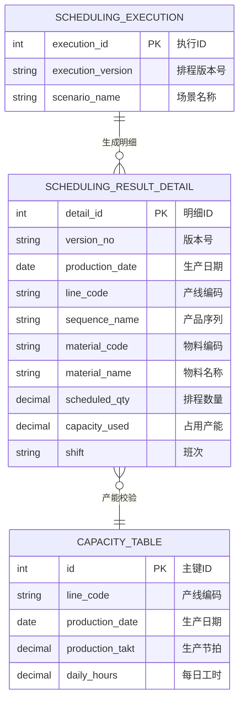
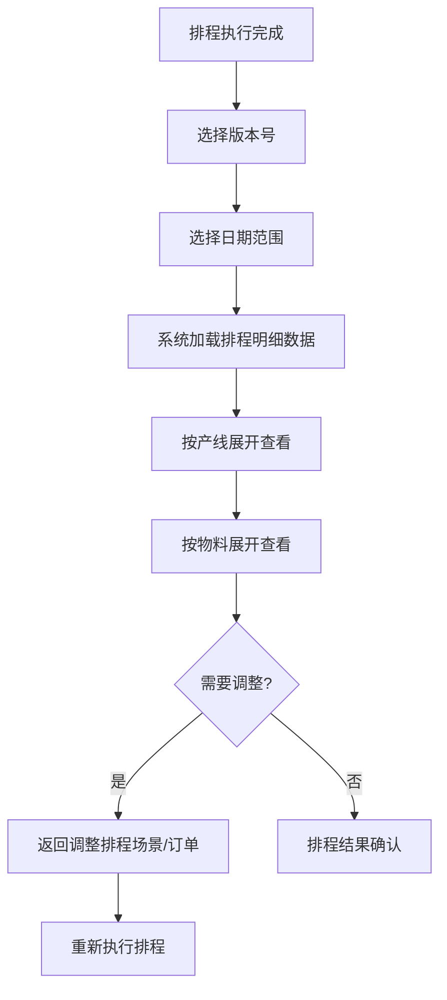

# 查询排程结果

## 概述

查询排程结果是 PS 排程管理的明细数据查询页面。计划员可按版本号和日期范围查询每次排程执行的明细结果，包括各产线、各日期、各物料的计划生产数量，支持向下钻取分析排程细节。

## 领域模型



## 核心流程



## 功能说明

### 查询排程结果

按版本号和日期范围查询排程明细，支持按产线、物料维度展开。

**功能入口**: 查询排程结果

| 字段名 | 中文名 | 类型 | 约束 | 影响业务 | 备注 |
|--------|--------|------|------|----------|------|
| version_no | 版本号 | VARCHAR(50) | 必填 | 排程结果标识 | |
| production_date | 生产日期 | DATE | 必填 | 排程日期 | |
| line_code | 产线编码 | VARCHAR(50) | 显示 | 产能归属 | |
| sequence_name | 产品序列 | VARCHAR(200) | 显示 | 排程分组 | |
| material_code | 物料编码 | VARCHAR(50) | 显示 | 排程对象 | |
| material_name | 物料名称 | VARCHAR(200) | 显示 | | |
| scheduled_qty | 排程数量 | DECIMAL(12,2) | 显示 | 当日计划产量 | |
| capacity_used | 占用产能 | DECIMAL(10,4) | 显示 | 产能消耗 | 小时 |
| shift | 班次 | VARCHAR(50) | 显示 | 班次归属 | |

## 业务规则

1. **查询范围**：仅"已完成"状态的排程版本可查询明细
2. **数据只读**：排程结果明细为只读数据，不可直接修改，需调整源数据后重新排程
3. **产能校验显示**：查询结果中展示实际占用产能 vs 可用产能，超产能部分标红告警
4. **版本唯一性**：同一版本号下的排程结果为一个完整快照，不可部分更新

## 搜索条件说明

| 搜索字段 | 中文名 | 搜索类型 | 说明 |
|----------|--------|----------|------|
| version_no | 版本号 | 下拉选择 | 选择排程版本 |
| date_range | 生产日期范围 | 日期区间 | 默认显示排产周期内全部日期 |
| line_code | 产线 | 下拉选择 | 按产线筛选 |
| material | 物料 | 下拉选择 | 按物料筛选 |

## 菜单树结构

```
查询排程结果
```

## 相关模块接口

| 模块 | 接口方向 | 说明 |
|------|----------|------|
| PS_SCHEDULING | [执行生产排程](../03-执行生产排程/index.md) | 获取排程版本和执行汇总 |
| PS_RESULT_COMPARE | [排程结果对比](../04-排程结果对比/index.md) | 对比页钻取至明细 |
| PS_PROD_PLAN_QUERY | [生产计划查询](../06-生产计划查询/index.md) | 明细数据可视化为甘特图 |

## 版本历史

| 版本 | 日期 | 说明 |
|------|------|------|
| 1.0 | 2026-05-21 | 从单页文档拆分为独立子页面 |
