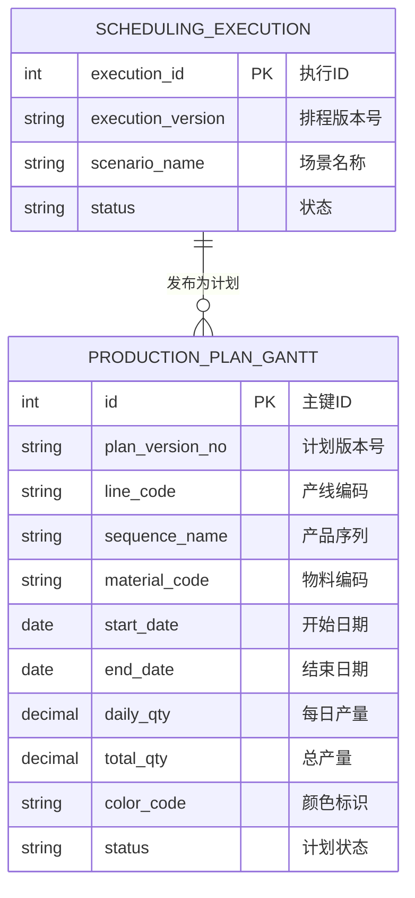
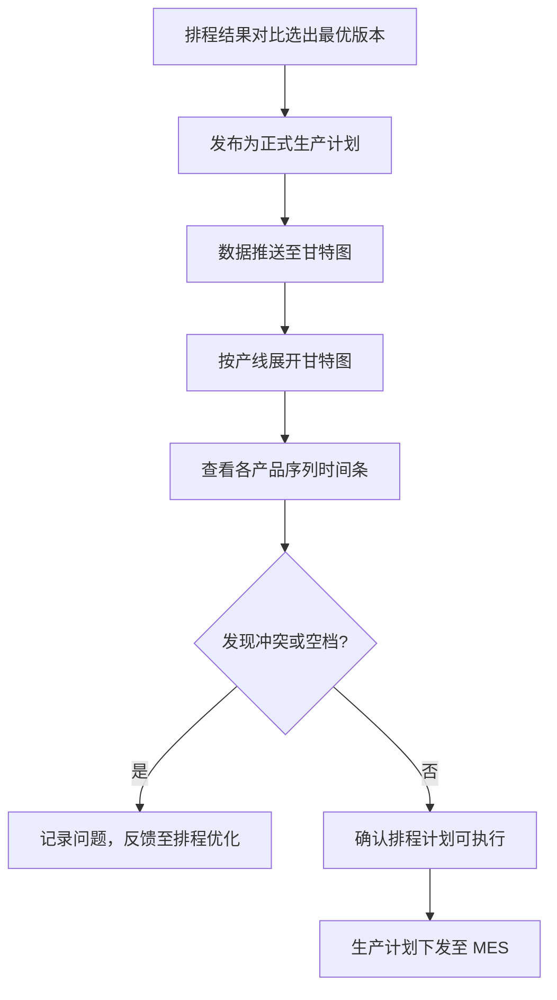

# 生产计划查询

## 概述

生产计划查询是 PS 排程管理的可视化页面，以甘特图（Gantt Chart）形式展示已发布的生产计划。计划员和生产管理人员通过此页面直观查看各产线、各产品序列的生产时间安排，快速识别产能冲突和生产瓶颈。

## 领域模型



## 核心流程



## 功能说明

### 生产计划查询（甘特图）

以甘特图形式可视化展示已发布的生产排程计划。

**功能入口**: 生产计划查询

**甘特图结构**：
- **纵轴（行）**：产线 → 产品序列（树形展开，可折叠）
- **横轴（列）**：日期（按排产周期展开，通常为天粒度）
- **时间条**：每个产品序列的生产时间段，颜色区分不同产品序列
- **信息提示**：悬停时间条显示：产品序列名称、物料编码、每日产量、总产量

### 甘特图数据字段

| 字段名 | 中文名 | 类型 | 约束 | 影响业务 | 备注 |
|--------|--------|------|------|----------|------|
| plan_version_no | 计划版本号 | VARCHAR(50) | 必填 | 标识发布的排程版本 | |
| line_code | 产线编码 | VARCHAR(50) | 必填 | 甘特图行分组 | |
| sequence_name | 产品序列 | VARCHAR(200) | 必填 | 甘特图行子分组 | |
| material_code | 物料编码 | VARCHAR(50) | 显示 | 物料追溯 | |
| start_date | 开始日期 | DATE | 计算 | 甘特图时间条起点 | |
| end_date | 结束日期 | DATE | 计算 | 甘特图时间条终点 | |
| daily_qty | 每日产量 | DECIMAL(12,2) | 计算 | 日产能分配 | |
| total_qty | 总产量 | DECIMAL(12,2) | 计算 | 当次排程总产量 | |
| color_code | 颜色标识 | VARCHAR(20) | 系统分配 | 甘特图视觉区分 | 不同产品序列不同颜色 |

## 甘特图交互说明

| 交互 | 说明 |
|------|------|
| 缩放 | 支持时间轴缩放（天/周/月粒度切换） |
| 拖拽滚动 | 支持左右拖动时间轴查看不同时间范围 |
| 悬停提示 | 鼠标悬停时间条弹出详细生产信息 |
| 产线折叠 | 支持按产线折叠/展开子序列 |
| 冲突高亮 | 同产线同日期出现两条时间条时红色高亮告警 |
| 导出 | 支持甘特图导出为图片或 PDF |

## 业务规则

1. **发布唯一性**：只有发布了的生产计划才在甘特图中可见
2. **只读展示**：甘特图为只读视图，不直接在甘特图上修改排程
3. **冲突检测**：系统自动检测同产线同日期的产能冲突，以红色高亮告警
4. **数据同步**：甘特图数据与排程结果明细一致，发布时生成快照，后续排程重新执行不影响已发布版本
5. **自动刷新**：已发布的计划版本不可变，新发布版本需手动切换查看

## 搜索条件说明

| 搜索字段 | 中文名 | 搜索类型 | 说明 |
|----------|--------|----------|------|
| plan_version | 计划版本号 | 下拉选择 | 选择已发布的计划版本 |
| line_code | 产线 | 下拉选择 | 按产线筛选（支持多选） |
| date_range | 日期范围 | 日期区间 | 默认显示当周 |

## 菜单树结构

```
生产计划查询
```

## 相关模块接口

| 模块 | 接口方向 | 说明 |
|------|----------|------|
| PS_RESULT_COMPARE | [排程结果对比](../04-排程结果对比/index.md) | 发布操作触发计划生成 |
| PS_RESULT_QUERY | [查询排程结果](../05-查询排程结果/index.md) | 甘特图明细与排程结果一致 |
| MES_PRODUCTION | [MES 生产管理](../../06-MES-生产管理/index.md) | 计划同步至 MES 生产工单 |
| MES_DISPATCH | [MES 调度](../../06-MES-生产管理/index.md) | 生产计划作为车间调度依据 |

## 版本历史

| 版本 | 日期 | 说明 |
|------|------|------|
| 1.0 | 2026-05-21 | 从单页文档拆分为独立子页面 |
