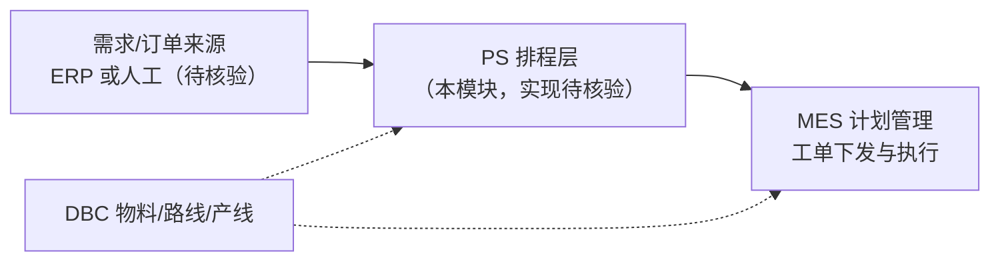

# PS 排程管理

> 适用基线：测试环境目标 / `dev` 分支 / 2026-07-15。
> 阅读对象：计划员、生产主管、实施顾问；**测试、实施（主）**。
> **侧栏标注「规划中」。** 规划中 / 能力未落地：本模块当前只能写清产品规划意图与 MES/DBC 边界；不能把旧稿字段表、算法指标与未经确认的 ER 当作已落地事实。已落地的下发/开工请读 [MES 计划管理](../06-MES-生产管理/03-计划管理/index.md)。

!!! warning "规划中 / 能力未落地 — 对外介绍与验收注意"
    - **不要**对外宣称本仓库已证实具备完整 APS/排程引擎、甘特发布或与 MES 自动挂接。  
    - **已落地**的「ERP 订单 → 生产订单 → 工单 → 下发/开工」请读 [MES 计划管理](../06-MES-生产管理/03-计划管理/index.md)。  
    - 下列分组名来自站点导航骨架；**分组名 ≠ 已落地菜单或后端对象**（见下方盘点结论）。  
    - 旧稿字段表、算法指标、ER、策略枚举均**尚未核实**，禁止当作培训/验收事实。

## 业务目的（产品意图）

排程管理（Production Scheduling，PS）在产品规划中，面向生产计划员，承接「需求/订单 → 产能约束下的可执行计划 → 下发生产」之间的排程层能力：维护排程所需基础约束、录入或导入待排订单、执行排程、对比版本、查询结果，并以计划视图支撑发布决策。

**它与 MES 计划管理不是同一层：**

| 层级 | 负责什么 | 当前文档入口 |
| --- | --- | --- |
| PS（规划） | 多约束下的排产/版本对比与计划输出（本模块） | 本页及下列分组 |
| MES 计划管理（已落地） | ERP 订单 → 生产订单 → 生产工单 → 下发/开工 | [计划管理](../06-MES-生产管理/03-计划管理/index.md) |
| DBC 工艺/工厂（已落地） | 工艺路线、车间/产线等主数据 | [工艺路线](../04-DBC-主数据管理/08-工艺建模/02-工艺路线.md)、[生产线](../04-DBC-主数据管理/04-工厂建模/07-生产线管理.md) |

培训与实施时：**不要把 MES 工单拆分、下发、开工规则抄进 PS**；也不要把 PS 尚未确认的算法参数写进 MES。

## 测试与实施从哪读

| 你的目的 | 建议阅读 |
| --- | --- |
| 判断 PS 能否按「完整排程产品」验收/对外介绍 | **本页警告框 + 盘点结论**（答案：现阶段不能） |
| 已落地计划/下发/开工怎么测、怎么配 | [MES 计划管理](../06-MES-生产管理/03-计划管理/index.md) 及其叶页/维护参考 |
| 工艺/产线等排程可能引用的主数据 | DBC 工艺建模、工厂建模对应页 |
| 站点上 PS 分组页在写什么 | 下表分组（仅规划意图；**无**字段级维护参考可依赖） |
| 对外介绍本能力 | 说明「规划中排程层意图 + 已落地计划在 MES」；尚未核实字段/指标不作演示依据 |

## 配置依赖概览

| 依赖 | 当前口径 |
| --- | --- |
| MES 计划管理 | 实施与测试应优先在此做**真实配置与验证**；勿把 MES 规则抄进 PS |
| DBC 物料/BOM/路线/产线 | 规划中排程输入可能引用；维护细则在 DBC，**映射未证实** |
| ERP / 外部排程引擎 | 订单同步、结果回传均**待核验**；不得臆造接口路径 |
| PS 自身菜单/参数/引擎 | **未在本仓库证实**；无独立配置页可按「已上线」验收 |

## 当前可确认状态（盘点结论）

| 能力点 | 结论 |
| --- | --- |
| 站点文档导航 | **有**：模块首页 + 6 个业务分组页 |
| 产品菜单 | **未检出**独立「排程 / PS / APS」等菜单项 |
| 后端排程模块 | **无**独立排程/APS 业务模块可按已上线验收 |
| 前端排程视图 | **无**独立 PS 业务视图 |
| 对象级说明 | **无**；缺口见 `GAP-017` |
| 旧版分组页中的字段表 / ER / 指标公式 | **尚未核实**，不得继续当作培训事实 |

**因此当前只写到：** 保留导航与业务分组骨架，用业务语言写清意图与边界，并显式标注未证实项；**暂不展开**字段级维护细节与对象级对照。

## 业务分组（站点分组页）

下列分组名称来自站点导航结构；**分组名本身不等于已落地菜单或后端对象**。

| 分组 | 规划意图（非实现断言） | 当前可写范围 |
| --- | --- | --- |
| [01-基础数据](01-基础数据.md) | 产能、序列、节拍、排程场景等约束主数据 | 只写期望作用与缺口 |
| [02-维护订单](02-维护订单.md) | 排程输入侧订单/需求维护 | 只写与 MES 订单的边界，不抄 MES 字段 |
| [03-执行生产排程](03-执行生产排程.md) | 按场景/版本触发排程引擎 | 不写未证实算法参数与公式 |
| [04-排程结果对比](04-排程结果对比.md) | 多版本指标横向对比与择优 | 不写未证实指标与优劣阈值 |
| [05-查询排程结果](05-查询排程结果.md) | 按版本/日期查排程明细 | 不写未证实明细字段 |
| [06-生产计划查询](06-生产计划查询.md) | 计划可视化（如甘特）与发布后查询 | 不写未证实交互与发布规则 |

## 期望协同关系（示意）

上图只表达产品边界意图。箭头方向、触发时机、幂等与失败补偿均属 **未证实**，见 `GAP-017`。

## 与相关模块的边界

| 协同方 | PS 侧期望职责 | 不在本模块展开 / 勿混写 |
| --- | --- | --- |
| [MES 计划管理](../06-MES-生产管理/03-计划管理/index.md) | 排程结果如何进入可下发工单（待核验） | ERP→生产订单→工单→下发/开工的已证实规则 |
| [DBC 工艺路线](../04-DBC-主数据管理/08-工艺建模/02-工艺路线.md) | 排程约束可能引用路线/序列（待核验） | 路线图形与节点维护 |
| [DBC 生产线](../04-DBC-主数据管理/04-工厂建模/07-生产线管理.md) / [车间](../04-DBC-主数据管理/04-工厂建模/06-车间管理.md) | 产能与产线资源定位（待核验） | 工厂建模主数据维护细则 |
| [DBC 物料](../04-DBC-主数据管理/01-物料管理/01-物料基本信息.md) / [BOM](../04-DBC-主数据管理/01-物料管理/02-BOM.md) | 物料与 BOM 版本作为排程输入（待核验） | 物料/BOM 主数据维护 |
| ERP / 外部排程引擎 | 订单同步、结果回传（待核验） | 不得臆造接口路径与报文 |
| API 参考 | 排程相关接口登记入口 | 见 [API 参考](../14-API参考/index.md)（仍为占位） |

## 当前边界对照
| 类别 | 说明 |
| --- | --- |
| 已证实（弱） | 站点存在 PS 文档导航骨架；MES 计划与 DBC 工艺/工厂为可引用的相邻事实层。 |
| 未证实 | PS 菜单、页面路由、后端模块、表结构、字段、状态机、算法参数、版本发布、甘特交互、与 MES/ERP 的真实挂接。 |
| 明确禁止 | 继续传播旧稿中的虚构字段名、ER 图实体、利用率公式与「冲产能/平衡/保守」等尚未核实策略枚举。 |

## 常见误解

| 误解 | 正确口径 |
| --- | --- |
| 「文档里有字段表，所以系统已有这些功能」 | 字段表来自历史占位草稿，**未与源码/菜单对齐**。 |
| 「MES 计划管理就是 PS」 | MES 管工单生命周期；PS 是规划中的排程层，当前实现未在本仓库证实。 |
| 「可以把 MES 工单字段抄到维护订单页」 | 禁止。边界指向 MES 计划管理与 DBC，核实后再写映射。 |
| 「可对外按完整 APS 售卖本模块」 | **禁止**；对外只可说规划中，落地能力指 MES。 |

## 版本历史

| 版本 | 日期 | 说明 |
| --- | --- | --- |
| V1.3 | 2026-07-23 | 增量强化规划中/待核实警告、测试实施阅读路径与配置依赖 |
| V1.2 | 2026-07-17 | 盘点后改为薄弱资料口径：去掉尚未核实字段/ER/公式，明确与 MES/DBC 边界 |
| V1.1 | 2026-05-21 | 拆分为多页面结构（历史占位） |
| V1.0 | 2026-05-20 | 初版占位（当时按测试环境菜单编写；后续未证实对应菜单项） |
