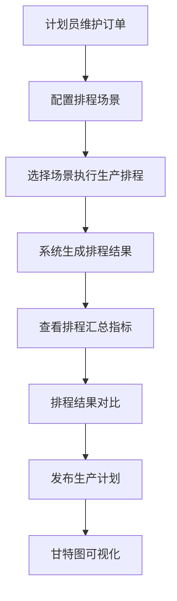
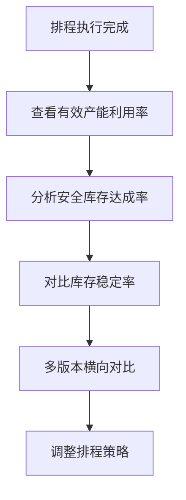
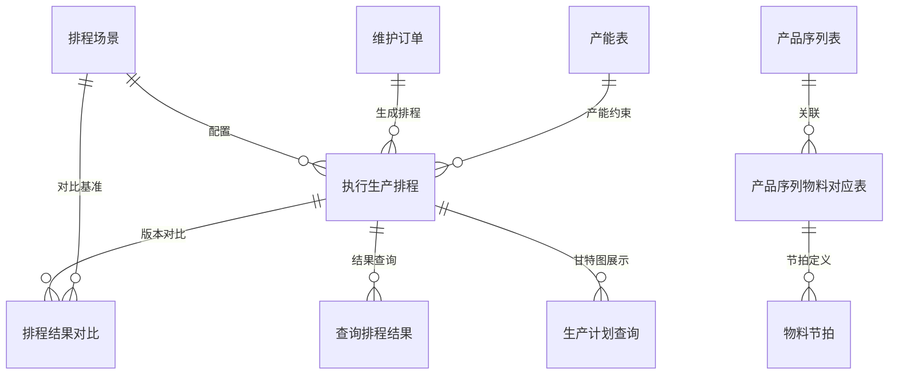

# PS 排程管理

## 模块概述

排程管理（Production Scheduling，PS）是面向生产计划员的智能排程引擎，连接 MES 与 ERP，实现生产计划自动生成、产能优化、交付日期承诺的数字化。

**核心价值**：
- 计划员通过排程场景配置产能策略和连续生产规则
- 系统自动生成生产排程甘特图，支持版本对比
- 实时查询排程结果和生产计划执行状态
- 多维度产能利用率分析和库存策略优化

## 业务分组

| 分组 | 说明 |
|------|------|
| 基础数据 | 产能表、产品序列、产品序列物料对应、物料节拍、排程场景 |
| 维护订单 | 生产订单录入与管理（PS 视角） |
| 执行生产排程 | 排程场景选择、版本发布、汇总结果查看 |
| 排程结果对比 | 多版本排程结果横向对比分析 |
| 查询排程结果 | 按版本号/生产日期查询排程明细 |
| 生产计划查询 | 甘特图视图下的生产计划可视化 |

## 完整菜单树（实测）

```
闻荫供应商系统
  ├─ 系统管理
  ├─ 基础设施
  ├─ 报表管理
  └─ 报表

首页（PS Dashboard：当前无独立数据看板）

基础数据管理
  ├─ 产能表
  ├─ 产品序列表
  ├─ 产品序列物料对应表
  ├─ 物料节拍
  └─ 排程场景

维护订单
执行生产排程
排程结果对比
查询排程结果
生产计划查询
```

## 核心流程

### 生产排程执行流程



### 排程结果分析流程



## 字段说明

### 维护订单

| 字段名 | 中文名 | 类型 | 约束 | 影响业务 | 备注 |
|--------|--------|------|------|----------|------|
| 版本号 | 版本号 | VARCHAR(50) | 必填 | 排程关联标识 | |
| 工厂名称 | 工厂名称 | VARCHAR(100) | 必填 | 排程范围 | |
| 订单类型 | 订单类型 | ENUM | 字典项 | 生产类型区分 | 普通订单等 |
| 产品序列名称 | 产品序列名称 | VARCHAR(200) | 必填 | 排程对象 | |
| BOM版本 | BOM版本 | VARCHAR(50) | 必填 | 物料清单版本 | |
| 需求数量 | 需求数量 | DECIMAL(12,2) | 必填 | 排程数量依据 | |
| 交付日期 | 交付日期 | DATE | 必填 | 排程约束 | |
| 创建时间 | 创建时间 | DATETIME | 自动 | 记录审计 | |

### 执行生产排程

| 字段名 | 中文名 | 类型 | 约束 | 影响业务 | 备注 |
|--------|--------|------|------|----------|------|
| 场景名称 | 场景名称 | VARCHAR(100) | 必填 | 排程策略载体 | |
| 订单版本号 | 订单版本号 | VARCHAR(50) | 必填 | 排程对象 | |
| 版本号 | 版本号 | VARCHAR(50) | 必填 | 排程结果标识 | |
| 排程开始时间 | 排程开始时间 | DATETIME | 计算 | 排程性能指标 | |
| 排程结束时间 | 排程结束时间 | DATETIME | 计算 | 排程性能指标 | |
| 执行人 | 执行人 | VARCHAR(50) | 自动 | 审计 | |
| 有效产能利用率 | 有效产能利用率 | DECIMAL(5,2) | 计算 | 产能评估 | % |
| 安全库存下限达成率 | 安全库存下限达成率 | DECIMAL(5,2) | 计算 | 库存安全评估 | % |
| 安全库存上限控制率 | 安全库存上限控制率 | DECIMAL(5,2) | 计算 | 库存上限管控 | % |
| 库存稳定率 | 库存稳定率 | DECIMAL(5,2) | 计算 | 库存波动评估 | % |
| 连续生产保持率 | 连续生产保持率 | DECIMAL(5,2) | 计算 | 生产连续性评估 | % |

### 排程结果对比

| 字段名 | 中文名 | 类型 | 约束 | 影响业务 | 备注 |
|--------|--------|------|------|----------|------|
| 版本号 | 版本号 | VARCHAR(50) | 必填 | 对比对象 | |
| 生产日期 | 生产日期 | DATE | 必填 | 对比维度 | |
| 有效产能利用率 | 有效产能利用率 | DECIMAL(5,2) | 计算 | 产能对比 | % |
| 安全库存下限达成率 | 安全库存下限达成率 | DECIMAL(5,2) | 计算 | 库存安全对比 | % |
| 安全库存上限控制率 | 安全库存上限控制率 | DECIMAL(5,2) | 计算 | 库存上限对比 | % |
| 库存稳定率 | 库存稳定率 | DECIMAL(5,2) | 计算 | 库存波动对比 | % |
| 连续生产保持率 | 连续生产保持率 | DECIMAL(5,2) | 计算 | 连续性对比 | % |
| 总生产数量 | 总生产数量 | DECIMAL(12,2) | 计算 | 产量统计 | 件 |
| 总工时 | 总工时 | DECIMAL(10,2) | 计算 | 工时统计 | 小时 |

### 产能表

| 字段名 | 中文名 | 类型 | 约束 | 影响业务 | 备注 |
|--------|--------|------|------|----------|------|
| 车间编码 | 车间编码 | VARCHAR(50) | 必填 | 产能范围 | |
| 产线编码 | 产线编码 | VARCHAR(50) | 必填 | 排程单位 | |
| 生产日期 | 生产日期 | DATE | 必填 | 产能时间维度 | |
| 班次 | 班次 | VARCHAR(50) | 非必填 | 产能细分 | |
| 生产节拍 | 生产节拍 | DECIMAL(10,4) | 必填 | 排程速度依据 | 分钟 |
| 每日工时 | 每日工时 | DECIMAL(10,4) | 必填 | 产能计算 | 小时 |

### 产品序列表

| 字段名 | 中文名 | 类型 | 约束 | 影响业务 | 备注 |
|--------|--------|------|------|----------|------|
| 序列编号 | 序列编号 | VARCHAR(50) | 必填 | 唯一标识 | |
| 序列名称 | 序列名称 | VARCHAR(200) | 必填 | 排程显示 | |
| 序列描述 | 序列描述 | VARCHAR(500) | 非必填 | 业务说明 | |

### 产品序列物料对应表

| 字段名 | 中文名 | 类型 | 约束 | 影响业务 | 备注 |
|--------|--------|------|------|----------|------|
| 序列编号 | 序列编号 | VARCHAR(50) | 必填 | 关联产品序列 | |
| 序列名称 | 序列名称 | VARCHAR(200) | 必填 | 显示 | |
| 物料编码 | 物料编码 | VARCHAR(50) | 必填 | 物料关联 | |
| 物料名称 | 物料名称 | VARCHAR(200) | 必填 | 显示 | |
| 生产优先级 | 生产优先级 | ENUM | 字典项 | 排程优先级 | 高/中/低 |

### 物料节拍

| 字段名 | 中文名 | 类型 | 约束 | 影响业务 | 备注 |
|--------|--------|------|------|----------|------|
| 序列编号 | 序列编号 | VARCHAR(50) | 必填 | 关联产品序列 | |
| 序列名称 | 序列名称 | VARCHAR(200) | 必填 | 显示 | |
| 生产节拍 | 生产节拍 | DECIMAL(10,4) | 必填 | 排程速度 | 分钟 |
| 整备时间 | 整备时间 | DECIMAL(10,4) | 非必填 | 切换时间 | 分钟 |
| 稼动率 | 稼动率 | DECIMAL(5,2) | 计算 | 设备效率 | % |
| 产线编码 | 产线编码 | VARCHAR(50) | 必填 | 产能归属 | |

### 排程场景

| 字段名 | 中文名 | 类型 | 约束 | 影响业务 | 备注 |
|--------|--------|------|------|----------|------|
| 场景名称 | 场景名称 | VARCHAR(100) | 必填 | 场景标识 | |
| 场景描述 | 场景描述 | VARCHAR(500) | 非必填 | 业务说明 | |
| 排产周期 | 排产周期 | INT | 必填 | 排程时间跨度 | 天 |
| 产能策略 | 产能策略 | ENUM | 字典项 | 排程优化目标 | 冲产能/平衡/保守 |
| 连续生产策略 | 连续生产策略 | ENUM | 字典项 | 生产连续性控制 | |
| 库存策略 | 库存策略 | ENUM | 字典项 | 库存上下限控制 | |

## 关联关系



## 业务规则

1. **排程执行前提**：维护订单数据完整且版本已确认后才能执行排程
2. **场景隔离**：不同排程场景独立运行，互不影响
3. **版本管理**：每次排程生成新版本，保留历史版本供对比
4. **产能约束**：排程结果受产能表节拍和产线实际产能约束

## 版本历史

| 版本 | 日期 | 说明 |
|------|------|------|
| V1.0 | 2026-05-20 | 初版完成，基于测试环境菜单结构提取 |
