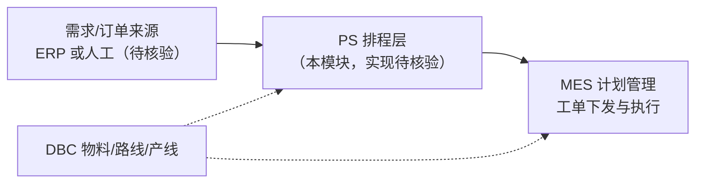

# PS 排程管理

> 适用基线：测试环境目标 / `dev` 分支 / 2026-07-15。
> 阅读对象：计划员、生产主管、实施顾问。
> **资料状态：薄弱。** 本模块当前只能写清「产品导航占位意图 + 与 MES/DBC 的边界」；不能把旧稿字段表、算法指标与假 ER 当作已证实事实。

## 业务目的（产品意图）

排程管理（Production Scheduling，PS）在产品规划中，面向生产计划员，承接「需求/订单 → 产能约束下的可执行计划 → 下发生产」之间的排程层能力：维护排程所需基础约束、录入或导入待排订单、执行排程、对比版本、查询结果，并以计划视图支撑发布决策。

**它与 MES 计划管理不是同一层：**

| 层级 | 负责什么 | 当前文档入口 |
| --- | --- | --- |
| PS（规划） | 多约束下的排产/版本对比与计划输出（本模块） | 本页及下列分组 |
| MES 计划管理（已证实） | ERP 订单 → 生产订单 → 生产工单 → 下发/开工 | [计划管理](../06-MES-生产管理/03-计划管理/index.md) |
| DBC 工艺/工厂（已证实） | 工艺路线、车间/产线等主数据 | [工艺路线](../04-DBC-主数据管理/08-工艺建模/02-工艺路线.md)、[生产线](../04-DBC-主数据管理/04-工厂建模/07-生产线管理.md) |

培训与实施时：**不要把 MES 工单拆分、下发、开工规则抄进 PS**；也不要把 PS 未证实的算法参数写进 MES。

## 当前可确认状态（盘点结论）

| 检查项 | 结论 |
| --- | --- |
| `docs/11-PS-排程管理/` 导航结构 | **有**：模块首页 + 6 个业务分组页（与 `mkdocs.yml` 一致） |
| `reference/menu.csv` | **未检出**含「排程 / PS / APS / 产能表 / 产品序列 / 物料节拍」等菜单项 |
| `sourcecode/backend` | **无**独立 `win-module-ps` / `aps` / 排程业务模块；现有 `schedule` 命中多为定时任务、发票进度、EAM/ANDON 日程等无关对象 |
| `sourcecode/frontend/ui/src/views` | **无** `ps` 视图目录（已有 andon/dbc/eam/mes/qms/scp/wms 等） |
| `project-docs` 字段证据 | **无** PS 逐对象取证页；仅有 BATCH-04 占位与 `GAP-017` |
| 旧版分组页中的字段表 / ER / 指标公式 | **未取证**，不得继续当作培训事实 |

**因此本轮只能做到：** 保留导航与业务分组骨架，用业务化文风写清意图与边界，并显式标注未证实项；**做不到**第二轮字段级业务化（主文档字段表 + 维护参考 + 对象证据）。

取证任务见内部清单：`project-docs/04-资料与证据/字段证据/PS/资料缺口与取证清单.md`（不参与站点发布）。

## 业务分组（导航占位）

下列分组名称来自站点导航结构；**分组名本身不等于已证实菜单或后端对象**。

| 分组 | 规划意图（非实现断言） | 当前可写范围 |
| --- | --- | --- |
| [01-基础数据](01-基础数据.md) | 产能、序列、节拍、排程场景等约束主数据 | 只写期望作用与缺口 |
| [02-维护订单](02-维护订单.md) | 排程输入侧订单/需求维护 | 只写与 MES 订单的边界，不抄 MES 字段 |
| [03-执行生产排程](03-执行生产排程.md) | 按场景/版本触发排程引擎 | 不写未证实算法参数与公式 |
| [04-排程结果对比](04-排程结果对比.md) | 多版本指标横向对比与择优 | 不写未证实指标与优劣阈值 |
| [05-查询排程结果](05-查询排程结果.md) | 按版本/日期查排程明细 | 不写未证实明细字段 |
| [06-生产计划查询](06-生产计划查询.md) | 计划可视化（如甘特）与发布后查询 | 不写未证实交互与发布规则 |

## 期望协同关系（示意，非已证实接口）

上图只表达产品边界意图。箭头方向、触发时机、幂等与失败补偿均属 **未证实**，见 `GAP-017`。

## 与相关模块的边界

| 协同方 | PS 侧期望职责 | 不在本模块展开 / 勿混写 |
| --- | --- | --- |
| [MES 计划管理](../06-MES-生产管理/03-计划管理/index.md) | 排程结果如何进入可下发工单（待核验） | ERP→生产订单→工单→下发/开工的已证实规则 |
| [DBC 工艺路线](../04-DBC-主数据管理/08-工艺建模/02-工艺路线.md) | 排程约束可能引用路线/序列（待核验） | 路线图形与节点维护 |
| [DBC 生产线](../04-DBC-主数据管理/04-工厂建模/07-生产线管理.md) / [车间](../04-DBC-主数据管理/04-工厂建模/06-车间管理.md) | 产能与产线资源定位（待核验） | 工厂建模主数据维护细则 |
| [DBC 物料](../04-DBC-主数据管理/01-物料管理/01-物料基本信息.md) / [BOM](../04-DBC-主数据管理/01-物料管理/02-BOM.md) | 物料与 BOM 版本作为排程输入（待核验） | 物料/BOM 主数据维护 |
| ERP / 外部排程引擎 | 订单同步、结果回传（待核验） | 不得臆造接口路径与报文 |
| API 参考 | 排程相关接口登记入口 | 见 [API 参考](../14-API参考/index.md)（仍为占位） |

## 已证实 / 未证实对照

| 类别 | 说明 |
| --- | --- |
| 已证实（弱） | 站点存在 PS 文档导航骨架；MES 计划与 DBC 工艺/工厂为可引用的相邻事实层。 |
| 未证实 | PS 菜单、页面路由、后端模块、表结构、字段、状态机、算法参数、版本发布、甘特交互、与 MES/ERP 的真实挂接。 |
| 明确禁止 | 继续传播旧稿中的虚构字段名、ER 图实体、利用率公式与「冲产能/平衡/保守」等未取证策略枚举。 |

## 常见误解

| 误解 | 正确口径 |
| --- | --- |
| 「文档里有字段表，所以系统已有这些功能」 | 字段表来自历史占位草稿，**未与源码/菜单对齐**。 |
| 「MES 计划管理就是 PS」 | MES 管工单生命周期；PS 是规划中的排程层，当前实现未在本仓库证实。 |
| 「可以把 MES 工单字段抄到维护订单页」 | 禁止。边界指向 MES 计划管理与 DBC，取证后再写映射。 |

## 版本历史

| 版本 | 日期 | 说明 |
| --- | --- | --- |
| V1.2 | 2026-07-17 | 盘点后改为薄弱资料口径：去掉未取证字段/ER/公式，明确与 MES/DBC 边界 |
| V1.1 | 2026-05-21 | 拆分为多页面结构（历史占位） |
| V1.0 | 2026-05-20 | 初版占位（声称基于测试环境菜单；本轮未在 menu.csv 复核到对应项） |
