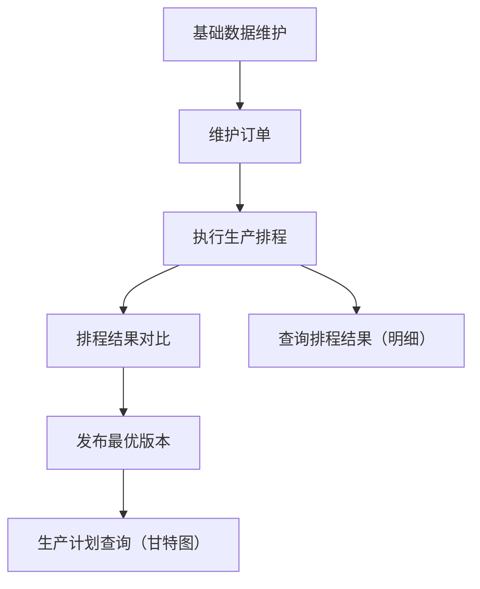
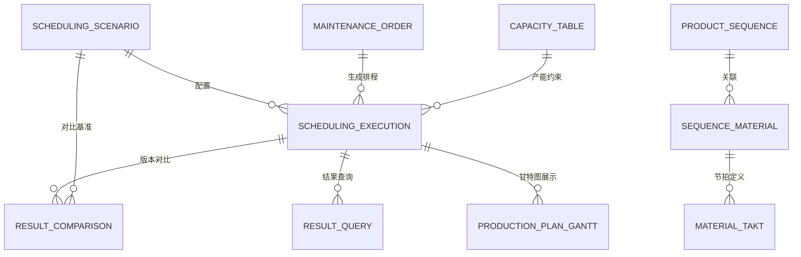

# PS 排程管理

## 模块概述

排程管理（Production Scheduling，PS）是面向生产计划员的智能排程引擎，连接 MES 与 ERP，实现生产计划自动生成、产能优化、交付日期承诺的数字化。

**核心价值**：
- 计划员通过排程场景配置产能策略和连续生产规则
- 系统自动生成生产排程甘特图，支持版本对比
- 实时查询排程结果和生产计划执行状态
- 多维度产能利用率分析和库存策略优化

## 业务分组

| 分组 | 说明 |
|------|------|
| [01-基础数据](01-基础数据/index.md) | 产能表、产品序列、产品序列物料对应、物料节拍、排程场景 |
| [02-维护订单](02-维护订单/index.md) | 生产订单录入与管理（PS 视角） |
| [03-执行生产排程](03-执行生产排程/index.md) | 排程场景选择、版本发布、汇总结果查看 |
| [04-排程结果对比](04-排程结果对比/index.md) | 多版本排程结果横向对比分析 |
| [05-查询排程结果](05-查询排程结果/index.md) | 按版本号/生产日期查询排程明细 |
| [06-生产计划查询](06-生产计划查询/index.md) | 甘特图视图下的生产计划可视化 |

## 核心流程

### 端到端排程流程

## 关联关系

## 接口规范

### PS → MES 接口

| 接口 | 方向 | 说明 |
|------|------|------|
| 生产计划同步 | PS→MES | 已发布排程计划同步至 MES 生产工单 |
| 产能反馈查询 | MES→PS | 获取产线实际产能数据用于排程校验 |

### PS → ERP 接口

| 接口 | 方向 | 说明 |
|------|------|------|
| 生产订单同步 | ERP→PS | ERP 生产订单同步至维护订单 |
| 排程结果回传 | PS→ERP | 排程结果回传至 ERP 供交期承诺 |

## 业务规则

1. **排程执行前提**：维护订单数据完整且版本已确认后才能执行排程
2. **场景隔离**：不同排程场景独立运行，互不影响
3. **版本管理**：每次排程生成新版本，保留历史版本供对比
4. **产能约束**：排程结果受产能表节拍和产线实际产能约束

## 版本历史

| 版本 | 日期 | 说明 |
|------|------|------|
| V1.1 | 2026-05-21 | 拆分为多页面结构，完善各子页面内容 |
| V1.0 | 2026-05-20 | 初版完成，基于测试环境菜单结构提取 |
