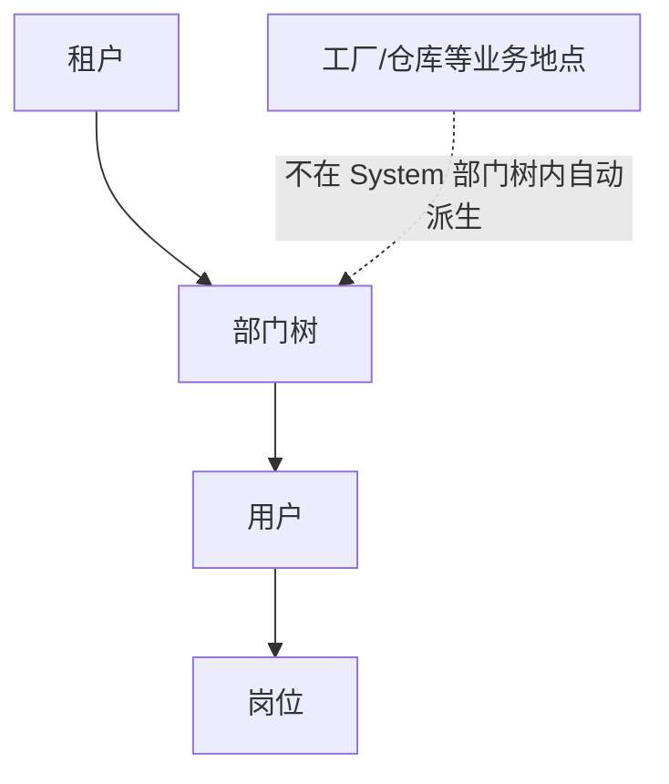

# 组织架构

> 适用基线：测试环境目标 / `dev` 分支 / 2026-07-15。
> 阅读对象：测试、实施、运维（主）；需要解释「人员挂在哪、部门树怎么影响数据范围」的业务管理员（顺带）。

## 业务目的与适用范围

新建了「仓储部」却发现工厂建模里什么都没变——这是最常见的误会：部门树不等于工厂/仓库。组织架构回答：System 侧用哪些对象表达责任归属与人员挂载，以及它们如何与数据权限配合。

读完本页，应能：判断组织类问题该改部门树、改用户归属，还是该去 DBC/WMS 建工厂仓库、去岗位页配库位；并能说明「本部门 / 本部门及下级」依赖什么。旧版“企业—工厂—部门”三级不能直接等同于当前 System 菜单模型：工厂、仓库在 DBC/WMS 维护；System 以部门树为主，岗位见权限分组。

## 本页与相邻能力的边界

| 能力 | 本页管什么 | 不管什么（去哪看） |
| --- | --- | --- |
| 部门树与用户归属 | 树形部门、负责人、用户挂部门 | 租户隔离 → [租户与认证](../01-租户与认证/index.md) |
| 与数据权限的关系 | 提供「本部门/下级」计算基础 | 五档范围配置 → [数据权限](../03-用户与权限/02-数据权限与决策权限.md) |
| 岗位 / 工厂仓库 | 只划清「不是部门树」 | 岗位库位 → [岗位页](../03-用户与权限/03-岗位、任务分配与审批主体.md)；工厂/仓库 → DBC/WMS |
| 菜单功能授权 | 不涉及 | [RBAC](../03-用户与权限/01-RBAC权限模型.md) |

## 如何使用本组文档

| 你的目的 | 建议阅读 |
| --- | --- |
| 理解部门树如何影响数据范围，并据此验收/排障 | 本页：准备 → 部门树如何工作 → 边界 → 建议验证点 |
| 维护部门树、负责人、用户归属或查字段细节 | [组织架构-维护与查询参考](组织架构-维护与查询参考.md) |
| 配置角色部门数据范围 | [数据权限与决策权限](../03-用户与权限/02-数据权限与决策权限.md) |
| 配置岗位库位 | [岗位、任务分配与审批主体](../03-用户与权限/03-岗位、任务分配与审批主体.md) |
| 理解工厂/仓库主数据 | DBC 工厂建模、物流配置等对应页面 |

## 使用前准备

| 需要确认什么 | 为什么重要 |
| --- | --- |
| 部门树是否反映真实责任结构 | 本部门/下级数据范围与负责人字段都依赖树。 |
| 用户是否已挂部门 | 未挂部门时，部门类数据范围可能异常收窄。 |
| 工厂/仓库是否已在 DBC 建好 | 业务地点不在部门树里“自动生成”。 |
| 是否与岗位混淆 | 岗位解决现场职责与库位条件，不是部门树本身。 |

!!! example "📷 截图占位"
    部门管理树形列表，标出上级部门、负责人、状态；使用脱敏数据。

## 当前组织对象
| 对象 | 在哪里维护 | 主要作用 | 本页是否详写 |
| --- | --- | --- | --- |
| 部门 | 系统管理 → 部门管理 | 树形组织、用户归属、角色数据范围计算基础。 | 是 |
| 用户所属部门 | 用户管理 | 把人挂到部门。 | 是（联查） |
| 岗位 | 岗位管理 | 职责位置 + 库位/物料等条件。 | 否，见岗位页 |
| 租户 | 租户管理 | 多租户隔离与套餐能力边界。 | 否，见租户页 |
| 工厂/仓库/库区/库位 | DBC / WMS | 业务地点与库存地点。 | 否，见对应业务页 |

## 部门树如何工作

部门以树形维护：可指定上级部门、显示顺序、负责人、联系方式、状态和部门编号。根节点之上无业务上级；下级部门用于“本部门及下级”类数据范围。

用户归属到某一部门后：

1. 角色数据范围为“本部门 / 本部门及下级 / 仅本人”时，会用到该归属；
2. 负责人字段便于组织联络与部分业务展示，**不能**单独证明审批自动找负责人（审批见岗位/业务页边界）；
3. 停用部门前应先处理下属用户与下级部门，避免责任悬挂。

!!! example "📝 示例数据占位"
    总部 → 仓储部 → 一号库班组；两名用户分属不同下级部门，在“本部门”范围下可见结果不同。

!!! example "写实示例：给定配置 → 期望可见范围"
    **给定：** 部门树为「仓储部 → 一号班 / 二号班」；用户甲挂一号班、乙挂二号班；两人均为同一「仓库查询」角色，数据范围为「本部门」；验收对象为已挂接部门规则的 System 用户/部门列表（非任意库存单据）。
    **期望：** 甲在列表中只看到一号班相关数据，看不到二号班；乙相反。若把范围改为「本部门及下级」且用户挂在「仓储部」，应能看到一号班与二号班。

    若目标是库存单据隔离：不能假定仅靠部门树生效——先确认业务表是否挂接部门数据权限（`GAP-070`），库位现场隔离另查岗位。

### 建议验证点

- 用户未挂部门时，「本部门 / 本人」类范围是否异常收窄（用非超管账号）。
- 调整上级部门后，「本部门及下级」可见集合是否随之变化。
- 在部门树中找不到工厂/仓库属预期；应在 DBC/WMS 维护。
- 负责人字段变更不应被验收成「审批人自动切换」（审批边界见岗位/业务页）。

## 与工厂、仓库、数据权限的边界

「建了部门是不是等于建了工厂」这类误解在实施初期最常见，下表逐条澄清：

| 常见误解 | 正确口径 |
| --- | --- |
| 建了部门就等于建了工厂 | 否。工厂在 DBC 等业务主数据中维护。 |
| 部门范围自动隔离所有库存单据 | 否。仅对已挂接部门数据权限的对象生效；见数据权限页与 `GAP-070`。 |
| 部门可以替代岗位库位 | 否。库位现场隔离看岗位区域权限。 |
| 组织树应严格等于菜单树 | 否。菜单是功能入口，部门是组织责任结构。 |

更宏观的多组织/多工厂隔离讨论见[多组织、多工厂与数据隔离](../../01-总体框架/02-多组织、多工厂与数据隔离.md)；该总览页仍可能保留待核验项，实施细节以本页与数据权限页的已证实结论为准。

## 查询与联查

| 想解决的问题 | 推荐定位方式 | 建议联查 |
| --- | --- | --- |
| 用户部门不对 | 用户详情中的部门、部门树是否启用。 | 用户管理、部门管理。 |
| 数据范围不符合预期 | 用户部门 + 角色数据范围类型。 | [数据权限与决策权限](../03-用户与权限/02-数据权限与决策权限.md)。 |
| 找不到工厂/仓库 | 不应在部门树里找，去 DBC/WMS。 | 工厂建模、仓库/库位页。 |
| 班组现场权限不对 | 查岗位与岗位库位。 | 岗位页。 |

## 常见问题与处理

| 情况 | 建议处理 |
| --- | --- |
| 新建用户未选部门 | 补挂部门后再验收数据范围。 |
| 部门改名/调整上级后范围变化 | 预期行为；通知相关角色并回归关键查询。 |
| 想按仓库建“部门”来做隔离 | 先评估是否应使用仓库主数据 + 岗位库位/业务字段，避免用部门树硬模拟仓库。 |
| 负责人能否当审批人 | 不默认等于审批主体；回业务规则与岗位/审批边界说明。 |

## 当前限制与待确认事项

- 企业/公司级独立组织对象是否存在及与部门树关系，待补充取证；
- 工厂与部门的业务映射（若项目有自定义约定）未在 System 通用能力中证实；
- 部门停用对历史单据展示、统计口径的影响待测试环境核对；
- 总体框架“多组织多工厂”页的参考设计需随本页结论逐步收敛，不阻塞本页使用。

## 待补充的图示与示例
| 类型 | 后续需要补充的内容 | 目的 |
| --- | --- | --- |
| 树形截图 | 三级部门样例。 | 支持实施培训。 |
| 对照表 | 部门 vs 工厂 vs 仓库 vs 岗位。 | 减少概念混用。 |
| 示例数据 | 两部门用户数据范围差异。 | 支持验收。 |
