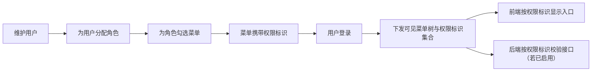
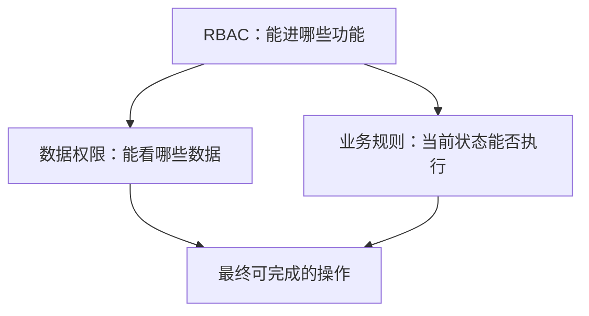

# RBAC 权限模型

> 适用基线：测试环境目标 / `dev` 分支 / 2026-07-15。
> 阅读对象：测试、实施、运维（主）；安全与审计协同人员（顺带）。

## 业务目的与适用范围

RBAC（基于角色的访问控制）把“登录用户能使用哪些功能”管理成可维护、可追溯的授权结果：通过用户、角色、菜单和权限标识，决定登录后能看到哪些页面，以及页面上哪些操作入口应显示。

读完本页，应能跟完「用户 → 角色 → 菜单 → 权限标识」主链，区分菜单可见、按钮显示与接口鉴权三层，并知道看不见菜单时先查什么。数据可见范围、岗位派工、审批主体和业务状态前置条件见同组其它页；业务模块动作规则仍以各业务页为准。

## 如何使用本组文档

| 你的目的 | 建议阅读 |
| --- | --- |
| 理解用户如何获得菜单和操作入口，并据此设计验证/排障 | 本页：准备 → 一次授权如何生效 → 三层边界 → 建议验证点 |
| 维护用户、角色、菜单或做角色授权 | [RBAC权限模型-维护与查询参考](RBAC权限模型-维护与查询参考.md) |
| 区分“能进页面”和“能看哪些数据” | [数据权限与决策权限](02-数据权限与决策权限.md) |
| 理解岗位、任务分配与审批人 | [岗位、任务分配与审批主体](03-岗位、任务分配与审批主体.md) |

## 使用前准备

| 需要确认什么 | 为什么重要 |
| --- | --- |
| 组织与部门是否已建立 | 用户通常挂在组织树上，便于管理和后续数据范围。 |
| 需要哪些角色 | 角色是授权的主要载体，避免直接给每个用户逐项勾菜单。 |
| 菜单与权限标识是否完整 | 菜单决定页面入口；权限标识决定按钮/接口侧配置口径。 |
| 是否存在超级管理员角色 | 超管可获得全部菜单能力，变更需受控。 |
| 业务模块是否另有状态限制 | 有菜单权限不等于任意状态下都能执行业务动作。 |

!!! example "📷 截图占位"
    角色管理页勾选菜单树，标出目录、页面和权限标识；使用脱敏测试数据。

## 一次授权如何生效

用户本身不直接勾选功能菜单；通过角色获得菜单集合。登录后系统返回可见菜单树和权限标识集合。前端据此控制菜单与按钮显示；后端是否强制校验同一权限标识，取决于接口是否启用鉴权，二者不能默认对齐。

!!! example "📝 示例数据占位"
    用户张三分配“仓库执行”角色，角色勾选采购收货任务页及执行相关权限标识；登录后可见收货任务菜单，按钮显示以权限标识为准。

!!! example "写实示例：给定配置 → 期望可见范围"
    **给定：** 非超管用户「仓管甲」仅有角色「仓库执行」；该角色勾选「采购收货任务」页面菜单及执行相关权限标识；菜单均为启用；租户套餐包含该菜单。
    **期望：**

    1. 登录后可见采购收货任务入口；未勾选的其它仓储菜单不可见。
    2. 页面上带对应权限标识的按钮应显示；未下发标识的按钮不显示。
    3. 看见按钮仍可能执行失败——需另查接口是否鉴权、业务状态、数据范围（❓ 各业务页按钮—接口矩阵见 `GAP-014`，未证实前勿断言「一定可执行」）。

### 建议验证点

- 未分配角色 / 角色停用 / 菜单停用：登录后目标菜单不可见。
- 角色新增勾选后：通常需重新登录（或等权限缓存刷新）再验收；❓ 缓存刷新时机以环境为准。
- 超管账号：可见全量菜单，不适合作为「普通角色菜单范围」的对照账号。
- 租户套餐不含某菜单时：即使角色勾选，功能上限仍可能被套餐收缩——先查套餐再查角色。
- 前端可见 ≠ 后端已强制鉴权：抽查关键写操作时，以接口实际拒绝/放行为准，未测接口标 ❓。

### 关键判断

| 判断点 | 应先确认什么 | 判断后的影响 |
| --- | --- | --- |
| 用角色还是直接改用户 | 是否已有可复用角色。 | 优先角色授权，降低维护成本。 |
| 菜单够不够 | 目录/页面是否已配置且启用。 | 决定用户能否进入业务页。 |
| 按钮看不看得见 | 对应权限标识是否随菜单下发给用户。 | 决定页面操作入口是否显示。 |
| 能不能真正执行 | 后端接口是否鉴权、业务状态是否允许。 | 前端可见不等于一定可执行成功。 |
| 是否应使用超管 | 是否确需全量菜单能力。 | 超管变更影响面大，应严格控制。 |

## 四类对象分别做什么

| 对象 | 用业务语言理解 | 使用者最关心什么 |
| --- | --- | --- |
| 用户 | 可登录的人员账号。 | 账号是否可用、属于谁、有哪些角色。 |
| 角色 | 一组功能授权的集合。 | 角色是否启用、勾了哪些菜单。 |
| 菜单 | 系统功能入口（目录、页面等）。 | 路由是否正确、是否启用、权限标识是什么。 |
| 权限标识 | 挂在菜单上的功能识别码，供前端显隐和后端鉴权引用。 | 与按钮/接口配置是否一致。 |

当前实现中，权限标识维护在菜单上，而不是单独一张“权限主数据”清单页面。没有独立的“权限管理”菜单作为日常维护入口。

## 角色与操作分工

| 角色/岗位 | 典型工作 |
| --- | --- |
| 系统管理员 | 维护用户、角色、菜单，完成角色授权。 |
| 实施顾问 | 按岗位设计角色模板，核对菜单范围。 |
| 业务管理员 | 提出本部门需要哪些功能入口，不直接改底层菜单。 |
| 安全/审计协同 | 抽查超管、高权限角色和关键接口保护。 |

| 常见动作 | 业务结果 |
| --- | --- |
| 新增/停用用户 | 控制谁能登录。 |
| 分配用户角色 | 决定用户继承哪些功能集合。 |
| 维护角色并勾选菜单 | 决定该角色可见的功能范围。 |
| 维护菜单与权限标识 | 决定系统有哪些入口及标识口径。 |

## 超级管理员

系统存在超级管理员类角色（角色编码为超级管理员标识）。具备该角色时，授权计算会按“可获得全部菜单”的方式处理，并在权限判断中放行。

培训与实施时应注意：

- 超管用于初始配置和紧急处理，不宜作为日常业务操作账号；
- 前端可能存在通配或角色名判断的显示逻辑，与后端超管编码不一定同名，不能混为一谈；
- 具体账号是否超管，以当前环境角色配置为准。

## 菜单权限、按钮显示与接口鉴权

这是 RBAC 培训中最容易混淆的三层：

| 层级 | 它回答什么 | 当前可确认的事实 |
| --- | --- | --- |
| 菜单权限 | 登录后能否看到某页面入口 | 由角色勾选的启用菜单决定；菜单树下发时不包含纯按钮型菜单节点。 |
| 按钮/入口显示 | 页面上是否显示某操作按钮 | 前端按权限标识集合控制显示。 |
| 接口鉴权 | 直接调用接口时是否被拒绝 | 部分接口启用了权限校验，部分接口的权限注解在当前源码中处于关闭/注释状态；**不能**把前端显示当成后端已强制鉴权。 |

因此，正确说法是：

- “该角色被授予了某菜单/权限标识”；
- “页面上因此可能显示某按钮”；
- “该接口是否强制鉴权，需单独核验”。

错误说法是：

- “只要看见按钮就一定能执行成功”；
- “前端有权限码就等于接口安全已闭环”。

## 与数据权限、业务规则的边界

| 主题 | 是否本页范围 | 说明 |
| --- | --- | --- |
| 用户—角色—菜单—权限标识 | 是 | 本页主链。 |
| 按部门等过滤可见数据 | 否 | 见数据权限页。 |
| 岗位派工、审批人是谁 | 否 | 见岗位与审批主体页。 |
| 某业务状态下能否提交/撤销 | 否 | 见各业务页动作规则。 |

## 查询、详情与联查

| 想解决的问题 | 推荐定位方式 | 建议联查 |
| --- | --- | --- |
| 某用户为何看不到菜单 | 用户是否启用、角色是否启用、角色是否勾选该菜单。 | 用户详情、角色菜单。 |
| 某用户为何看不见按钮 | 权限标识是否随登录结果下发。 | 角色菜单中的权限标识、前端按钮配置。 |
| 看见按钮却执行失败 | 接口是否鉴权、业务状态、数据范围。 | 接口错误提示、业务单据状态、数据权限。 |
| 是否误用超管 | 用户角色列表是否包含超级管理员角色。 | 角色编码与授权范围。 |

详情建议分组：账号基本信息、所属组织、角色列表、有效菜单范围、系统信息。

## 常见问题与处理

| 情况 | 建议处理 |
| --- | --- |
| 新用户登录后菜单为空 | 检查用户启用状态、是否分配角色、角色是否启用且已勾选菜单。 |
| 角色勾了菜单仍看不见 | 确认菜单本身启用；重新登录刷新权限缓存。 |
| 按钮看不见 | 核对菜单上的权限标识是否配置，以及角色是否包含对应菜单。 |
| 按钮看得见但提示无权限或失败 | 按“接口鉴权 / 业务状态 / 数据范围”三层排查，不要只改前端。 |
| 想给单人开一个按钮 | 优先纳入角色模板；避免大量绕过角色的特例授权。 |
| 分不清角色管理和权限管理 | 当前日常维护入口是用户、角色、菜单；权限标识在菜单上维护。 |

## 当前限制与待确认事项

- ❓ 全站“页面—角色—按钮—接口”实测矩阵尚未建立（`GAP-014`），不能对每个业务动作给出最终可执行结论；
- ❓ 菜单清单快照中按钮型菜单稀少，与前端大量按钮权限标识的对应关系待环境核验；
- ❓ 部分系统管理接口的后端权限注解在当前源码中被注释，前端显隐与后端强制鉴权可能不一致；
- ❓ 前端通配权限、角色名判断与后端超级管理员编码的等价关系待证实；
- 数据权限、岗位与审批主体不在本页完成标准内。

## 待补充的图示与示例
| 类型 | 后续需要补充的内容 | 目的 |
| --- | --- | --- |
| 授权关系图 | 用户—角色—菜单—权限标识。 | 支持入门讲解。 |
| Web 截图 | 用户分配角色、角色勾选菜单、菜单维护权限标识。 | 支持实施操作。 |
| 对照表示例 | 同一动作的前端权限标识与后端鉴权是否启用。 | 支持安全培训。 |
| 示例数据 | 普通角色与超管各一账号的菜单差异。 | 支持授权验收。 |
