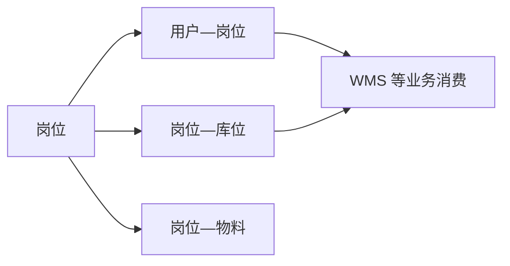

# 岗位、任务分配与审批主体

> 适用基线：测试环境目标 / `dev` 分支 / 2026-07-15。
> 阅读对象：测试、实施、运维（主）；仓储/现场班组长与需要解释“谁该接任务、谁能在哪些库位作业”的业务管理员（顺带）。

## 业务目的与适用范围

岗位把“组织中的职责位置”与用户关联，并可为岗位配置业务条件（如库位区域、物料范围）。任务分配回答：现场任务由谁领取或承接。审批主体回答：高风险流程由谁审批。

读完本页，应能：用非超管现场账号验证「岗位库位 → 任务可见范围」；分清岗位与角色、部门五档不是同一机制；并对“全站按岗位自动派单 / 通用审批引擎”保持未证实边界。本页与[RBAC](01-RBAC权限模型.md)、[数据权限](02-数据权限与决策权限.md)互补。

## 如何使用本组文档

| 你的目的 | 建议阅读 |
| --- | --- |
| 理解岗位如何约束现场任务，并据此验收/排障 | 本页：准备 → 当前主链 → 任务/审批边界 → 建议验证点 |
| 维护岗位、挂用户、配库位或查字段细节 | [岗位、任务分配与审批主体-维护与查询参考](岗位、任务分配与审批主体-维护与查询参考.md) |
| 配菜单/按钮权限 | [RBAC 权限模型](01-RBAC权限模型.md) |
| 配部门数据范围 | [数据权限与决策权限](02-数据权限与决策权限.md) |
| 查某类仓储任务的领取/执行规则 | 对应 WMS 业务页（发料、盘点、上架等） |

## 使用前准备

| 需要确认什么 | 为什么重要 |
| --- | --- |
| 岗位清单与命名 | 岗位是用户组织职责与业务条件的载体。 |
| 用户是否已分配岗位 | 岗位库位/物料等条件通过用户岗位生效。 |
| 库位主数据是否齐全 | 岗位区域权限依赖有效库位。 |
| 是否误把岗位当成角色 | 岗位与角色无直接关联；功能入口仍靠角色菜单。 |

!!! example "📷 截图占位"
    岗位管理页，标出岗位基本信息、关联用户、库位/物料配置入口；使用脱敏数据。

## 当前主链

| 能力 | 当前结论 |
| --- | --- |
| 岗位主数据 | 系统提供岗位管理菜单；岗位可分配给用户。 |
| 与角色关系 | 用户可同时有角色和岗位；二者独立维护，无“岗位自动带角色”的已证实链路。 |
| 岗位库位 | 可为岗位维护关联库位；WMS 部分任务查询按岗位库位过滤可见范围。 |
| 岗位物料 | 可为岗位维护关联物料；业务是否消费需按具体业务页确认。 |
| 任务领取人 | WMS 任务存在领取人（承接人）类字段；属业务任务模型，不是 System 通用派工引擎。 |
| 审批主体引擎 | ❓ 当前不能证实存在已启用的全站审批主体配置中心；工作流模块在部分部署形态下处于禁用/未导入状态。 |

## 关键判断

| 判断点 | 应先确认什么 | 判断后的影响 |
| --- | --- | --- |
| 看不见任务是权限还是区域 | 先查角色菜单，再查岗位库位，再查任务领取人。 | 避免只改角色或只改岗位。 |
| 人员调动后任务归属 | 用户岗位是否调整、在途任务领取人是否仍指向旧人。 | 决定是否只需改岗位，还是要转派任务。 |
| 是否需要审批流 | 目标业务是否自带审批/开关，还是依赖独立工作流。 | 未启用工作流时，不能按通用审批引擎培训。 |

!!! example "📝 示例数据占位"
    岗位「一号库执行」关联库区 A 库位；用户戊挂该岗位并具备对应业务菜单；同角色用户己挂「二号库执行」岗位。

!!! example "写实示例：给定配置 → 期望可见范围"
    **给定：** 用户戊仅挂岗位「一号库执行」，岗位库位覆盖库区 A；角色菜单已含目标 WMS 任务页；非超管。用户己岗位覆盖库区 B。
    **期望：** 在消费岗位库位的 WMS 任务列表中，戊主要看到库区 A 相关任务，己看到库区 B（以该业务页实际过滤为准）。仅改角色部门五档、不改岗位库位，通常**不能**单独解决库位隔离。

### 建议验证点

- 有菜单、无岗位或岗位库位未覆盖：目标库区任务不可见或不可作业（按业务规则）。
- 调岗后：旧岗位解除、新岗位库位生效；在途任务领取人是否仍指向旧人需按业务页处理。
- 用超管验收岗位隔离：结果不可信，换现场业务账号。
- ❓ 岗位物料是否被目标业务消费——未证实业务页勿写成必配。
- ❓ 全站自动派单 / 转派委托超时升级 / 通用审批中心——未证实，不写入必测路径。

## 任务分配：能说什么、不能说什么

**能说：**

- 岗位把用户与库位（及可选物料）等业务条件关联起来；
- WMS 等业务可按岗位库位限制任务可见/可作业区域；
- 任务单据上可有领取人，用于标记谁承接执行。

**不能说（当前未证实为 System 通用能力）：**

- 全站统一的“按岗位自动派单引擎”；
- 岗位匹配地点/物料/项目/分类的通用优先级规则中心；
- 转派、委托、超时升级的统一平台流程（需回各业务页取证）。

## 审批主体边界

| 层级 | 当前口径 |
| --- | --- |
| 功能权限 | 能否打开审批相关入口，仍看 RBAC。 |
| 业务规则 | 许多高风险动作由业务状态、单据开关、模块内审批决定。 |
| 独立工作流 | 不能假定当前环境已启用通用 BPM 审批主体配置。 |
| 培训建议 | 某业务“谁批、何时批”以该业务页为准；本页只说明与岗位/角色的分工。 |

## 查询与联查

| 想解决的问题 | 推荐定位方式 | 建议联查 |
| --- | --- | --- |
| 用户岗位不对 | 用户详情中的岗位、岗位管理中的成员。 | 用户管理、岗位管理。 |
| 库位区域不对 | 岗位关联库位是否覆盖目标区域。 | 岗位维护、库位主数据、对应 WMS 任务页。 |
| 有菜单仍看不到现场任务 | 是否被岗位库位过滤，或任务已被他人领取。 | 数据权限页（排除部门范围误判）、WMS 业务页。 |
| 审批找不到配置页 | 确认是否业务内审批，而非独立工作流中心。 | 对应业务页、问题总账。 |

## 常见问题与处理

| 情况 | 建议处理 |
| --- | --- |
| 给用户加了角色仍进不了某库区任务 | 检查岗位库位，而不是只加菜单。 |
| 把岗位当成数据权限配置 | 回到角色数据范围页；岗位不替代部门五档。 |
| 按旧规划书培训“岗位优先派发” | 改为：岗位提供区域/物料条件；具体派发/领取看业务页。 |
| 用超管验证岗位库位隔离 | 换现场业务账号重测。 |

## 当前限制与待确认事项

- ❓ 各 WMS/MES 业务对岗位库位、岗位物料的消费清单待逐页补齐；
- ❓ 任务转派、委托、超时升级是否存在及规则待业务页取证；
- ❓ 审批主体/工作流启用范围与环境差异待确认；
- 旧版“岗位优先分配”设计与现状差异已部分澄清，剩余细则不阻塞组织等其它 System 切片。

## 待补充的图示与示例
| 类型 | 后续需要补充的内容 | 目的 |
| --- | --- | --- |
| 关系图 | 用户—岗位—库位—任务可见性。 | 支持实施培训。 |
| 配置截图 | 岗位维护与库位关联。 | 支持操作说明。 |
| 示例数据 | 两岗位覆盖不同库区时的任务可见差异。 | 支持验收。 |
