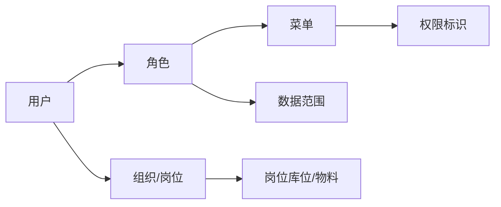

# 用户与权限

> 适用基线：测试环境目标 / `dev` 分支 / 2026-07-15。
> 阅读对象：测试、实施、运维（主）；安全协同与需要配置/排查授权的业务管理员（顺带）。

## 这一组业务解决什么问题

「没权限」三个字背后，可能是看不见菜单、看不见按钮，或者数据范围太窄——原因不同，排查路径完全不同。用户与权限回答三件彼此相关、但不能混为一谈的事：

1. **功能授权（RBAC）**：谁能看到哪些菜单、页面和操作入口。
2. **数据权限**：在已有功能入口内，能看到或操作哪些数据范围。
3. **岗位与审批主体**：任务由谁承接、现场区域如何约束，以及审批与功能授权如何配合。

读完本页，应能把一句笼统的「没权限」拆成三个可验证问题，并知道下一跳读哪一叶页。WMS、MES、QMS 等业务页仍要写清各自动作的状态条件与审计要求，不能只写“有某某权限码”。

## 本组与相邻能力的边界

| 能力 | 本组管什么 | 不管什么（去哪看） |
| --- | --- | --- |
| RBAC | 用户—角色—菜单—权限标识 | 租户套餐上限 → [租户与认证](../01-租户与认证/index.md) |
| 数据权限 | 角色部门/本人五档（已挂接表） | 工厂/仓库通用角色范围 **未证实**；库位现场 → 岗位叶页 |
| 岗位 | 用户—岗位、岗位库位/物料条件 | 全站自动派单/通用审批引擎 **未证实**；细则回业务页 |
| 部门树 | 只消费，不在本组维护 | [组织架构](../02-组织架构/index.md) |
| 消息 / 运维 / 开发平台 | 不涉及 | 对应分组 |

## 如何使用本组文档

按目的选入口；三件事有先后依赖时再按下表学习顺序：

| 你的目的 | 建议阅读 |
| --- | --- |
| 理解授权主链，设计「看不见菜单/按钮」类场景 | [RBAC 权限模型](01-RBAC权限模型.md) |
| 理解「同角色不同数据」并验收部门范围 | [数据权限与决策权限](02-数据权限与决策权限.md) |
| 理解库位现场任务可见性 / 审批边界 | [岗位、任务分配与审批主体](03-岗位、任务分配与审批主体.md) |
| 日常维护与联查字段 | 各叶页对应的「维护与查询参考」 |

## 建议学习与操作顺序

| 顺序 | 建议先看什么 | 为什么 |
| --- | --- | --- |
| 1 | [RBAC 权限模型](01-RBAC权限模型.md) | 先建立用户—角色—菜单—权限标识主链。 |
| 2 | [RBAC权限模型-维护与查询参考](RBAC权限模型-维护与查询参考.md) | 学会日常维护与排错顺序。 |
| 3 | [数据权限与决策权限](02-数据权限与决策权限.md) | 区分“能进功能”和“能看数据/能做高风险动作”。 |
| 4 | [数据权限与决策权限-维护与查询参考](数据权限与决策权限-维护与查询参考.md) | 配置角色数据范围与验收。 |
| 5 | [岗位、任务分配与审批主体](03-岗位、任务分配与审批主体.md) | 理解岗位库位/物料与现场任务边界。 |
| 6 | [岗位、任务分配与审批主体-维护与查询参考](岗位、任务分配与审批主体-维护与查询参考.md) | 岗位日常维护与联查。 |

不确定时：先 RBAC（有没有入口）→ 再数据权限（行是否被过滤）→ 再岗位（库位/领取）→ 最后回业务状态规则。

## 关键对象关系

## 分页说明

三个页面各管一段，出问题先按下表定位该改哪一页：

| 页面 | 说明 | 本阶段状态 |
| --- | --- | --- |
| RBAC 权限模型 | 功能授权主链、超管、菜单/按钮/接口分层。 | 已业务化；含维护与查询参考。 |
| 数据权限与决策权限 | 角色部门/本人五档、与岗位库位边界、决策动作分析框架。 | 已业务化；含维护与查询参考。 |
| 岗位、任务分配与审批主体 | 岗位主数据、WMS 消费与审批引擎边界。 | 已业务化；含维护与查询参考。 |

## 常见问题（分组级）

| 情况 | 建议处理 |
| --- | --- |
| 用户说“没权限” | 先分清是看不见菜单、看不见按钮，还是执行时报错。 |
| 想靠加菜单解决数据隔离 | 回到数据权限页；并确认目标业务是否接入部门范围。 |
| 库位现场看不见任务 | 查岗位区域权限，不要只改角色数据范围。 |
| 业务动作在某状态不能做 | 回对应业务页查状态规则，不要只改角色。 |

## 当前限制与待确认事项

- ❓ 全站逐页 RBAC 实测矩阵尚未建立（`GAP-014`）；未证实前勿脑补「某按钮一定可执行」。
- ❓ 各业务模块部门数据权限挂接清单未齐（`GAP-070`）；未挂接业务不能假定配了五档即生效。
- 岗位在各业务页的消费细则与审批启用范围待随业务续作；
- 前端显隐与后端强制鉴权不一致的接口清单需持续登记。
