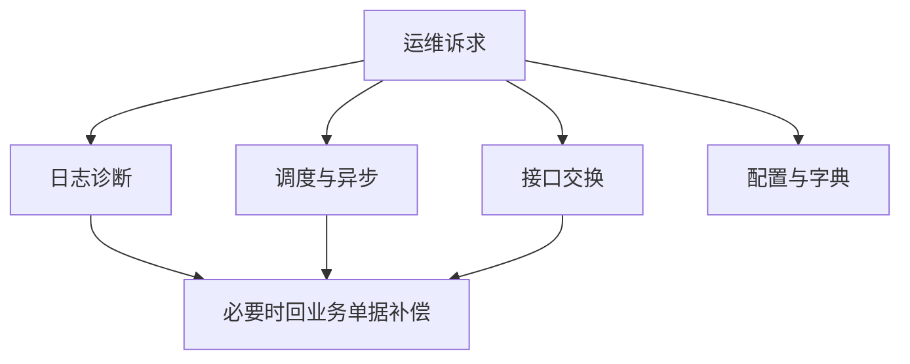

# 运维管理

> 适用基线：测试环境目标 / `dev` 分支 / 2026-07-15。
> 阅读对象：测试、实施、运维（主）；业务用户通常不直接用本页入口完成现场作业。

## 业务目的与适用范围

业务说「系统坏了」，运维却不知道该查日志、查任务还是查接口——本页就是为了减少这种来回试错。它说明“在系统里如何做运行维护”：查日志、管任务、看交换失败、改高风险配置。

读完本页，应能：按现象选对菜单入口；动手前确认环境/租户/权限与回滚；并把单据撤销、业务重算留给业务页，而不是在运维菜单里“顺手改业务”。平台能力细节在基础设施各页；本页提供入口与风险口径。

## 本页与相邻能力的边界

| 能力 | 本页管什么 | 不管什么（去哪看） |
| --- | --- | --- |
| 运维入口与风险口径 | 按现象选菜单、高风险动作要求 | 日志/调度/交换如何工作 → 基础设施对应页 |
| 租户 / RBAC / 数据权限 | 只要求运维角色与业务角色分离 | 授权模型 → 用户与权限分组 |
| 消息发不出 | 指向消息相关日志入口 | 用户公告/站内信 → [消息通知](../05-消息通知/index.md)；渠道治理 → 基础设施消息页 |
| 开发平台配置 | 指向开发相关菜单 | [开发平台](../06-开发平台/index.md) |
| 业务单据补偿 | 不涉及 | 对应业务模块页 |

## 如何使用本组文档

| 你的目的 | 建议阅读 |
| --- | --- |
| 按现象定位运维入口，并设计值班/验收检查 | 本页：准备 → 入口地图 → 高风险口径 → 建议验证点 |
| 查登录/操作/API 日志 | [日志、审计与运行监控](../../03-基础设施/07-日志、审计与运行监控.md) |
| 管定时任务 | [定时任务与后台作业](../../03-基础设施/08-定时任务与后台作业.md) |
| 重试外部接口 | [数据交换与集成可靠性](../../03-基础设施/09-数据交换与集成可靠性.md) |
| 改参数/字典 | [系统参数、字典与个性化配置](../07-系统参数、字典与个性化配置.md) |

## 使用前准备

| 需要确认什么 | 为什么重要 |
| --- | --- |
| 运维角色与权限 | 高风险入口应与普通业务角色分离。 |
| 当前环境/租户 | 避免在错误环境执行清理或重试。 |
| 变更窗口与回滚 | 生产操作需可回退。 |
| 是否先备份 | 清理、重算、主配置切换前必须评估。 |

!!! example "📷 截图占位"
    运维常用菜单拼图（日志、任务、交换、配置）；脱敏。

## 运维入口地图

| 运维诉求 | 建议入口 | 文档 |
| --- | --- | --- |
| 谁登录/谁操作了什么 | 登录日志、操作日志 | 日志页 |
| 接口报错/访问轨迹 | API 访问日志、错误日志 | 日志页 |
| 导入导出失败 | 导入/导出日志 | 导入导出页 |
| 定时作业启停与执行日志 | 调度控制台（XXL-Job） | 定时任务页 |
| 外部调用失败与重试 | 接口调用信息、异步失败记录 | 数据交换页 |
| 文件存不通 | 文件配置/文件列表 | 文件页 |
| 改运行参数/字典 | 配置管理、字典管理 | 系统参数页 |
| 消息发不出 | 短信/邮件日志、站内信记录 | 消息页 |
| 代码生成/开发配置 | 开发平台相关菜单 | 开发平台页 |

!!! example "写实示例：给定现象 → 期望入口"
    **给定：** 业务反馈「外部库存回写失败，单据已收货」；当前为生产租户；运维账号具备数据交换与日志菜单。
    **期望：** 先查数据交换/异步失败记录与错误信息，确认是否可幂等重试；不要先改收货单据“抹平”。重试后仍失败则查外部系统状态，避免无限重试。

### 建议验证点

- 运维角色可进日志/调度/交换入口；普通业务角色默认不可做清理/主配置切换（按实施角色方案验收）。
- 异步/接口重试前：错误信息可读、幂等风险已评估。
- 字典/参数变更：有操作痕迹可追溯；❓ 是否强制二次确认/双人复核，以环境为准，未证实勿写成全站强制。
- 「系统坏了」类工单：能按登录/权限、业务状态、接口交换、定时任务四类分流，而不是随机点菜单。

## 与基础设施、业务页的分工

「运维能不能顺手改业务数据」是最容易踩线的问题，下表划清三方分工：

| 范围 | 归属 |
| --- | --- |
| 运维菜单入口、风险动作口径、权限分离要求 | 本页 |
| 日志/调度/交换/文件等能力如何工作 | 基础设施对应页 |
| 单据撤销、业务重算、业务侧补偿按钮 | 对应业务模块页 |

## 高风险动作口径

| 动作类型 | 要求 |
| --- | --- |
| 清理历史（日志/异步成功记录等） | 确认保留策略与参数；优先在非高峰执行。 |
| 异步/接口重试 | 先确认幂等；避免重复入账。 |
| 切换文件主配置/存储 | 评估旧文件可达性；需迁移方案。 |
| 字典/参数变更 | 评估引用面；生产需审批与记录。 |
| 调度 Cron/手动触发 | 确认执行器与租户参数；保留执行日志。 |

二次确认、双人复核是否在每个入口强制，以环境实际为准；文档要求运维流程至少做到“可追溯”。

## 关键判断

| 判断点 | 应先做什么 |
| --- | --- |
| 业务说系统坏了 | 先分清：登录/权限、业务状态、接口交换、定时任务，再选入口。 |
| 重试后仍失败 | 看错误信息与外部系统状态，不要无限重试。 |
| 权限过大 | 收敛运维角色菜单；超管仅应急。 |

## 常见问题与处理

| 情况 | 建议处理 |
| --- | --- |
| 用业务账号做清理/重试 | 改用运维角色并留审计。 |
| 只改业务单据不查交换记录 | 涉及外部系统时必须查数据交换页。 |
| 调度控制台打不开 | 检查菜单外链与网络/账号，见定时任务页。 |

## 当前限制与待确认事项

- ❓ 独立“运维工作台”单页未证实；当前为菜单能力拼图；
- ❓ 高风险动作的强制二次确认矩阵待抽样；
- 监控大盘/告警订阅若另有外部平台，待环境清单补充；
- 运维权限与数据权限叠加规则随角色方案实施。

## 待补充的图示与示例
| 类型 | 后续补充 | 目的 |
| --- | --- | --- |
| 入口地图截图 | 常用运维菜单。 | 培训。 |
| 排障剧本 | 接口失败重试一例。 | 值班。 |
