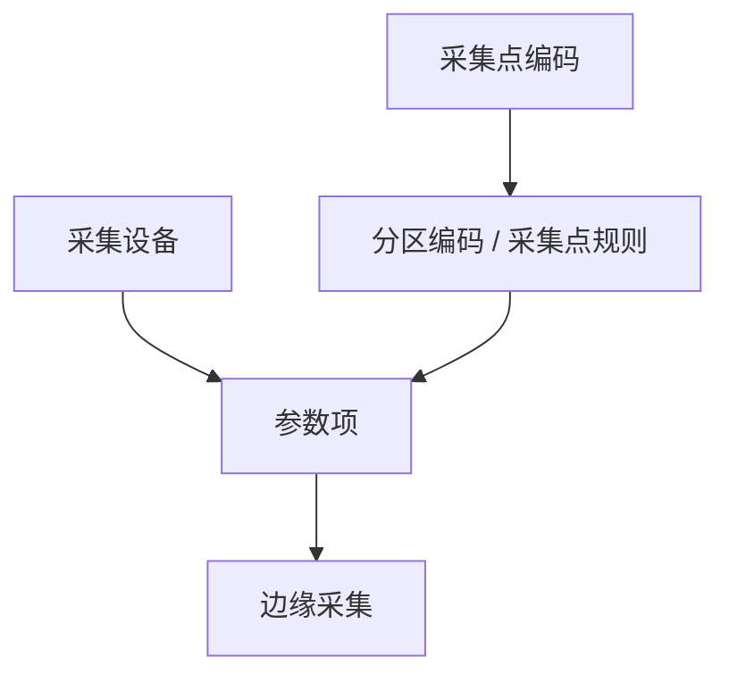

# 采集点

> 适用基线：测试环境目标 / `dev` 分支 / 2026-07-15。
> 阅读对象：测试、实施、运维（主）；自动化/设备工程师（顺带）。操作见[采集点-维护与查询参考](采集点-维护与查询参考.md)。

## 业务目的与适用范围

参数配了、开关也打开了，采集日志却始终是空的——十有八九是分区编码没对上采集点。本组维护「采哪里」与「采什么」的配置底座：

- **采集点信息**：采集点编码/名称，以及目标 IP、端口、参数地址、目标类型和扩展参数。
- **设备参数配置**：某采集设备下的参数项（编码、类型、读写、是否采集、分区编码）。

分区编码（页面标签）对应配置中的采集点规则编码，用于把参数项挂到采集点分区；未配齐这两层时，采集日志通常不会按预期出现。读完本页，应能按「采集点 → 参数项」两层顺序排查配置缺口，并知道字段细节下沉到维护参考。

## 如何使用本组文档

| 你的目的 | 建议阅读 |
| --- | --- |
| 想理解采集点与参数项关系 | 本页：准备 → 对象关系 → 关键判断 → 验证点 |
| 弄清配错会导致什么，或据此验收 | 本页「写实示例」「建议验证点」 |
| 正在新增/导出采集点或参数 | [采集点-维护与查询参考](采集点-维护与查询参考.md) |
| 想查采集结果与 MQTT | [设备管理](../02-设备管理/index.md) |
| 想看整体接入分层 | [数采与边缘接入模型](../04-数采与边缘接入模型.md) |

## 使用前准备

下表决定字段能不能填对，漏一项常导致新建即报错或日志长期为空：

| 需要确认什么 | 为什么重要 |
| --- | --- |
| 目标设备/PLC/网关的 IP、端口、地址约定 | 采集点字段才能填对 |
| 目标类型字典（`iot_target_type`）取值 | 类型选错可能导致边缘无法识别 |
| 采集设备编码已在「设备管理」建档 | 参数配置挂在设备上 |
| 参数类型、读写方式字典可用 | `data_type`、`iot_param_rw` |

!!! example "📷 截图占位"
    采集点列表（编码、IP、目标类型）。

## 对象与关系

| 对象 | 关键业务字段（已从前端取证） | 使用者关心 |
| --- | --- | --- |
| 采集点 | 采集点编码、名称；目标 IP、参数地址、类型、端口；扩展参数 1/2 | 目标是否可达、类型是否匹配现场协议 |
| 设备参数配置 | 设备编码/名称；参数名称/编码/类型；参考值；读写方式；是否采集；分区编码 | 是否打开采集、分区是否对上采集点 |

!!! example "写实示例：给定配置 → 期望行为"
    **给定：** 已建采集点 `CP-A`；设备 `DEV-01` 已启用；新建参数 `P-TEMP`，分区编码填 `CP-A`，是否采集=是。
    **期望：** 边缘按约定上报后，采集日志可按设备/参数/采集点查到值。若分区编码写成 `CP-B` 或不存在的编码，日志通常归错点或查不到——先对分区，再查边缘进程。

## 状态与关键动作

| 常见动作 | 业务结果 |
| --- | --- |
| 新增/编辑/删除采集点 | 维护目标连接线索 |
| 导出采集点 | 导出 Excel（权限 `iot:collect-point-info:export`） |
| 新增/编辑/删除参数配置 | 维护可采集参数清单 |
| 切换「是否采集」 | 采集项开关（`1` 采集 / `0` 不采集） |
| 导出参数配置 | 导出 Excel |

## 关键判断

| 判断点 | 应先确认什么 | 影响 |
| --- | --- | --- |
| 参数配了但无日志 | 是否采集=是；分区编码与采集点一致；边缘是否上报 | 只改 Web 无效 |
| 目标类型选项空 | 字典 `iot_target_type` 是否已发布 | 无法选类型 |
| 分区编码填错 | 是否与采集点编码/现场分区约定一致 | 日志归错点或查不到 |

### 建议验证点

- 新建采集点后列表可见编码与目标 IP。
- 为设备新增参数：分区指向该采集点并打开采集；边缘上报后日志可查。
- 将「是否采集」改为否：该项不再按预期出现在新采集结果中。
- 导出采集点 / 参数配置（有权限时）成功。

完整操作步骤与字段核对见[维护与查询参考](采集点-维护与查询参考.md)。

## 限制与待确认

以下几点容易被当成已验证事实，实际仍待环境核实：

- 采集点编码全局唯一性、删除是否校验被参数引用：后端在仓外网关，**待证实**（`GAP-072`）。
- 扩展参数 1/2 的现场语义依赖目标类型，不以本页臆造协议细节。
- 参考值字段类型在接口模型中较宽，培训按「参考/阈值线索」理解，不以强校验公式断言。
- 数采设备与 DBC 台账是否同步、Node-RED 页面可用性见模块概述与 `GAP-072`。
